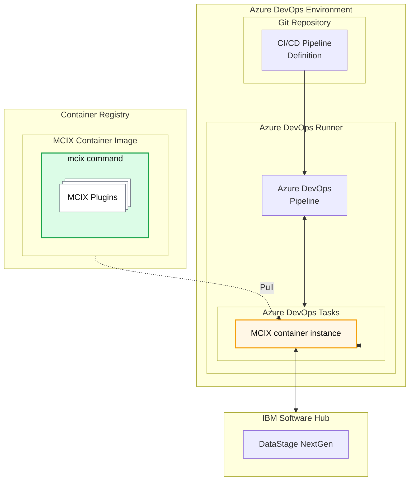

<script type="module" src="https://1.www.s81c.com/common/carbon-for-ibm-dotcom/version/v2.8.0/card-group.min.js"></script>
<script type="module" src="https://1.www.s81c.com/common/carbon-for-ibm-dotcom/version/v2.8.0/content-block.min.js"></script>
<script type="module" src="https://1.www.s81c.com/common/carbon-for-ibm-dotcom/version/v2.8.0/content-block-mixed.min.js"></script>
<script type="module" src="https://1.www.s81c.com/common/carbon-for-ibm-dotcom/version/v2.8.0/link-list.min.js"></script>

<c4d-link-list type="default" slot="complementary">
  <c4d-link-list-heading>Resources</c4d-link-list-heading>
  <c4d-link-list-item
    href="https://marketplace.visualstudio.com/items?itemName=MettleCI.mcix"
    target="mcix-azure"
    cta-type="external"
  >
    MCIX for Azure DevOps on Visual Studio Marketplace
  </c4d-link-list-item>
</c4d-link-list>

## Introduction

Like GitHub users, Azure DevOps users (both Server and SaaS) can also take advantage of native pipeline tasks. The **MCIX Azure DevOps Task Extension**, available in the [Visual Studio Marketplace](https://marketplace.visualstudio.com/items?itemName=MettleCI.mcix){:target="_blank" rel="noopener"} provides a number of native tasks for use in Azure DevOps CI/CD pipelines - again, underpinned by the MCIX container image which is nosted automtically by your Azure DevOps runner. For example:

## Example

### Command Line Pipeline Task

```yaml
- stage: Export
  pool:
    vmImage: "ubuntu-latest"
  jobs:
    - job: MCIX_Export
      steps:
        - bash: |
            ./some-location/mcix datastage export \
              -api-key ${API_KEY} \
              -url ${CPD_URL} \
              -user ${CPD_USER} \
              -project ${CPD_PROJECT} \
              -export-path ${EXPORT_PATH}
          displayName: "Run export command"
```

### Azure DevOps Native Task

```yaml
- stage: Export
  pool:
    vmImage: "ubuntu-latest"
  jobs:
    - job: MCIX_Export
      steps:
        - task: mcixDatastageExport@1
          inputs:
            containerRegistry: "my-docker-service-connection"
            imageName: "mettleci.azurecr.io/mettleci/mcix"
            api-key: ${API_KEY}
            url: ${CPD_URL}
            user: ${CPD_USER}
            project: ${CPD_PROJECT}
            assets: ${EXPORT_PATH}
          displayName: "Export DataStage Assets"
```

## Architecture



## Setup

There are a number of mandatory and recommendedf processes you'll need to perform to be able to use the Aziure Devops extensions