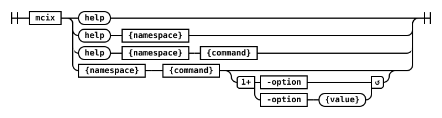

## Introduction

<cds-inline-notification
  kind="info"
  title="Note"
  subtitle="The MCIX command is the CPD-compatible equivalent of the Classic MettleCI Command Line Interface for DataStage v11.x.  In DataStage NextGen the `mettleci` command is replaced with the `mcix` command."
  low-contrast
  id="overlay-notification">
</cds-inline-notification>

The DataStage NextGen MettleCI Command Line Interface (MCIX) is available for Unix (x86), Microsoft Windows (x86), and Apple macOS (Apple Silicon) command-line environments.

The MCIX CLI consists of two primary components:

- The **MCIX Command Shell**, which provides the command-line interface used to invoke MCIX functionality, and
- A collection of **MCIX CLI Plugins**, which provide the individual MCIX capabilities and commands. Plugins are distributed as `.jar` files and reside within the `Plugins` directory of your MCIX installation.  

The MCIX installation media includes a full set of plugins so under normal circumstances you should never need involved yourself with the contents of the `Plugins` directory.

Commands are organised into *Namespaces*, which are used to fully qualify each command and avoid naming conflicts. The Command Shell is used like this:

```shell
$> mcix {namespace} {command} {parameters} 
```

For example, on Linux/macOS the `datastage` namespace contains a `compile` command:

```shell
$> mcix datastage compile \
     -api-key $CP4DKEY \
     -url     $CP4DHOSTNAME \
     -user    $CP4DUSERNAME \
     -report  mettleci_compilation.xml \
     -project dstage1 \
     -include-asset-in-test-name
```

The MCIX command supports two different modes of operation: **console mode** or **command mode**. MCIX commands accept various parameters which can optionally be sourced from a [command file](#using-external-command-files-with-the-mettleci-cli).  Note that both modes of operation are supported by the same `mcix` executable.

## Console Mode

In console mode MCIX prints a command prompt (`mcix>`) and waits for a command. Each command is processed without exiting MCIX. You may need to provide authentication parameters for a commands which invoke functionality in third party systems.

Start the MCIX CLI in console mode by entering `mcix` in your terminal. You then have various options available ...

| **Operation** | **Process** |
| List available namespaces            | Type `help`. |
| List the commands within a namespace | Type `help {namespace}`<br/>(or just `{namespace}`.) |
| List the parameters for a command    | Type `help {namespace} {command}`  (or just `{namespace} {command}`).<br/> The mandatory parameters required to execute the command are denoted with an asterisk (`*`) next to their name. |
| Execute a command                    | Type `{namespace} {command}` followed by values for all the mandatory parameters. |
| Exit the console                     | Type `exit` or `quit`. |

Click below to see an example.

<details markdown="1">
  <summary>MCIX console mode example</summary>
```
$> mcix
MettleCI Command Line (build 1.0-SNAPSHOT)
(C) 2018-2026 Data Migrators Pty Ltd
Enter [namespace] [command] [options]
or 'help' for more information, 'exit' or 'quit' to leave.
mcix>help
Usage: [namespace] [command] [command options]
  Namespaces:
    datastage
    migrate
    overlay
    system
    unit-test

mcix>datastage
Expected a command
Usage: datastage [command] [command options]
  Commands:
    compile        Compile DataStage assets that don't have up to date binaries 
    import         Incrementally import DataStage assets into a CP4D project
    export         Export all DataStage assets from a CP4D project

mcix>datastage compile
The following options are required: [-user], [-url], [-api-key], [-report]
Usage: datastage compile [options]
  Options:
  * -api-key
      CP4D/CP4DaaS API key
    -include-asset-in-test-name
      Test case names will include the compiled asset name in the JUnit reports 
      Default: false
    -project
      Name of target project (required when -project-id not specified)
    -project-id
      Id of target project (required when -project not specified)
  * -report
      JUnit compilation report file
  * -url
      Base url of CP4D/CP4DaaS
  * -user
      CP4D/CP4DaaS username

mcix>quit
$>
```
</details>

## Command mode

In command mode you can enter commands one at a time at your operating system's command line. Start each command with `mcix`  (on all platforms) followed by a namespace and command, then all of that command's mandatory parameters.  



Execute an MCIX command with:
```
mcix {namespace} {command} [options]
```

- List available namespaces by typing `mcix help`, where `{namespace}` is your relevant namespace.
- List a namespace's available commands by typing `mcix help {namespace}`, where `{namespace}` is your relevant namespace.
- Verify a command's required parameters by typing `mcix help {namespace} {command}`. Mandatory parameters required to execute the command are denoted with an asterisk (`*`) next to their name.

Click below to see an example.

<details markdown="1">
  <summary>MCIX command mode example</summary>
```

$> mcix help datastage
MettleCI Command Line (build 1.0-SNAPSHOT)
(C) 2018-2026 Data Migrators Pty Ltd
Usage: datastage [command] [command options]
  Commands:
    compile        Compile DataStage assets that don't have up to date binaries 
    import         Incrementally import DataStage assets into a CP4D project
    export         Export all DataStage assets from a CP4D project

$> mcix help datastage compile
MettleCI Command Line (build 1.0-SNAPSHOT)
(C) 2018-2026 Data Migrators Pty Ltd
Usage: datastage compile [options]
  Options:
  * -api-key
      CP4D/CP4DaaS API key
    -include-asset-in-test-name
      Test case names will include the compiled asset name in the JUnit reports 
      Default: false
    -project
      Name of target project (required when -project-id not specified)
    -project-id
      Id of target project (required when -project not specified)
  * -report
      JUnit compilation report file
  * -url
      Base url of CP4D/CP4DaaS
  * -user
      CP4D/CP4DaaS username

$> mcix datastage compile \
     -api-key $CP4DKEY \
     -url     $CP4DHOSTNAME \
     -user    $CP4DUSERNAME \
     -report  mettleci_compilation.xml \
     -project dstage1
Analyzing assets to compile
Compilation folder location = \opt\mci\command-shell\log\compiliation
Attempting to compile with 4 working threads.
Compiling DataStage jobs...
 * Compile 'test2-engn.datamigrators.io/dstage1/Jobs/Load/EX_Account.pjb' - COMPLETED
 [REDACTED FOR BREVITY]
 * Compile 'test2-engn.datamigrators.io/dstage1/Jobs/Load/TX_StockHolding.pjb' - COMPLETED
Compilation complete
$> 
```
</details>

Note that MCIX CLI namespaces, commands, and options are all case sensitive. 

## Mutually exclusive parameters

Some mandatory command parameters may be mutually exclusive with one another, 
meaning that one or other of the parameters must be supplied, but not both.  
The `-project` and `project-id` parameters are a good example of this:

```
mcix>datastage compile
The following options are required: [-user], [-url], [-api-key], [-report]
Usage: datastage compile [options]
  Options:
  * -api-key
      CP4D/CP4DaaS API key
    -include-asset-in-test-name
      Test case names will include the compiled asset name in the JUnit reports 
      Default: false
    -project
      Name of target project (required when -project-id not specified)
    -project-id
      Id of target project (required when -project not specified)
  * -report
      JUnit compilation report file
  * -url
      Base url of CP4D/CP4DaaS
  * -user
      CP4D/CP4DaaS username
```

When their usage is listed by the `mcix` command neither is identified as mandatory, but the description provides more details.

## Error logging

The MCIX command logs all its behaviour by default into a set of files located here:

<details markdown="1">
  <summary>Linux</summary>
```bash
${XDG_CACHE_HOME}/MettleCI/logs
```
or if `${XDG_CACHE_HOME}` has not been set:
```bash
~/.cache/MettleCI/logs 
```
</details>
<details markdown="1">
  <summary>macOS</summary>
```bash
~/Library/Logs/MettleCI
```
</details>

<details markdown="1">
  <summary>Windows</summary>
```bash
%LOCALAPPDATA%\MettleCI\logs
```
or if `%LOCALAPPDATA%` has not been set:
```bash
%USERPROFILE%\.MettleCI\logs
```
</details>

There are two forms of log file, both in plain text:

| Filename | Description |
| -------- | ----------- |
| cli.*YYYY-MM-DD*.log | A regular log file summarising all behaviour of the MCIX command  |
| exception.*{Unique Hexadecimal ID}* | A log file describing a specific exception event in detail | 

#### cli files

These files contain a log of all operations produced by the MCIX command shell, including high-level details of any exceptions encountered.  Points to note:
- A new log is created for each day that MCIX is executed.
- A maximum of 30 days worth of logs are stored.  Older logs are automatically removed.
- The size of a log file is capped at 100MB.

#### exception files

Every MCIX exception is described along with a unique hexadecimal ID which you can use to identify an associated exception file.  This file contained detailed debug information which can you in understanding your underlying issue.

For example, running an mcix command with an invalid API key produces:

```bash
There was an error running command. It has been logged (ID f2c386bfa8f17574).
HttpException: HTTP 401 {"id":"WSCPA0000E","code":401,"error":"Unauthorized","reason":"Bearer token is either missing or invalid: undefined.","message":"Access denied"}
Command failed.
```

So using `(ID f2c386bfa8f17574)` we can retrieve detailed logs about the error. For example:

```bash
$> ls -al ~/Library/Logs/MettleCI/
-rw-r--r--@ 1 johnmckeever  staff   5.6K 15 Jun 14:25 cli.2026-06-15.log
-rw-r--r--@ 1 johnmckeever  staff   921B 16 Jun 14:20 cli.2026-06-16.log
-rw-r--r--@ 1 johnmckeever  staff    20K 17 Jun 13:50 cli.2026-06-17.log
-rw-r--r--@ 1 johnmckeever  staff    34K 17 Jun 12:55 exception.f2c386bfa8f17574.log
```

If you ever need to raise a support request related to MCIX you should supply both the relevant **cli** and **exception** 
files with your support request.

## Use passwords containing special characters

If the password contains special characters, you will need to wrap it with single or double quote or by using escape characters.

| Password contains | Windows       | Unix/macOS |
|-------------------|---------------|------------|
| `!` (exclamation) | Use password without modification. <br/>For example: ```MyPassword!``` | Wrap password with single quote.  <br/>For example: ```'MyPassword!'``` |
| `“` (double quote) | Use escape character `\`. <br/>For example: ```My\”Password``` | Wrap password with single quote.  <br/>For example: ```'My"Password'``` |
| `'` (single quote) | Wrap password with double quote.  <br/>For example: ```“My'Password”``` | Wrap password with single quote and use escape character `\`.  <br/>For example: ```'My'\''Password'``` |
| `*` (asterisk) | Use password without modification. <br/>For example: ```My*Password``` | Wrap password with single quote.  <br/>For example: ```'My*Password'``` |
| `<space>` | Wrap password with double quote.  <br/>For example: ```“My Password”``` | Wrap password with single quote.  <br/>For example: `'My Password'``` |

## Using external command files with the MettleCI CLI

MCIX allows you to define a MCIX command, along with its parametesr, in a text-based *command file* which you can then pass as parameter to the MCIX command.  This is accomplished using the `@{filename}` command syntax: 

```
# Here's a typical command file
$> cat file mycommand.txt
datastage
compile
-domain
test1-svcs.datamigrators.io:59445
-username
isadmin
-password
isadminpwd
-server
test1-engn.datamigrators.io
-project
dstage1

# ... and here's how to use it
$> mcix @mycommand.txt
```

**Note:**

* Each element of a command file needs to be on an individual line, i.e. separated by your operating system’s line ending  character combination (`CR`/`LF`, for example)
* A command file can only contain the definition of a single MCIX command
* You can run the MCIX Command Line with multiple commands by invoking it with individual command files from a shell script with one command per line. e.g.
   ```shell
   #!/usr/bin/env bash
   mcix @mycommand1.txt
   mcix @mycommand2.txt
   mcix @mycommand3.txt
   # etc.
   ``` 