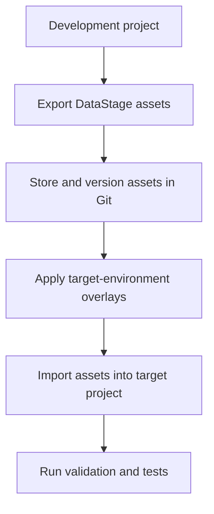
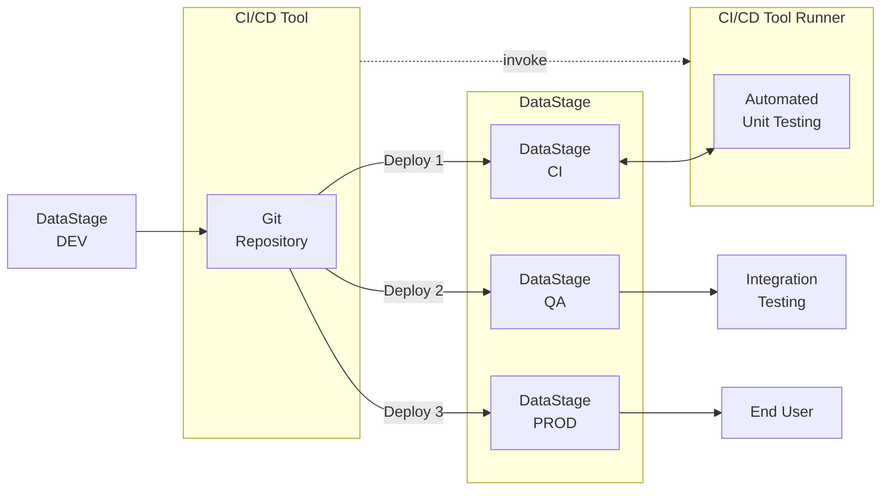

This command-line tutorial is intended to help you understand the individual steps that make up an MCIX-based CI/CD pipeline. In a production environment, these steps would normally be executed automatically by a CI/CD platform such as GitHub Actions, Azure DevOps, Jenkins, GitLab CI, or Tekton. In a production pipeline, the CI/CD platform provides the automation, orchestration, credential management, approval gates, audit history, logging, notifications, and repeatability needed to run these steps reliably across teams and environments. The MCIX CLI performs the DataStage-related work, but the CI/CD tool is responsible for deciding when, where, and how these commands are executed. Read more about the role of a CI/CD tool [here](/introduction/cicd-concepts).

In this tutorial, however, you will run the same type of CI/CD pipeline manually from your local command line.  This gives you a practical way to understand what each pipeline stage does before you automate the process in a real CI/CD tool.

**Process**

1.  Ensure you have established the [prerequisites](/command-line/pipeline-tutorial-prerequisites), ensuring ...
- The MCIX and Git command line interfaces are installed and configured you on local host (e.g. your laptop.)
- You have access to a Git platform containing an empty a template repository for your DataStage project artefacts.

1. Follow the [steps to emulate a pipeline](/command-line/pipeline-tutorial-steps) using the MCIX CLI, covering ...
- Exporting assets from DataStage
- Identifying changes
- Comitting and pushing those assest to a remote Git repository
- Applying overlays

---

## Why run a pipeline manually?

A command-line tutorial is not intended to replace a real CI/CD platform.

Instead, it helps you learn the mechanics of the pipeline in a simple, visible, and repeatable way. By running each command yourself, you can see:

- which assets are exported from DataStage
- how those assets are stored in Git
- how environment-specific overlays are applied
- how assets are imported into a target project
- how validation and testing commands fit into the delivery process
- which files are produced as pipeline outputs

Once those steps are clear, the same operations can be moved into a CI/CD platform and executed automatically.

---

## What this tutorial demonstrates

The tutorial simulates a simple deployment flow between two DataStage projects:

The pipeline pattern is deliberately simple. It focuses on the essential delivery lifecycle rather than the details of any one CI/CD product.

---

## The pipeline stages

The tutorial walks through the following stages.

| Stage    | Purpose                                                     |
| -------- | ----------------------------------------------------------- |
| Export   | Retrieve DataStage assets from a source project.            |
| Version  | Store the exported assets in a Git repository.              |
| Overlay  | Apply environment-specific configuration changes.           |
| Import   | Deploy the modified assets into a target DataStage project. |
| Validate | Check that the assets meet expected standards.              |
| Test     | Execute DataStage unit tests and produce test results.      |

Some of stages are optional. For example, asset analysis may only apply where asset analysis rules are available.

---

## How this differs from a real CI/CD pipeline

In this tutorial, you act as the pipeline orchestrator.

You decide when to run each command, inspect the outputs, and move from one step to the next. This makes the process easier to learn and troubleshoot.

In a real CI/CD implementation, the same steps would usually be automated by your CI/CD platform. For example:

| Tutorial approach                                          | Real-world CI/CD approach                                             |
| ---------------------------------------------------------- | --------------------------------------------------------------------- |
| You run commands manually.                                 | The CI/CD platform runs commands automatically.                       |
| You store credentials locally or in environment variables. | Credentials are stored in platform-managed secrets.                   |
| You inspect results in the filesystem.                     | Test results are published to you CI/CD platform by the pipeline run. |
| You decide when to continue.                               | The pipeline enforces success, failure, and approval rules.           |
| You run the process from your workstation.                 | Jobs run on hosted or self-hosted build agents.                       |

The important point is that the underlying MCIX commands remain broadly the same (almost all MCIX commands have equivalent native tasks for the popular
build systems). The CI/CD platform changes _how_ the commands are orchestrated, not the purpose of the commands themselves.

---

## What you will need

Before running the pipeline steps, you will prepare a local working environment containing:

- the MCIX command line
- the Git command line
- access to a remote Git repository
- a local clone of that repository
- access to a source DataStage project
- access to a target DataStage project
- overlay files for the target environment
- unit test specifications and test data

The [prerequisite page](/command-line/pipeline-tutorial-prerequisites) walks through the local MCIX and Git setup, repository creation, template repository cloning, and verification of basic Git operations.

---

## Repository role in the tutorial

The Git repository acts as the well goverened, single source of truth for your DataStage delivery assets.

It is not tied to a single environment such as Dev, Test, or Production. Instead, it represents the authoritative versioned source for the DataStage initiative.

The different DataStage environments are populated from that source at different stages of the delivery lifecycle. For example:

| Environment | Typical role                                                                   |
| ----------- | ------------------------------------------------------------------------------ |
| Development | Where changes are initially created                                            |
| CI          | Where exported and overlaid assets are imported and (automaticaly) unit tested |
| QA          | Where a tested candidate release may be validated further                      |
| Production  | Where only approved versions should be deployed                                |

<cds-inline-notification
  kind="warning"
  title="Important"
  subtitle="The repository stores the versioned source, while the DataStage projects represent 
  deployments of that source into specific environments.  Each environment (project) represents 
  a version of the source at different points in its lifecycle."
  low-contrast
  hide-close-button="true"
  id="overlay-notification">
</cds-inline-notification>

---

## Tutorial structure

This tutorial is split into two main parts.

### 1. Prepare the prerequisites

The prerequisite section confirms that your local workstation and Git repository are ready for the pipeline exercise.

You will:

- install and verify the MCIX CLI
- verify that the required MCIX command namespaces are available
- configure access to your Git platform
- create a suitable empty repository
- clone the MettleCI template repository
- repoint the local clone to your own repository
- confirm that you can pull, commit, and push changes

### 2. Run the pipeline steps

The pipeline section then uses that prepared environment to simulate a CI/CD process from the command line.

You will:

- define connection details for your source and target DataStage projects
- export DataStage assets
- apply overlays
- import the modified assets
- run validation checks
- execute unit tests
- review the generated outputs

The attached pipeline page already describes the command sequence and expected outputs for this process.

---

## Next Steps

After completing this tutorial, you should understand the purpose of each pipeline stage and how the MCIX commands work together.  That understanding provides the foundation for implementing the same process in a real CI/CD platform, where the manually executed commands can be converted into automated pipeline steps using a container or native MCIX tasks.
