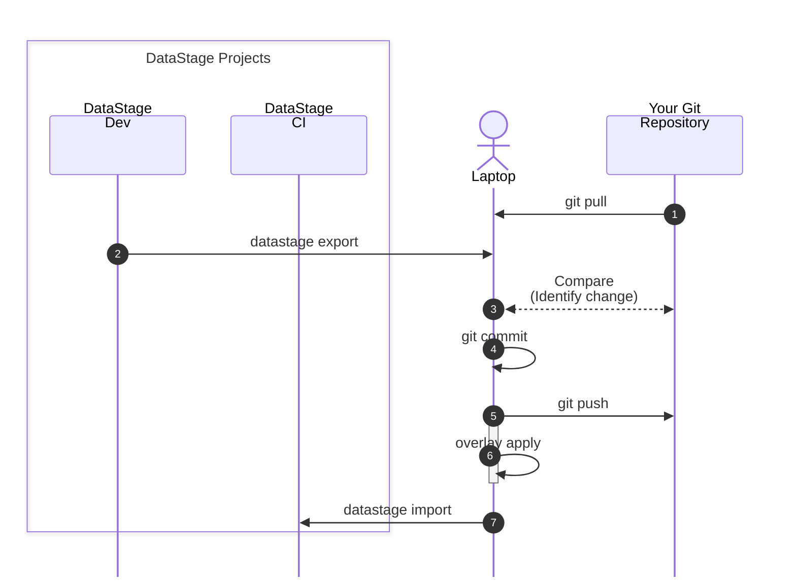
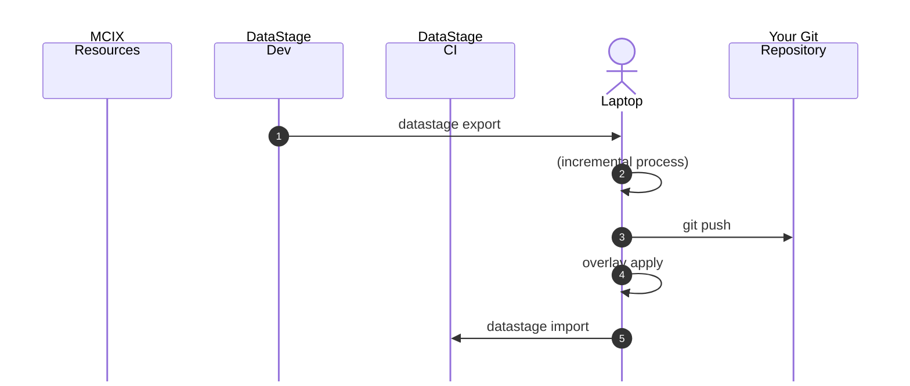
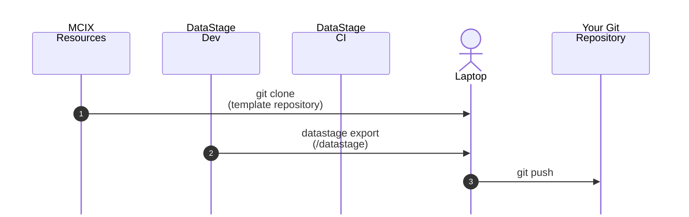

<c4d-link-list type="default" slot="complementary">
  <c4d-link-list-heading>Resources</c4d-link-list-heading>
  <c4d-link-list-item
    href="/command-line/command-reference"
    target="cmd-ref"
    cta-type="local"
  >
    MCIX Command Reference
  </c4d-link-list-item>
</c4d-link-list>

---

# A simple CI/CD pipeline using the MCIX CLI

## Scenario

This tutorial shows how to replicate the actions of you CI/CD tool manually by issuing 
various `mcix` commands at the command line.  In the real world your pipeline would normally 
be executed by your CI/CD tool's integrated pipeline orchestration engine.  

We'll break the tutorial into two steps:

1. Establishing the  prerequisites, ensuring ...
  - the necessary command line tools (`mcix` and `git`) are installed and configured you on local host
  - you have access to a remote Git repository with the relevant configuration and permissions
1. Manaully replicating the steps involved in a typical CI/CD pipeline on your local hosts's command line.

It is assumed you already have:

* a source Nextgen DataStage project containing compiled and executing DataStage flows and associated assets
* unit-test specifications and associated test data for at least some of those DataStage flows
* a target Nextgen DataStage project into which assets can be imported, compiled, and executed
* environment-specific overlay files stored in your repository

* asset-analysis rules available


**Note:** If you don't have a source NextGen DataStage project available you can download a sample project for tutorial purposes here:

&nbsp;&nbsp;&nbsp;&nbsp;&nbsp;[]({{ site.url }}/assets/files/junit.xml.zip)
<br/>&nbsp;[Download<br/>ElectroMart]({{ site.url }}/assets/files/junit.xml.zip)

---

# Constructing a pipeline

The pipeline you'll simulate will:

1. Export assets from a source project.
1. Apply environment-specific changes using overlays.
1. Import the modified assets into a target project.

  1. Run asset analysis tests.

1. Execute DataStage unit tests in the target project.



The example assumes you are moving DataStage assets from a source project, applying environment-specific overlays, importing them into a target project, then validating and testing the result.

---

## 1. Prepare a working directory

After you've followed the [prerequisite steps](/command-line/pipeline-tutorial-prerequisites) to create your local Git repository you'll have established your directory to hold exported assets, overlay output, reports, and test results.  Your repository directory will look something like this:

```text
mcix-cli-pipeline-demo/
├── .git              # Tells the Git CLI this is a local Git repository
├── .gitattributes    # Tells the Git CLI the repository properties
├── .gitignore        # Tells the Git CLI which files to ignore
├── datastage/        # Where DataStage assets will to be stored
│                     # (in asset type-specific sub-directories)
├── filesystem/       # Where non-DataStage assets will to be stored
│                     # (scripts, reference files, etc.)
├── pipelines/        # Stores CI/CD tools' pipeline definitions
│                     # (Not relevant to this tutorial)
├── overlays/         # Stores overlay configuration files 
├── README.md         # The repository's homepage (in markdown)
└── unit-tests/       # DataStage unit test specifications and data files
```

---

## 2. Define your connection details

For readability, define the values you will use throughout the pipeline as shell variables.

```bash
export SOURCE_CP4D_URL="https://source-cpd.example.com"
export SOURCE_PROJECT="Development"

export TARGET_CP4D_URL="https://target-cpd.example.com"
export TARGET_PROJECT="Test"

export CP4D_USERNAME="john@example.com"
export CP4D_API_KEY="your-api-key"

export EXPORT_DIR="./exported-assets"
export OVERLAY_DIR="./overlaid-assets"
export REPORT_DIR="./reports"
export TEST_RESULTS_DIR="./test-results"
```

Adjust the variable names and values to match your MCIX command options.

NOTE: You can generate a Cloud Pak API key [here](https://www.ibm.com/docs/en/cloud-paks/cp-data/5.3.x?topic=tutorials-generating-api-keys).

---

## 3. Export DataStage assets

The first stage exports assets from the source DataStage project.

```bash
mcix datastage export \
  --url "$SOURCE_CP4D_URL" \
  --project "$SOURCE_PROJECT" \
  --username "$CP4D_USERNAME" \
  --api-key "$CP4D_API_KEY" \
  --output-dir "$EXPORT_DIR"
```

After this step, your exported DataStage assets should be available in:

```text
./exported-assets
```

This exported directory becomes the input to the next stage.

---

## 4. Apply environment overlays

Next, apply overlays to transform the exported assets for the target environment.

For example, overlays might change connection names, schema names, database endpoints, project parameters, or other environment-specific values.

```bash
mcix overlay apply \
  --input-dir "$EXPORT_DIR" \
  --overlay-dir "./overlays/test" \
  --output-dir "$OVERLAY_DIR"
```

After this step, the transformed assets should be available in:

```text
./overlaid-assets
```

A common pattern is to keep overlays in source control, for example:

```text
overlays/
├── dev/
├── test/
└── prod/
```

---

## 5. Import DataStage assets

Now import the overlaid assets into the target DataStage project.

```bash
mcix datastage import \
  --url "$TARGET_CP4D_URL" \
  --project "$TARGET_PROJECT" \
  --username "$CP4D_USERNAME" \
  --api-key "$CP4D_API_KEY" \
  --input-dir "$OVERLAY_DIR"
```

At this point, the transformed DataStage assets have been deployed into the target project.

---

## 6. Run asset analysis tests

Next, run asset analysis tests to validate that the imported assets comply with your rules.

```bash
mcix asset-analysis test \
  --url "$TARGET_CP4D_URL" \
  --project "$TARGET_PROJECT" \
  --username "$CP4D_USERNAME" \
  --api-key "$CP4D_API_KEY" \
  --rules-dir "./asset-analysis-rules" \
  --junit-output "$REPORT_DIR/asset-analysis-results.xml"
```

This produces a JUnit-style test result file:

```text
./reports/asset-analysis-results.xml
```

That file can later be consumed by a CI/CD system such as GitHub Actions, Azure DevOps, Jenkins, or Tekton.

---

## 7. Run unit tests

Finally, execute the DataStage unit tests.

```bash
mcix unit-test execute \
  --url "$TARGET_CP4D_URL" \
  --project "$TARGET_PROJECT" \
  --username "$CP4D_USERNAME" \
  --api-key "$CP4D_API_KEY" \
  --junit-output "$TEST_RESULTS_DIR/unit-test-results.xml"
```

This produces another JUnit-style result file:

```text
./test-results/unit-test-results.xml
```

---

## 8. Run the full pipeline as a script

Once the individual commands work, place them into a shell script.

Create a file named:

```bash
run-mcix-pipeline.sh
```

Add the following content:

```bash
#!/usr/bin/env bash
set -euo pipefail

export SOURCE_CP4D_URL="https://source-cpd.example.com"
export SOURCE_PROJECT="Development"

export TARGET_CP4D_URL="https://target-cpd.example.com"
export TARGET_PROJECT="Test"

export CP4D_USERNAME="john@example.com"
export CP4D_API_KEY="your-api-key"

export EXPORT_DIR="./exported-assets"
export OVERLAY_DIR="./overlaid-assets"
export REPORT_DIR="./reports"
export TEST_RESULTS_DIR="./test-results"

mkdir -p "$EXPORT_DIR"
mkdir -p "$OVERLAY_DIR"
mkdir -p "$REPORT_DIR"
mkdir -p "$TEST_RESULTS_DIR"

echo "Exporting DataStage assets..."
mcix datastage export \
  --url "$SOURCE_CP4D_URL" \
  --project "$SOURCE_PROJECT" \
  --username "$CP4D_USERNAME" \
  --api-key "$CP4D_API_KEY" \
  --output-dir "$EXPORT_DIR"

echo "Applying overlays..."
mcix overlay apply \
  --input-dir "$EXPORT_DIR" \
  --overlay-dir "./overlays/test" \
  --output-dir "$OVERLAY_DIR"

echo "Importing DataStage assets..."
mcix datastage import \
  --url "$TARGET_CP4D_URL" \
  --project "$TARGET_PROJECT" \
  --username "$CP4D_USERNAME" \
  --api-key "$CP4D_API_KEY" \
  --input-dir "$OVERLAY_DIR"

echo "Running asset analysis tests..."
mcix asset-analysis test \
  --url "$TARGET_CP4D_URL" \
  --project "$TARGET_PROJECT" \
  --username "$CP4D_USERNAME" \
  --api-key "$CP4D_API_KEY" \
  --rules-dir "./asset-analysis-rules" \
  --junit-output "$REPORT_DIR/asset-analysis-results.xml"

echo "Running unit tests..."
mcix unit-test execute \
  --url "$TARGET_CP4D_URL" \
  --project "$TARGET_PROJECT" \
  --username "$CP4D_USERNAME" \
  --api-key "$CP4D_API_KEY" \
  --junit-output "$TEST_RESULTS_DIR/unit-test-results.xml"

echo "Pipeline completed successfully."
echo "Asset analysis report: $REPORT_DIR/asset-analysis-results.xml"
echo "Unit test report:      $TEST_RESULTS_DIR/unit-test-results.xml"
```

Make the script executable:

```bash
chmod +x run-mcix-pipeline.sh
```

Run it:

```bash
./run-mcix-pipeline.sh
```

---

## 9. Expected result

After the script completes successfully, you should have:

```text
mcix-pipeline-demo/
├── exported-assets/
│   └── exported DataStage assets
├── overlaid-assets/
│   └── transformed assets ready for import
├── reports/
│   └── asset-analysis-results.xml
└── test-results/
    └── unit-test-results.xml
```

The pipeline has:

1. Exported assets from the source project.
2. Applied target-environment configuration.
3. Imported assets into the target project.
4. Validated the assets using asset analysis rules.
5. Executed unit tests against the deployed solution.

---

## Notes for real-world usage

Avoid hard-coding credentials directly in the script. For local use, prefer environment variables or a secure secrets manager.

The same sequence can later be moved into a CI/CD platform. In that case, each command becomes a pipeline step, and the JUnit XML files can be published as test results.

For repeatable deployments, keep the following items in source control:

```text
overlays/
asset-analysis-rules/
unit-test definitions/
run-mcix-pipeline.sh
```

Do not usually store exported runtime output or generated reports in source control.

---

<!--
# Constructing a pipeline

```text
datastage export
   ↓
overlay apply
   ↓
datastage import
   ↓
asset-analysis test
   ↓
unit-test execute
```




The example assumes you are moving DataStage assets from a source project, applying environment-specific overlays, importing them into a target project, then validating and testing the result.

---

## 1. Prepare a working directory

Create a local directory to hold exported assets, overlay output, reports, and test results.

```bash
mkdir mcix-pipeline-demo
cd mcix-pipeline-demo

mkdir exported-assets
mkdir overlaid-assets
mkdir reports
mkdir test-results
```

Example structure:

```text
mcix-pipeline-demo/
├── exported-assets/
├── overlaid-assets/
├── reports/
└── test-results/
```

---


---

## Notes for real-world usage

Avoid hard-coding credentials directly in the script. For local use, prefer environment variables or a secure secrets manager.

The same sequence can later be moved into a CI/CD platform. In that case, each command becomes a pipeline step, and the JUnit XML files can be published as test results.

For repeatable deployments, keep the following items in source control:

```text
overlays/
asset-analysis-rules/
unit-test definitions/
run-mcix-pipeline.sh
```

Do not usually store exported runtime output or generated reports in source control.




---

<!--
# Constructing a pipeline

```text
datastage export
   ↓
overlay apply
   ↓
datastage import
   ↓
asset-analysis test
   ↓
unit-test execute
```


The example assumes you are moving DataStage assets from a source project, applying environment-specific overlays, importing them into a target project, then validating and testing the result.

---

## 1. Prepare a working directory

Create a local directory to hold exported assets, overlay output, reports, and test results.

```bash
mkdir mcix-pipeline-demo
cd mcix-pipeline-demo

mkdir exported-assets
mkdir overlaid-assets
mkdir reports
mkdir test-results
```

Example structure:

```text
mcix-pipeline-demo/
├── exported-assets/
├── overlaid-assets/
├── reports/
└── test-results/
```

---

## 2. Define your connection details

For readability, define the values you will use throughout the pipeline as shell variables.

```bash
export SOURCE_CP4D_URL="https://source-cpd.example.com"
export SOURCE_PROJECT="Development"

export TARGET_CP4D_URL="https://target-cpd.example.com"
export TARGET_PROJECT="Test"

export CP4D_USERNAME="john@example.com"
export CP4D_API_KEY="your-api-key"

export EXPORT_DIR="./exported-assets"
export OVERLAY_DIR="./overlaid-assets"
export REPORT_DIR="./reports"
export TEST_RESULTS_DIR="./test-results"
```

Adjust the variable names and values to match your MCIX command options.

NOTE: You can generate a Cloud Pak API key [here](https://www.ibm.com/docs/en/cloud-paks/cp-data/5.3.x?topic=tutorials-generating-api-keys).

---

## 3. Export DataStage assets

The first stage exports assets from the source DataStage project.

```bash
mcix datastage export \
  --url "$SOURCE_CP4D_URL" \
  --project "$SOURCE_PROJECT" \
  --username "$CP4D_USERNAME" \
  --api-key "$CP4D_API_KEY" \
  --output-dir "$EXPORT_DIR"
```

After this step, your exported DataStage assets should be available in:

```text
./exported-assets
```

This exported directory becomes the input to the next stage.

---

## 4. Apply environment overlays

Next, apply overlays to transform the exported assets for the target environment.

For example, overlays might change connection names, schema names, database endpoints, project parameters, or other environment-specific values.

```bash
mcix overlay apply \
  --input-dir "$EXPORT_DIR" \
  --overlay-dir "./overlays/test" \
  --output-dir "$OVERLAY_DIR"
```

After this step, the transformed assets should be available in:

```text
./overlaid-assets
```

A common pattern is to keep overlays in source control, for example:

```text
overlays/
├── dev/
├── test/
└── prod/
```

---

## 5. Import DataStage assets

Now import the overlaid assets into the target DataStage project.

```bash
mcix datastage import \
  --url "$TARGET_CP4D_URL" \
  --project "$TARGET_PROJECT" \
  --username "$CP4D_USERNAME" \
  --api-key "$CP4D_API_KEY" \
  --input-dir "$OVERLAY_DIR"
```

At this point, the transformed DataStage assets have been deployed into the target project.

---

## 6. Run asset analysis tests

Next, run asset analysis tests to validate that the imported assets comply with your rules.

```bash
mcix asset-analysis test \
  --url "$TARGET_CP4D_URL" \
  --project "$TARGET_PROJECT" \
  --username "$CP4D_USERNAME" \
  --api-key "$CP4D_API_KEY" \
  --rules-dir "./asset-analysis-rules" \
  --junit-output "$REPORT_DIR/asset-analysis-results.xml"
```

This produces a JUnit-style test result file:

```text
./reports/asset-analysis-results.xml
```

That file can later be consumed by a CI/CD system such as GitHub Actions, Azure DevOps, Jenkins, or Tekton.

---

## 7. Run unit tests

Finally, execute the DataStage unit tests.

```bash
mcix unit-test execute \
  --url "$TARGET_CP4D_URL" \
  --project "$TARGET_PROJECT" \
  --username "$CP4D_USERNAME" \
  --api-key "$CP4D_API_KEY" \
  --junit-output "$TEST_RESULTS_DIR/unit-test-results.xml"
```

This produces another JUnit-style result file:

```text
./test-results/unit-test-results.xml
```

---

## 8. Run the full pipeline as a script

Once the individual commands work, place them into a shell script.

Create a file named:

```bash
run-mcix-pipeline.sh
```

Add the following content:

```bash
#!/usr/bin/env bash
set -euo pipefail

export SOURCE_CP4D_URL="https://source-cpd.example.com"
export SOURCE_PROJECT="Development"

export TARGET_CP4D_URL="https://target-cpd.example.com"
export TARGET_PROJECT="Test"

export CP4D_USERNAME="john@example.com"
export CP4D_API_KEY="your-api-key"

export EXPORT_DIR="./exported-assets"
export OVERLAY_DIR="./overlaid-assets"
export REPORT_DIR="./reports"
export TEST_RESULTS_DIR="./test-results"

mkdir -p "$EXPORT_DIR"
mkdir -p "$OVERLAY_DIR"
mkdir -p "$REPORT_DIR"
mkdir -p "$TEST_RESULTS_DIR"

echo "Exporting DataStage assets..."
mcix datastage export \
  --url "$SOURCE_CP4D_URL" \
  --project "$SOURCE_PROJECT" \
  --username "$CP4D_USERNAME" \
  --api-key "$CP4D_API_KEY" \
  --output-dir "$EXPORT_DIR"

echo "Applying overlays..."
mcix overlay apply \
  --input-dir "$EXPORT_DIR" \
  --overlay-dir "./overlays/test" \
  --output-dir "$OVERLAY_DIR"

echo "Importing DataStage assets..."
mcix datastage import \
  --url "$TARGET_CP4D_URL" \
  --project "$TARGET_PROJECT" \
  --username "$CP4D_USERNAME" \
  --api-key "$CP4D_API_KEY" \
  --input-dir "$OVERLAY_DIR"

echo "Running asset analysis tests..."
mcix asset-analysis test \
  --url "$TARGET_CP4D_URL" \
  --project "$TARGET_PROJECT" \
  --username "$CP4D_USERNAME" \
  --api-key "$CP4D_API_KEY" \
  --rules-dir "./asset-analysis-rules" \
  --junit-output "$REPORT_DIR/asset-analysis-results.xml"

echo "Running unit tests..."
mcix unit-test execute \
  --url "$TARGET_CP4D_URL" \
  --project "$TARGET_PROJECT" \
  --username "$CP4D_USERNAME" \
  --api-key "$CP4D_API_KEY" \
  --junit-output "$TEST_RESULTS_DIR/unit-test-results.xml"

echo "Pipeline completed successfully."
echo "Asset analysis report: $REPORT_DIR/asset-analysis-results.xml"
echo "Unit test report:      $TEST_RESULTS_DIR/unit-test-results.xml"
```

Make the script executable:

```bash
chmod +x run-mcix-pipeline.sh
```

Run it:

```bash
./run-mcix-pipeline.sh
```

---

## 9. Expected result

After the script completes successfully, you should have:

```text
mcix-pipeline-demo/
├── exported-assets/
│   └── exported DataStage assets
├── overlaid-assets/
│   └── transformed assets ready for import
├── reports/
│   └── asset-analysis-results.xml
└── test-results/
    └── unit-test-results.xml
```

The pipeline has:

1. Exported assets from the source project.
2. Applied target-environment configuration.
3. Imported assets into the target project.
4. Validated the assets using asset analysis rules.
5. Executed unit tests against the deployed solution.

---

## Notes for real-world usage

Avoid hard-coding credentials directly in the script. For local use, prefer environment variables or a secure secrets manager.

The same sequence can later be moved into a CI/CD platform. In that case, each command becomes a pipeline step, and the JUnit XML files can be published as test results.

For repeatable deployments, keep the following items in source control:

```text
overlays/
asset-analysis-rules/
unit-test definitions/
run-mcix-pipeline.sh
```

Do not usually store exported runtime output or generated reports in source control.


-->
-->