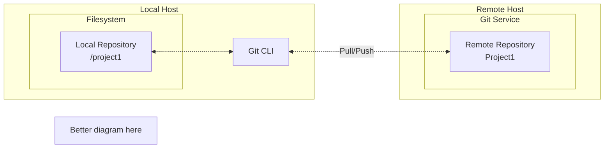

Before you begin this tutorial you’ll need to prepare your local execution environment and verify access to your DataStage projects and remote Git repository.

## Configure your DataStage projects

Ensure you have a DataStage NextGen project existing for each of the [environments](/introduction/cicd-concepts#environments-and-datastage-project-naming) you use during the tutorial:

1. Your source (DEV) DataStage project, and 
1. Each of the environments to which you wish to deploy.  For the purposes of this tutorial we'll stick to CI only.

| Environment | Project name         |
| ----------- | -------------------- |
| Development | `mcix-cli-demo`      | 
| CI          | `mcix-cli-demo-ci`   | 

Ensure your DataStage NextGen projects are not configured as **Git Integrated** project.
- **Do not** select **Git Integrated** when creating the project
- **Do not** select **Enable Git integration** in the settings of the created project

## Generate an API key

If you don't yet have one you should generate an API key. The type of key you need to generate and the process for creating it is different for DataStage NextGen on self-hosted platforms and IBM Cloud-hosted DataStage-as-a-Service:

#### Self-hosted

Create an API key by following the steps in IBM's [documentation](https://www.ibm.com/docs/en/cloud-paks/cp-data/latest?topic=tutorials-generating-api-keys). Follow IBM's guidance on whether you should create ...
  - a **platform API key** or 
  - an **instance API key**.

#### SaaS

Create an IBM Cloud API key (not a Cloud **Pak** API key) by following the steps in IBM's [documentation](https://cloud.ibm.com/docs/iam?topic=iam-manapikey). Note that this is a different type of key to that created for the self-hosted DataStage NextGen.  The value of a key is only provided once - at creation time.  The copy icon alongside each key on the page listing all keys will copy the key's ***ID***, not the actual key value.

## Configuring DataStage test data storage

As part of the tutorial you'll execute unit tests against one of the DataStage flows.
To support this you'll need to configure test data storage in your CI project as this is where tests will be executed. Instructions for doing this in your project are provided [here](https://dataplatform.cloud.ibm.com/docs/content/dstage/dsnav/topics/configuring_test_data_storage.html) 

## Install the MCIX command line

You'll perform the CI/CD actions at the commad line of your local host. Start by ensuring you have a locally-installed MCIX command line interface:

Download the MCIX CLI installation media for your local host platform from [here]({{ site.mcix-cmd-url }}) then follow the installation instructions: 

<details markdown="1">
  <summary>Linux</summary>
TBC
</details>

<details markdown="1">
  <summary>macOS</summary>
1. Unzip it
1. Drag the `mcix.app` folder to your local host's `/Applications` folder
1. Add `export PATH=$PATH:/Applications/mcix.app/Contents/MacOS` to your shell's profile file

One way of permanently adding the command to your path is by entering a command like this in a command shell:

```
echo "export PATH=$PATH:/Applications/mcix.app/Contents/MacOS" >> ~/.profile
```

Note that you configuration may use `~/.bash_profile` or `~/.zprofile`, for example.  This approach ensures the application is located alongside your other applications, is easily discoverable from macOS Finder, and can be invoked from the command shell by typing `mcix`.
</details>

<details markdown="1">
  <summary>Windows</summary>
1. Unzip it
1. Copy the contents into "C:\Program Files\mcix"
1. Permanently add "C:\Program Files\mcix" to your system Path

One way of permanently adding the command to your path is by entering the following in a command shell:

```
setx PATH "%PATH%;C:\Program Files\mcix" /M
```
</details>

Next, verify your MCIX installation using the `mcix system version` command:

```shell
mcix system version
```

Which should produce something like the below. Note that your version number and list of bundled plugins may differ from this example.

```
MettleCI Command Line (build 1.0-123)
(C) 2018-2026 Data Migrators Pty Ltd
system version (1.0-123)
Mac OS X 26.3 (aarch64)
johnmckeever, English (Australia)

Loaded plugins:
 * mcix-asset-analysis-2.1-123.jar
 * MettleCI CP4D Compile Plugin (1.0-123)
 * MettleCI CP4D Export Plugin (1.0-123)
 * MettleCI CP4D Import Plugin (1.0-123)
 * MettleCI CP4D Overlays Plugin (1.0-123)
 * MettleCI CP4D Unit Testing Plugin (1.0-123)
```

Check which namespaces are provided by your MCIX installation.

```shell
mcix help
```

Which should produce something like the below. Note that your list of namespaces, and their ordering, may differ from this example.

```
MettleCI Command Line (build 1.0-123)
(C) 2018-2026 Data Migrators Pty Ltd
Usage: [namespace] [command] [command options]
  Namespaces:
    overlay
    asset-analysis
    datastage
    unit-test
    system
```

You can verify you have access to the commands required for this tutorial with the following commands:

```shell
mcix help 
mcix help datastage export
mcix help datastage import
mcix help overlay apply
mcix help unit-test execute
# mcix help asset-analysis test is out of scope for the current tutorial      
```

Each command should produce a usage statement similar to this:

```
MettleCI Command Line (build 1.0-123)
(C) 2018-2026 Data Migrators Pty Ltd
Usage: overlay apply [options]
  Options:
  * -assets
      Path to DataStage export zip file or directory
  * -output
      Zip file or directory to write updated assets
  * -overlay
      Directory containing asset overlays. Each overlay will be applied in
      specified order when providing multiple (e.g: -overlay dir1 -overlay
      dir2)
    -properties
      Properties file with replacement values
```


---

## Configuring your Git platform

Before running through the CLI-based MCIX pipeline tutorial you need to  ensure you have access to your nominated Git platform, and that the platform hosts a Git repository suitably structured for the storage of IBM DataStage project assets. 

We'll start by establishing a folder on your local host's filesystem which is a local clone of a remote Git repository into which we'll push our DataStage assets.

<!--

-->

## Verify your local Git CLI instalation

If Git is not installed, [install it](https://git-scm.com/install/) before continuing.

Then, on your local host (Linux, macOS, or Windows), run:

```bash
git --version
```

You should see output similar to the below.  Your version number may well be different to that shown here.

```text
git version 2.54.0
```

## Create an empty project git repository

Your Git platform can be GitHub, GitLab, Bitbucket, Azure DevOps, your organisation’s internal Git platform, or any other Git-compatible service,

Login to your Git platform and create a new repository.

| Platform | URL | Links |
| -------- | --- | ----- |
| Azure DevOps | [https://dev.azure.com](https://dev.azure.com) | [Authentication](https://learn.microsoft.com/en-us/azure/devops/integrate/get-started/authentication/authentication-guidance?view=azure-devops),  [Create a repository](https://learn.microsoft.com/en-us/azure/devops/repos/git/create-new-repo?view=azure-devops) |
| Bitbucket | [https://bitbucket.org](https://bitbucket.org) | [Authentication](https://confluence.atlassian.com/bitbucketserver/permanently-authenticating-with-git-repositories-776639846.html), [Create a repository](https://support.atlassian.com/bitbucket-cloud/docs/create-a-git-repository/) |
| GitHub | [https://github.com](https://github.com) | [Authentication](https://docs.github.com/en/authentication/keeping-your-account-and-data-secure/about-authentication-to-github), [Create a repository](https://docs.github.com/en/repositories/creating-and-managing-repositories/creating-a-new-repository) |
| GitLab | [https://gitlab.com](https://gitlab.com) | [Authentication](https://docs.gitlab.com/auth/user_authentication/), [Create a repository](https://docs.gitlab.com/user/project/repository/#create-a-repository) |

Use a simple, purpose-based repository name, such as `mcix-cli-demo`.

Avoid naming the repository after a specific environment, such as `myproject-prod` or `myproject-test`. The repository should represent the single source of truth for the DataStage initiative, not one particular deployment target.

In this model, environments such as Dev, CI, QA, and Prod are separate DataStage projects. Each environment is populated from the repository at different points in the delivery lifecycle. For example, Dev may contain the latest working changes, QA may contain a tested candidate release, and Prod should contain only the approved production version.  Read more about our recommended project naming scheme [here](/introduction/cicd-concepts#environments-and-datastage-project-naming).

In other words, the repository stores the authoritative versioned source, while the DataStage projects represent environment-specific deployments of that source.

You do not need to enable any provider-specific features such as build pipelines, actions, runners, wikis, discussions, boards, branch protection rules, or deployment features for this tutorial.

Recommended settings for your repository:

| Setting | Value |
| ------- | ----- |
| Repository name   | mcix-cli-demo |
| Visibility        | Private  |
| Default branch    | main     |
| .gitignore        | Yes      |
| README            | Yes      |
| Licence           | Optional |
| Issues:           | Disabled |
| Wiki:             | Disabled |
| Discussions:      | Disabled |
| Projects/Boards:  | Disabled |
| Branch protection | Disabled |

<cds-inline-notification
  kind="info"
  title="Note"
  subtitle="Your Git platform will provide HTTPS and SSH references to you newly-created repository. HTTPS and SSH are the two primary secure transport protocols used to connect Git clients to remote repositories.  HTTPS uses port 443, relies on token-based or password authentication, and is generally easier to configure and more firewall-friendly.  SSH (Secure Shell) uses public/private key cryptography on port 22, and offers the convenience of eliminating the need for repetitive credential entry after initial setup."
  low-contrast
  hide-close-button="true"
  id="overlay-notification">
</cds-inline-notification>

## Clone the template repository locally

A MettleCI template repository is provided for convenience and as a recommended starting point. It is available to clone from [here](https://github.com/MettleCI/datastage-nextgen-repo-template). This repository is hosted on GitHub but is a generic Git repository which can be cloned to your local host and subsequently 
deployed to any target Git platform.

You are not required to follow the template repository's structure. You can organise your repository in whatever way best suits your project, including where you store DataStage assets, scripts, configuration files, documentation, and other non-DataStage artefacts. The repository does, however, demonstrate a practical best-practice layout that is easy to understand, easy to deploy, and suitable for most delivery pipelines. Starting from the template helps you avoid unnecessary setup decisions and gives you a working structure that can be adapted later as your needs evolve.

**Process**

These commands work the same regardless of your host platform (macOS, Windows, or Linux)

1. Configure your Git environment with your name and email:
```bash
git config --global user.name "Your Name"
git config --global user.email "you@example.com"
```

1. Copy the URL of the MettleCI template repository hosted on GitHub:
```
https://github.com/MettleCI/datastage-nextgen-repo-template
```

1. Clone the repository template to your local host:
```shell
git clone https://github.com/MettleCI/datastage-nextgen-repo-template
```
or, using SSH:
```bash
git clone git@github.com/MettleCI/datastage-nextgen-repo-template.git
```
If desired, you can test SSH access using:
```bash
ssh -T git@github.com
ssh -T git@gitlab.com
ssh -T git@bitbucket.org
etc.
```
If you want to use SSH with Azure DevOps repositories then use the SSH host shown in the 'clone' instructions of your repository in the Azure DevOps user interface. e.g.,
```shell
git@ssh.dev.azure.com:v3/MyOrg/mcix-cli-demo
```
A successful response to `ssh -T` usually confirms that you have authenticated, even if it says shell access is not provided.<br/><br/>
Both of these approaches (HTTPS or SSH) will require you to authenticate yourself to your Git platform.  When using HTTPS, your Git platform may require a personal access token rather than your account password.  See your Git platform's documentation for more details.<br/><br/>

1. To help keep things organised let's rename the directory containing your local Git repository 
clone with the name of *your* newly-created remote repository to which it will soon point:
```shell
mv datastage-nextgen-repo-template mcix-cli-demo
```
1. Inspect the contents of the cloned repository:
```shell
cd mcix-cli-demo
ls -al
```
Which should look like this:
```text
mcix-cli-demo/
├── .git
├── .gitattributes
├── .gitignore
├── datastage/
├── filesystem/
├── overlays/
└── README.md
```
The `.git` and `.gitattributes` files tell your Git CLI that this folder is 
a Git repository, and what its properties are.

## Push your local repository template to remote

Now you'll point your local Git clone to your new remote repository and push 
the contents we cloned from the template into that remote.

1. We'll start by confirming your local repository currently 
points to the remote template repository. From within your local directory:
```shell
git remote -v
```
This should show:
```shell
// For HTTPS:
origin	https://github.com/MettleCI/datastage-nextgen-repo-template (fetch)
origin	https://github.com/MettleCI/datastage-nextgen-repo-template (push)
// For SSH:
origin  git@github.com:MettleCI/datastage-nextgen-repo-template.git (fetch)
origin  git@github.com:MettleCI/datastage-nextgen-repo-template.git (push)
```
1. Now change the remote to your recently-created repository:
```shell
git remote set-url origin <YOUR_NEW_REPOSITORY_URL>   
```
For example:
```shell
git remote set-url origin https://myusername@dev.azure.com/MyOrg/MyProject/_git/mcix-cli-demo
```
Again, you can get the repository URL by clicking the **clone** button of your repository in the 
Azure DevOps user interface and selecting 'HTTPS'.<br/><br/>
You can verify your `git remote set` has worked by re-issuing... 
```shell
git remote -v
```
This should now show your remote as the Git repository you specified.<br/><br/>
1. To complete this step, we'll push the template repository up to your remote Git repository, 
ensuring you have a correctly structured remote repository, ready to receive your project assets:
```shell
git push -u origin main
```
This will produce output looking something like this:
```shell
Enumerating objects: 78, done.
Counting objects: 100% (78/78), done.
Delta compression using up to 10 threads
Compressing objects: 100% (57/57), done.
Writing objects: 100% (78/78), 52.67 KiB | 52.67 MiB/s, done.
Total 78 (delta 19), reused 72 (delta 16), pack-reused 0 (from 0)
remote: Resolving deltas: 100% (19/19), done.
To https://github.com/johnmckeever/mcix-cli-demo.git
 * [new branch]      main -> main
branch 'main' set up to track 'origin/main'.
```
Now you can login to your repository's user interface and inspect its contents.
