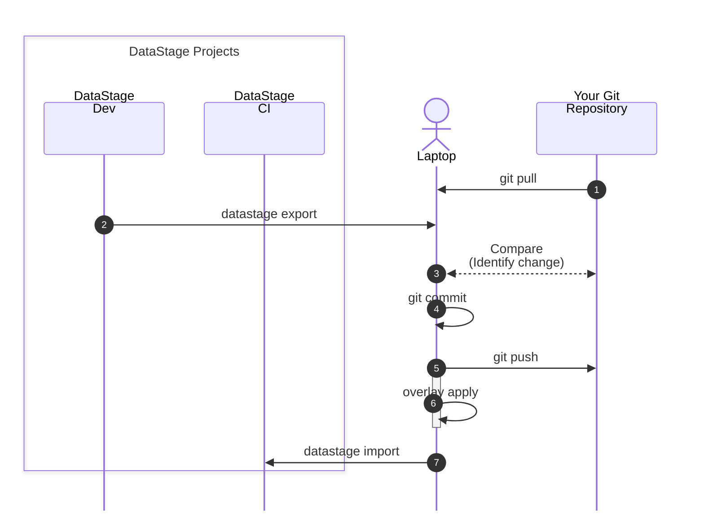

<script type="module" src="https://1.www.s81c.com/common/carbon-for-ibm-dotcom/version/v2.8.0/content-block.min.js"></script>
<script type="module" src="https://1.www.s81c.com/common/carbon-for-ibm-dotcom/version/v2.8.0/content-block-mixed.min.js"></script>
<script type="module" src="https://1.www.s81c.com/common/carbon-for-ibm-dotcom/version/v2.8.0/link-list.min.js"></script>

<c4d-link-list type="default" slot="complementary">
  <c4d-link-list-heading>Resources</c4d-link-list-heading>
  <c4d-link-list-item
    href="tutorial-introduction"
    target="cmd-ref"
    cta-type="local"
  >
    Tutorial Introduction
  </c4d-link-list-item>
  <c4d-link-list-item
    href="tutorial-prerequisites"
    target="cmd-ref"
    cta-type="local"
  >
    Tutorial Prerequisites
  </c4d-link-list-item>
  <c4d-link-list-item
    href="/command-line/command-reference"
    target="cmd-ref"
    cta-type="local"
  >
    Sample DataStage Project
  </c4d-link-list-item>
  <c4d-link-list-item
    href="assets/mcix-pipeline.sh"
    target="cmd-ref"
    cta-type="local"
  >
    Template pipeline script (bash)
  </c4d-link-list-item>
  <c4d-link-list-item
    href="assets/mcix-pipeline.ps1"
    target="bash"
    cta-type="local"
  >
    Template pipeline script (powershell)
  </c4d-link-list-item>
  <c4d-link-list-item
    href="/command-line/command-reference"
    target="powershell"
    cta-type="local"
  >
    MCIX Command Reference
  </c4d-link-list-item>
</c4d-link-list>

## Scenario

This tutorial shows how to replicate the actions of you CI/CD tool manually by issuing 
various `mcix` commands at the command line.  In the real world your pipeline would normally 
be executed by your CI/CD tool's integrated pipeline orchestration engine.  

We'll break the tutorial into two steps:

1. Establishing the  prerequisites, ensuring ...
  - the necessary command line tools (`mcix` and `git`) are installed and configured you on local host
  - you have access to a remote Git repository with the relevant configuration and permissions
1. Manaully replicating the steps involved in a typical CI/CD pipeline on your local hosts's command line.

It is assumed you already have:

* a source Nextgen DataStage project containing compiled and executing DataStage flows and associated assets
* unit-test specifications and associated test data for at least some of those DataStage flows
* a target Nextgen DataStage project into which assets can be imported, compiled, and executed
* environment-specific overlay files stored in your repository

* asset-analysis rules available


**Note:** If you don't have a source NextGen DataStage project available you can download a sample project 
for tutorial purposes (below) and import it into your source project in your DataStage NextGen environment:

&nbsp;&nbsp;&nbsp;&nbsp;&nbsp;[](assets/electromart.zip)
<br/>&nbsp;[Download<br/>ElectroMart](assets/electromart.zip)

---

# Constructing a pipeline

The pipeline you'll simulate will:

1. Export assets from a source project.
1. Apply environment-specific changes using overlays.
1. Import the modified assets into a target project.

  1. Run asset analysis tests.

1. Execute DataStage unit tests in the target project.



The example assumes you are moving DataStage assets from a source project, applying environment-specific overlays, importing them into a target project, then validating and testing the result.

---

## 1. Prepare a working directory

After you've followed the [prerequisite steps](/command-line/tutorial-prerequisites) to create your local Git repository you'll have established your directory to hold exported assets, overlay output, reports, and test results.  Your repository directory will look something like this:

```text
mcix-cli-pipeline-demo/
├── .git              # Tells the Git CLI this is a local Git repository
├── .gitattributes    # Tells the Git CLI the repository properties
├── .gitignore        # Tells the Git CLI which files to ignore
├── datastage/        # Where DataStage assets will to be stored
│                     # (in asset type-specific sub-directories)
├── filesystem/       # Where non-DataStage assets will to be stored
│                     # (scripts, reference files, etc.)
├── pipelines/        # Stores CI/CD tools' pipeline definitions
│                     # (Not relevant to this tutorial)
├── overlays/         # Stores overlay configuration files 
├── README.md         # The repository's homepage (in markdown)
└── unit-tests/       # DataStage unit test specifications and data files
```

Of particular note is the `datastage` directory.  This is where our DataStage asset will be placed, organised into subdirectories by their asset type.

---

## 2. Define your connection details

For readability, define the values you will use throughout the pipeline as shell variables.

```bash
# The location of your DataStage instance
# This tutorial uses the same instance for both source and target environments
export CP4D_URL="https://dataplatform.cloud.ibm.com/"    # DataStage as-a-service on IBM Cloud 
                                                         # or your internal CPD instance
export CP4D_USERNAME="myname@MyOrg.com"                  # DataStage username
export CP4D_API_KEY="my-api-key"                         # DataStage password

# Project names
export SOURCE_PROJECT="mcix-cli-demo" # The location of your development (source) project
export TARGET_PROJECT="mcix-cli-demo_CI"                 # Demo will deploy to a 'CI' environment

# Local working folders
export EXPORT_DIR="./datastage"                          # Exported assets
export OVERLAY_DIR="./overlaid-assets"                   # Overlaid assets
export REPORT_DIR="./reports"                            # JUnit report outputs
```

Adjust the variable names and values to match your environment. If you don't yet have one, you can generate a IBM Cloud Pak API key [here](https://www.ibm.com/docs/en/cloud-paks/cp-data/5.3.x?topic=tutorials-generating-api-keys).

---

## 3. Export DataStage assets

The first stage exports assets from the source DataStage project.

```bash
mcix datastage export \
  -url "$CP4D_URL" \
  -project "$SOURCE_PROJECT" \
  -username "$CP4D_USERNAME" \
  -api-key "$CP4D_API_KEY" \
  -export-path "$EXPORT_DIR"
```

<details markdown="1">
  <summary>Example output</summary>
```bash
MettleCI Command Line (build 1.0-123)
(C) 2018-2026 Data Migrators Pty Ltd
datastage export (1.0-123)
Connecting to CP4D...
Exporting project containing 108 assets
 * Write scRegionReference (data_intg_subflow) - SUCCESS
 * Write TxFctFinDs (data_intg_test_case) - SUCCESS
 * Write TxTransformedSales_container (data_intg_flow) - SUCCESS
 * Write LdDimDate (data_intg_flow) - SUCCESS
 * Write LdFactSales (data_intg_flow) - SUCCESS
 <<<REDACTED FOR BREVITY>>>
 * Write UpdateCustomerSurrogateKeys.DataStage job (job) - SUCCESS
 * Write UpdateSupplierSurrogateKeys.DataStage job (job) - SUCCESS
 * Write UpdateFinanceSurrogateKeys.DataStage job (job) - SUCCESS
 * Write Trial job - UpdDailySalesSummary (job) - SUCCESS
 * Write UpdDailySalesSummary.DataStage sequence (job) - SUCCESS
SUCCESS: Completed 108 actions
```
</details>

After this step, your exported DataStage assets should be available in your specified directory, organised by asset type:
```text
$> ls -al exported-assets
total 0
drwxr-xr-x@  4 johnmckeever  staff   128B 17 Jun 16:43 connection
drwxr-xr-x@ 38 johnmckeever  staff   1.2K 17 Jun 16:43 data_intg_flow
drwxr-xr-x@  3 johnmckeever  staff    96B 17 Jun 16:43 data_intg_subflow
drwxr-xr-x@  3 johnmckeever  staff    96B 17 Jun 16:43 data_intg_test_case
drwxr-xr-x@ 58 johnmckeever  staff   1.8K 17 Jun 16:43 job
drwxr-xr-x@ 12 johnmckeever  staff   384B 17 Jun 16:43 orchestration_flow
drwxr-xr-x@  4 johnmckeever  staff   128B 17 Jun 16:43 parameter_set
```

This directory of exported assets becomes the input to the next stage.

<cds-inline-notification
  kind="info"
  title="Note"
  low-contrast="true"
  hide-close-button="true">
  <div class="cds--inline-notification__subtitle">
    <p>The <code>mcix datastage export</code> command in the current release of MCIX performs a bulk export of the entire DataStage projecty to your local directory.</p>
    <p>A forthcoming release of IBM Cloud Pak will provide an API update which permits the <code>mcix datastage export</code> command to identify and export only
    those DataStage assets which are different to those already in the specified export directory.</p>
  </div>
</cds-inline-notification>

---

## 4. Identify and commit changes

Now we'll identify which of our exported assets in our local directory are different to 
our source of truth stored in Git; in other words, the difference between our local and 
remote Git repositories.  We'll do this using the Git command line:

```bash
git status
```

As you have an empty remote Git repository this command will list a

```bash
Refresh index: 100% (291/291), done.
On branch main
Your branch is up to date with 'origin/main'.

Untracked files:
  (use "git add <file>..." to include in what will be committed)
	datastage

nothing added to commit but untracked files present (use "git add" to track)
```

We can see, as expected, that we have new files (in the `datastage` directory) added to our local repository
 which are not present in the remote.  Let's tell Git we want to bring those files under version control by 
 **staging** them:

 ```bash
 git add datastage/
 ```

 This command will not produce a response, so let's check what's changed:

 ```bash
git status
```

We'll now see that the requested files are now under version control, but have yet to be comitted to the remote repository.
Your terminal output will look something like this:

```bash
Refresh index: 100% (291/291), done.
On branch main
Your branch is up to date with 'origin/main'.

Changes not staged for commit:
  (use "git add/rm <file>..." to update what will be committed)
  (use "git restore <file>..." to discard changes in working directory)
	added:      FlowName1.json
	added:      FlowName2.json
	added:      FlowName3.json
	added:      FlowName4.json
	added:      FlowName5.json
	added:      FlowName6.json
  etc.
```

Now let's commit these changes to the local repository:

```bash
git commit -m "Initial tutorial commit"
```

... and finally, push them to the remote repository:

```bash
git push
```

---

## 5. Import DataStage assets

Now import the overlaid assets into the target DataStage project.

```bash
mcix datastage import \
  -url "$TARGET_CP4D_URL" \
  -project "$TARGET_PROJECT" \
  -username "$CP4D_USERNAME" \
  -api-key "$CP4D_API_KEY" \
  -input-dir "$OVERLAY_DIR"
```

At this point, the transformed DataStage assets have been deployed into the target project.

---

## 6. Apply environment overlays

Next, we'll apply overlays to transform the exported assets for the target environment.  For example, overlays might change connection names, schema names, database endpoints, project parameters, or other environment-specific values.

A common pattern is to keep overlays in source control, for example:

```text
overlays/
├── ci/
│   ├── connection
│   ├── job
│   └── parameter_set
│       ├── MyParameterSet1.json
│       └── MyParameterSet2.json
├── qa/
│   └── etc. 
└── prod/
│   └── etc.
```

Start by creating an overlay file in your `overlays/ci` directory called `ci.overlay` and populating it with this overlay specification:

```json
{
  DatasetDir:   "/px-storage/data/electromart/ci/dataset",
  LandingDir:   "/px-storage/data/electromart/ci/file",
  StateFileDir: "/px-storage/data/electromart/ci/file",
  ReportDir:    "/px-storage/data/electromart/ci/report",
  RejectDir:    "/px-storage/data/electromart/ci/reject",
}
```
Then apply the overlay to te recently exported assets to generate a new set of **overlaid** assets:

```bash
mcix overlay apply \
  -input-dir "$EXPORT_DIR" \
  -overlay-dir "./overlays/test" \
  -output-dir "$OVERLAY_DIR"
```

After this step, the transformed assets should be available in:

```text
./overlaid-assets
```

---


## 7. Run asset analysis tests

Next, run asset analysis tests to validate that the imported assets comply with your rules.

```bash
mcix asset-analysis test \
  --url "$TARGET_CP4D_URL" \
  --project "$TARGET_PROJECT" \
  --username "$CP4D_USERNAME" \
  --api-key "$CP4D_API_KEY" \
  --rules-dir "./asset-analysis-rules" \
  --junit-output "$REPORT_DIR/asset-analysis-results.xml"
```

This produces a JUnit-style test result file:

```text
./reports/asset-analysis-results.xml
```

That file can later be consumed by a CI/CD system such as GitHub Actions, Azure DevOps, Jenkins, or Tekton.

---


## 7. Run unit tests

Now we'll execute the DataStage unit tests.

```bash
mcix unit-test execute \
  -url "$TARGET_CP4D_URL" \
  -project "$TARGET_PROJECT" \
  -username "$CP4D_USERNAME" \
  -api-key "$CP4D_API_KEY" \
  -junit-output "$REPORT_DIR/unit-test-results.xml"
```

You'll see the test being executed in the target environment:

```bash
MettleCI Command Line (build 1.0-99)
(C) 2018-2026 Data Migrators Pty Ltd
unit-test execute (1.0-123)
Finding changes to flows and unit tests
Executing 1 test cases with 8 concurrent jobs...
 * Test TxFctFinDs - PASSED (7s)
SUCCESS: Executed 1 tests
```

This produces another JUnit-style result file:

```text
./test-results/unit-test-results.xml
```

Note that if you were to run this command again then MCIX would identify that 
the test has already succeeded successfully and doesn't need to be re-executed:

```bash
MettleCI Command Line (build 1.0-99)
(C) 2018-2026 Data Migrators Pty Ltd
unit-test execute (1.0-123)
Finding changes to flows and unit tests
 * Test TxFctFinDs no changes detected - SKIPPED
Executing 0 test cases with 8 concurrent jobs...
SUCCESS: Executed 0 tests
```

---

## 8. Run the full pipeline as a script

Once you've run the individual commands you may wish to place them into a shell script to reproduce them easily. 

Templates of this script are available for Linux/macOS and Windows (below)

In each case you'll need to update the file's configuration values to suit your environment. For example:

```bash
$CP4D_URL="https://source-cpd.example.com"
$CP4D_USERNAME = "username@example.com"
$CP4D_API_KEY  = "your-api-key"
$PROJECT  = "Development"
$TARGET_PROJECT  = "Test"
$TARGET_PROJECT  = "Test_CI"
```

<details markdown="1">
  <summary>Linux/macOS</summary>
&nbsp;&nbsp;&nbsp;&nbsp;&nbsp;&nbsp;&nbsp;&nbsp;&nbsp;&nbsp;&nbsp;[](mcix-pipeline.sh)
<br/>&nbsp;&nbsp;&nbsp;&nbsp;&nbsp;&nbsp;[Download<br/>mcix-pipeline.sh](mcix-pipeline.sh)

Make the script executable:
```bash
chmod +x mcix-pipeline.sh
```

Run it:
```bash
./mcix-pipeline.sh
```

</details>

<details markdown="1">
  <summary>Windows</summary>
&nbsp;&nbsp;&nbsp;&nbsp;&nbsp;&nbsp;&nbsp;&nbsp;&nbsp;&nbsp;&nbsp;[](mcix-pipeline.ps1)
<br/>&nbsp;&nbsp;&nbsp;&nbsp;&nbsp;&nbsp;[Download<br/>mcix-pipeline.bat](mcix-pipeline.ps1)

This script assumes **PowerShell 7.4 or later**. The combination of `$ErrorActionPreference = "Stop"` and `$PSNativeCommandUseErrorActionPreference = $true` causes the script to stop if an external command such as `mcix` returns a non-zero exit code. In older versions of PowerShell, native command failures do not automatically behave like terminating PowerShell errors, so scripts may need to check `$LASTEXITCODE` explicitly after each command.

Yes. For a tutorial, I’d describe the process as:

## Running the PowerShell pipeline script

Download the PowerShell script to your local repository folder and review it before running it.

For example, save the script as:

```text
run-mcix-pipeline.ps1
````

Then open PowerShell, change into your repository directory, and run the script:

```powershell
cd path\to\mcix-cli-pipeline-demo
.\run-mcix-pipeline.ps1
```

If PowerShell blocks the script because of your local execution policy, you can allow the script to run for this session only:

```powershell
Set-ExecutionPolicy -Scope Process -ExecutionPolicy Bypass
```

Then run the script again:

```powershell
.\run-mcix-pipeline.ps1
```

This does not permanently change your system-wide PowerShell policy. It only applies to the current PowerShell session.

When the script completes successfully, it should have exported the DataStage assets, applied overlays, imported the overlaid assets into the target project, and produced the configured test result files.

````

I’d also add this small safety note:

```markdown
> **Note:** Always review downloaded scripts before running them, especially scripts that contain credentials, API keys, or deployment commands.
````

</details>

You'll need to update the variables wit your environment-specific configuration items, like URL's, credentials, and project names.

---

## 9. Expected result

After the script completes successfully, you should have:

```text
mcix-pipeline-demo/
├── exported-assets/
│   └── exported DataStage assets
├── overlaid-assets/
│   └── transformed assets ready for import
├── reports/
│   └── asset-analysis-results.xml
└── test-results/
    └── unit-test-results.xml
```

The pipeline has:

1. Exported assets from the source project.
2. Applied target-environment configuration.
3. Imported assets into the target project.
4. Validated the assets using asset analysis rules.
5. Executed unit tests against the deployed solution.

---

## Notes for real-world usage

Avoid hard-coding credentials directly in the script. For local use, prefer environment variables or a secure secrets manager.

The same sequence can later be moved into a CI/CD platform. In that case, each command becomes a pipeline step, and the JUnit XML files can be published as test results.

For repeatable deployments, keep the following items in source control:

```text
overlays/
asset-analysis-rules/
unit-test definitions/
mcix-pipeline.sh
```

Do not usually store exported runtime output or generated reports in source control.

---

