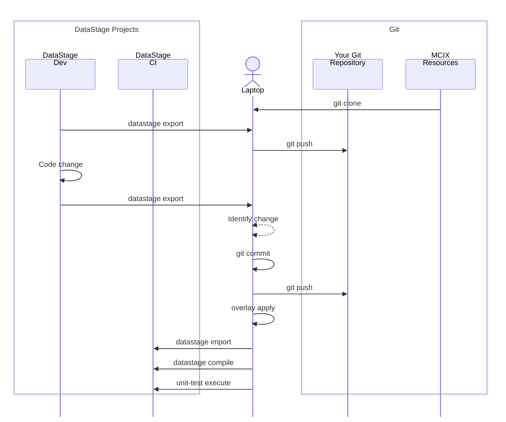

## Scenario

This tutorial shows how to replicate the actions of your CI/CD tool manually by issuing 
various `mcix` commands at the command line.  In the real world your pipeline would normally 
be executed by your CI/CD tool's integrated pipeline orchestration engine.  

We'll break the tutorial into two steps:

1. Establishing the  prerequisites, ensuring ...
  - the necessary command line tools (`mcix` and `git`) are installed and configured on your local host
  - you have access to a remote Git repository with the relevant configuration and permissions
1. Manually replicating the steps involved in a typical CI/CD pipeline on your local command line.

It is assumed you already have:

* a source DataStage NextGen project containing compiled and executing DataStage flows and associated assets
* unit-test specifications and associated test data for at least some of those DataStage flows
* a target DataStage NextGen project into which assets can be imported, compiled, and executed
* environment-specific overlay files stored in your repository

* asset-analysis rules available


**Note:** If you don't have a source NextGen DataStage project available you can download a sample project 
for tutorial purposes (below) and import it into your source project in your DataStage NextGen environment:

&nbsp;&nbsp;&nbsp;&nbsp;&nbsp;[](../../assets/files/electromart.zip)
<br/>&nbsp;[Download<br/>ElectroMart](/assets/files/electromart.zip)

<cds-inline-notification
  kind="warning"
  subtitle="Always review downloaded assets before running them"
  low-contrast="true"
  hide-close-button="true">
</cds-inline-notification>

### Notes for real-world usage

- Avoid hard-coding credentials directly in your commands. For local use you can use environment variables to provide consistent values across calls.
- The same sequence can later be moved into a CI/CD platform. In that case each command becomes a pipeline step, and the JUnit XML files can be published as test results to the platform.
- Do not store generated runtime output or reports in source control.

---

## Constructing a pipeline

The pipeline you'll simulate will:

1. Export all assets from a source DataStage project.
1. Commit and push them to a remote Git repository.
1. Change an asset in the source DataStage project.
1. Export the assets from the source project.
1. Commit and push modified assets to a remote Git repository. 
1. Apply environment-specific changes using overlays.
1. Import the modified assets into a target project.

  1. Run asset analysis tests.

1. Execute DataStage unit tests in the target project.



The example assumes you are moving DataStage assets from a source project, applying environment-specific overlays, importing them into a target project, then validating and testing the result.

---

## 1. Prepare your working directory

After you've followed the [prerequisite steps](/command-line/tutorial-prerequisites) to create your local Git repository you'll have established your directory to hold exported assets, overlay output, reports, and test results.  Your repository directory will look something like this:

```text
mcix-cli-demo/
├── .git              # Tells the Git CLI this is a local Git repository
├── .gitattributes    # Tells the Git CLI the repository properties
├── .gitignore        # Tells the Git CLI which files to ignore
├── datastage/        # Where DataStage assets will be stored
│                     # (in asset type-specific sub-directories)
├── filesystem/       # Where non-DataStage assets will be stored
│                     # (scripts, reference files, etc.)
├── overlays/         # Stores overlay configuration files 
└── README.md         # The repository's homepage (in markdown)
```

Of particular note is the `datastage` directory.  This is where our DataStage asset will be placed, organised into subdirectories by their asset type.

---

## 2. Define your connection details

For readability, define the values you will use throughout the pipeline as shell variables.

```bash
# The location of your DataStage instance
# This tutorial uses the same instance for both source and target environments
export CP4D_URL="https://cpd.myorg.com/"    # DataStage as-a-service on IBM Cloud 
                                            # or your internal CPD instance
export CP4D_USERNAME="MyUserName"           # DataStage username
export CP4D_API_KEY="my-api-key"            # DataStage API key

# Project names
export SOURCE_PROJECT="mcix-cli-demo"       # The location of your development (source) project
export TARGET_PROJECT="mcix-cli-demo-ci"    # Demo will deploy to a 'CI' environment

# Local working folders
export EXPORT_DIR="./datastage"             # Exported assets
export OVERLAY_DIR="./overlaid-assets"      # Overlaid assets
export REPORT_DIR="./reports"               # JUnit report outputs
```

Adjust the variable names and values to match your environment.

---

## 3. Export DataStage assets

The first stage [exports](/command-line/command-reference#datastage-export) assets from the source DataStage project.

```bash
mcix datastage export \
  -url "$CP4D_URL" \
  -project "$SOURCE_PROJECT" \
  -user "$CP4D_USERNAME" \
  -api-key "$CP4D_API_KEY" \
  -export-path "$EXPORT_DIR"
```

<details markdown="1">
  <summary>Example output</summary>
```bash
MettleCI Command Line (build 1.0-123)
(C) 2018-2026 Data Migrators Pty Ltd
datastage export (1.0-123)
Connecting to CP4D...
Exporting project containing 108 assets
 * Write scRegionReference (data_intg_subflow) - SUCCESS
 * Write TxFctFinDs (data_intg_test_case) - SUCCESS
 * Write TxTransformedSales_container (data_intg_flow) - SUCCESS
 * Write LdDimDate (data_intg_flow) - SUCCESS
 * Write LdFactSales (data_intg_flow) - SUCCESS
 <<<REDACTED FOR BREVITY>>>
 * Write UpdateCustomerSurrogateKeys.DataStage job (job) - SUCCESS
 * Write UpdateSupplierSurrogateKeys.DataStage job (job) - SUCCESS
 * Write UpdateFinanceSurrogateKeys.DataStage job (job) - SUCCESS
 * Write Trial job - UpdDailySalesSummary (job) - SUCCESS
 * Write UpdDailySalesSummary.DataStage sequence (job) - SUCCESS
SUCCESS: Completed 108 actions
```
</details>

After this step, your exported DataStage assets should be available in your specified directory (`datastage`), organised by asset type:
```text
$> ls -al datastage
total 0
drwxr-xr-x@  4 johnmckeever  staff   128B 17 Jun 16:43 connection
drwxr-xr-x@ 38 johnmckeever  staff   1.2K 17 Jun 16:43 data_intg_flow
drwxr-xr-x@  3 johnmckeever  staff    96B 17 Jun 16:43 data_intg_subflow
drwxr-xr-x@  3 johnmckeever  staff    96B 17 Jun 16:43 data_intg_test_case
drwxr-xr-x@ 58 johnmckeever  staff   1.8K 17 Jun 16:43 job
drwxr-xr-x@ 12 johnmckeever  staff   384B 17 Jun 16:43 orchestration_flow
drwxr-xr-x@  4 johnmckeever  staff   128B 17 Jun 16:43 parameter_set
```

This directory of exported assets becomes the input to the next stage.

---

## 4. Initial project commit

This section uses git commands.  If you're not familiar with git commands or 
terminology you should start by reading [git concepts](/introduction/cicd-concepts#git-essentials).

We'll now commit and push the entire exported project to our remote Git 
repository, giving us a  baseline against which we can manage future change.  
Start by adding the  export files to the Git **staging area**:

```shell
git add .
```
Next, we'll commit them to the **local repository** and push it to the 
**remote repository**:

```shell
git commit -m "Initial commit"
git push origin main
```

The commit message (`git commit -m "<message here>"`) can be anything you like, 
but it's best practice to use a description other developers will understand.

Now you can visit your Git repository's user interface and verify that the export assets have been pushed successfully.

## 5. Make a development change 

Next, you'll log in to your DataStage NextGen user interface and make a trivial change to one of your flows.

1. Navigate to your dev project (e.g. `mcix-cli-demo`) and open a DataStage flow.  If you've imported the sample project references in the [prerequisites](/command-line/tutorial-prerequisites) then open flow `LdDailySalesSummary`.

1. Select any stage on the canvas and at the bottom of the **Stage** tab enter/modify the long description field with any text you want.

1. Click **Apply**, then save your flow (you don't need to compile it.)

## 6. Identify and commit changes

Now we'll re-export our assets to our local working directory and identify which of those assets are different to those stored in your local Git repository. Start by re-exporting your development assets:

```bash
mcix datastage export \
  -url "$CP4D_URL" \
  -project "$SOURCE_PROJECT" \
  -user "$CP4D_USERNAME" \
  -api-key "$CP4D_API_KEY" \
  -export-path "$EXPORT_DIR"
```

<cds-inline-notification
  kind="info"
  title="Note"
  low-contrast="true"
  hide-close-button="true">
  <div class="cds--inline-notification__subtitle">
    <p>The <code>mcix datastage export</code> command in the current release of MCIX performs a bulk export of the entire DataStage project to your local directory.</p>
    <p>A forthcoming release of IBM Cloud Pak will provide an API update which permits the <code>mcix datastage export</code> command to identify and export only
    those DataStage assets which are different to those already in the specified export directory.</p>
  </div>
</cds-inline-notification>

Next, we'll see what's changed:

```bash
git status
```

Which produces the following output (in this example we edited flow `LdDailySalesSummary`):

```shell
On branch main
Your branch is up to date with 'origin/main'.

Changes not staged for commit:
  (use "git add <file>..." to update what will be committed)
  (use "git restore <file>..." to discard changes in working directory)
	modified:   datastage/data_intg_flow/LdDailySalesSummary.json
	modified:   datastage/data_intg_test_case/TxFctFinDs.zip

no changes added to commit (use "git add" and/or "git commit -a")
```
<cds-inline-notification
  kind="info"
  low-contrast="true"
  hide-close-button="true">
  <div class="cds--inline-notification__subtitle">
    You'll notice that as well as the expected <code>LdDailySalesSummary</code> there
    are also one or more 'modified' lines for ZIP files.  These files are (currently) regenerated as part of the export process. For this tutorial, we are only committing the deliberate flow change, so leave the regenerated test-case ZIP unstaged.
    <br/><br/>
    For this reason we'll ignore the <code>.zip</code> file.
  </div>
</cds-inline-notification>

We can see, as expected, that we have new files (in the `datastage` directory) added to our local repository
which are not present in the remote.  Let's tell Git we want to bring those files under version control by 
**staging** them:

Now let's stage, commit, and push our changes to the remote Git repository 
(you may find it convenient to copy the path to the file from the `modified` line of your `git status` output):
```bash
git add datastage/data_intg_flow/LdDailySalesSummary.json
```

This command will not produce a response. Let's check what's changed:
 ```bash
git status
```

We'll now see that the requested files are now **tracked** (under version control) but have yet to be committed or pushed to the remote repository.
```shell
On branch main
Your branch is up to date with 'origin/main'.

Changes to be committed:
  (use "git restore --staged <file>..." to unstage)
	modified:   datastage/data_intg_flow/LdDailySalesSummary.json

Changes not staged for commit:
  (use "git add <file>..." to update what will be committed)
  (use "git restore <file>..." to discard changes in working directory)
	modified:   datastage/data_intg_test_case/TxFctFinDs.zip
```

As described above, you can ignore the `Changes not staged for commit` part as that's related to the `.zip` file we're ignoring.

Now let's commit these changes to the local repository and push them to the remote:

```bash
git commit -m "Initial tutorial commit"
git push
```
Now you can revisit your Git repository's user interface and verify you can see those commits.

---

<cds-inline-notification
  kind="info"
  low-contrast="true"
  hide-close-button="true">
  <div class="cds--inline-notification__subtitle">
The operations from this point forward would normally be performed by a pipeline in your CI/CD platform which, in most cases, would be automatically triggered by the `git push` you've just performed.  For this CLI tutorial you'll be performing them manually.
  </div>
</cds-inline-notification>

&nbsp;

<cds-inline-notification
  kind="info"
  low-contrast="true"
  hide-close-button="true">
  <div class="cds--inline-notification__subtitle">
    An important distinction between the CLI and the MCIX native operations for CI/CD platforms is that the following tutorial steps will take you theough the execution of the
    following steps:
    <br/><br/>
    <code>overlay apply</code> → <code>datastage import</code> → <code>datastage compile</code>
    <br/><br/>
    Given that this combination of operations is very common, the MCIX native operators for CI/CD platforms provide a shortcut operation called <b>datastage deploy</b> which compopses all three operations, in the order described, into a single call. 
    <br><br>
    See the examples for 
    <a href="/github/action-reference#datastage-deploy">GitHub</a> and 
    <a href="/azure/azure-task-ref#datastage-deploy">Azure</a>.
  </div>
</cds-inline-notification>


---

## 7. Apply environment overlays

Next, we'll apply overlays to transform the exported assets for the target environment.  For example, overlays might change connection names, schema names, database endpoints, project parameters, or other environment-specific values.

A common pattern is to keep overlays in source control, for example:

```text
overlays/
├── ci/
│   ├── connection
│   ├── flows
│   ├── job
│   └── parameter_set
│       ├── MyParameterSet1.json
│       └── MyParameterSet2.json
├── qa/
│   └── etc. 
└── prod/
    └── etc.
```

Start by creating an overlay file in your `overlays/ci` directory called `ci.overlay` and populating it with this overlay specification:

```json
{
  DatasetDir:   "/px-storage/data/electromart/ci/dataset",
  LandingDir:   "/px-storage/data/electromart/ci/file",
  StateFileDir: "/px-storage/data/electromart/ci/file",
  ReportDir:    "/px-storage/data/electromart/ci/report",
  RejectDir:    "/px-storage/data/electromart/ci/reject",
}
```
Then [apply the overlay](/command-line/command-reference#overlay-apply) to the recently exported assets to generate a new set of **overlaid** assets:

```bash
mcix overlay apply \
  -assets "$EXPORT_DIR" \
  -overlay "./overlays/ci" \
  -output "$OVERLAY_DIR"
```

After this step, the transformed assets should be available in:

```text
./overlaid-assets
```

---

## 8. Import and Compile DataStage assets

Now [import](/command-line/command-reference#datastage-import) the overlaid assets into the target DataStage project.

```bash
mcix datastage import \
  -url "$CP4D_URL" \
  -project "$TARGET_PROJECT" \
  -user "$CP4D_USERNAME" \
  -api-key "$CP4D_API_KEY" \
  -assets "$OVERLAY_DIR"
```

And [compile](/command-line/command-reference#datastage-compile) them:

```bash
mcix datastage compile \
  -url "$CP4D_URL" \
  -project "$TARGET_PROJECT" \
  -user "$CP4D_USERNAME" \
  -api-key "$CP4D_API_KEY" \
  -report "$REPORT_DIR/compile-results.xml"
  -include-asset-in-test-name
```

At this point, the transformed DataStage assets have been deployed into the target project.

---

## 9. Run unit tests

Now we'll execute the DataStage unit tests.

```bash
mcix unit-test execute \
  -url "$CP4D_URL" \
  -project "$TARGET_PROJECT" \
  -user "$CP4D_USERNAME" \
  -api-key "$CP4D_API_KEY" \
  -report "$REPORT_DIR/unit-test-results.xml"
```

You'll see the test being executed in the target environment:

```bash
MettleCI Command Line (build 1.0-99)
(C) 2018-2026 Data Migrators Pty Ltd
unit-test execute (1.0-123)
Finding changes to flows and unit tests
Executing 1 test cases with 8 concurrent jobs...
 * Test TxFctFinDs - PASSED (7s)
SUCCESS: Executed 1 tests
```

This produces another JUnit-style result file:

```text
./reports/unit-test-results.xml
```

Note that if you were to run this command again then MCIX would identify that 
the test has already succeeded and doesn't need to be re-executed:

```bash
MettleCI Command Line (build 1.0-99)
(C) 2018-2026 Data Migrators Pty Ltd
unit-test execute (1.0-123)
Finding changes to flows and unit tests
 * Test TxFctFinDs no changes detected - SKIPPED
Executing 0 test cases with 8 concurrent jobs...
SUCCESS: Executed 0 tests
```

---


## 10. Run asset analysis tests

Next, run asset analysis tests to validate that the imported assets comply with your rules.

```bash
mcix asset-analysis test \
  -url "$CP4D_URL" \
  -project "$TARGET_PROJECT" \
  -user "$CP4D_USERNAME" \
  -api-key "$CP4D_API_KEY" \
  -rules "./asset-analysis-rules" \
  -report "$REPORT_DIR/asset-analysis-results.xml"
```

This produces a JUnit-style test result file:

```text
./reports/asset-analysis-results.xml
```

That file can later be consumed by a CI/CD system such as GitHub Actions, Azure DevOps, Jenkins, or Tekton.

---


## 11. Run the full pipeline as a script (optional)

Once you've run the individual commands you may wish to place them into a shell script to reproduce them easily. Templates of this script are available for **Linux/macOS** and **Windows** (below). For your selected platform you'll need to update the file's configuration values to suit your environment. For example:

<details markdown="1">
  <summary>Linux/macOS</summary>
&nbsp;&nbsp;&nbsp;&nbsp;&nbsp;&nbsp;&nbsp;&nbsp;&nbsp;&nbsp;&nbsp;[](mcix-pipeline.sh)
<br/>[mcix-pipeline.sh](mcix-pipeline.sh)

```bash
export CP4D_URL="https://cpd.example.com"
export CP4D_USERNAME="YourUsername"
export CP4D_API_KEY="your-api-key"
export SOURCE_PROJECT="mcix-cli-demo"
export TARGET_PROJECT="mcix-cli-demo-ci"
```

<cds-inline-notification
  kind="warning"
  subtitle="Always review downloaded assets before running them"
  low-contrast="true"
  hide-close-button="true">
</cds-inline-notification>

Make the script executable:
```bash
chmod +x mcix-pipeline.sh
```

Run it:
```bash
./mcix-pipeline.sh
```
</details>

<details markdown="1">
  <summary>Windows</summary>
&nbsp;&nbsp;&nbsp;&nbsp;&nbsp;&nbsp;&nbsp;&nbsp;&nbsp;&nbsp;&nbsp;[](mcix-pipeline.ps1)
<br/>[mcix-pipeline.ps1](mcix-pipeline.ps1)

```powershell
$CP4D_URL="https://source-cpd.example.com"
$CP4D_USERNAME = "YourUsername"
$CP4D_API_KEY  = "your-api-key"
$PROJECT  = "Development"
$SOURCE_PROJECT  = "Test"
$TARGET_PROJECT  = "Test-ci"
```

<cds-inline-notification
  kind="warning"
  subtitle="Always review downloaded assets before running them"
  low-contrast="true"
  hide-close-button="true">
</cds-inline-notification>

This script assumes **PowerShell 7.4 or later**. The combination of `$ErrorActionPreference = "Stop"` and `$PSNativeCommandUseErrorActionPreference = $true` causes the script to stop if an external command such as `mcix` returns a non-zero exit code. In older versions of PowerShell command failures do not automatically terminate the script, so scripts should check `$LASTEXITCODE` explicitly after each command.

## Running the PowerShell pipeline script

Open PowerShell, change to your repository directory, and run the script:

```powershell
cd path\to\mcix-cli-demo
.\mcix-pipeline.ps1
```

If PowerShell blocks the script because of your local execution policy, you can allow the script to run for this session only:

```powershell
Set-ExecutionPolicy -Scope Process -ExecutionPolicy Bypass
```

This does not permanently change your system-wide PowerShell policy - it only applies to the current PowerShell session.

When the script completes successfully, it should have exported the DataStage assets, applied overlays, imported the overlaid assets into the target project, and produced the configured test result files.
</details>

You'll need to update the variables with your environment-specific configuration items, like URLs, credentials, and project names.

### Expected results

After the script completes successfully, you should have a directory that looks like this:

```text
mcix-cli-demo/
├── datastage/ (A)
│   └── exported DataStage assets
├── overlaid-assets/ (B)
│   └── transformed assets ready for import
└── reports/    (C)
    └── unit-test-results.xml
```

The pipeline has:
1. Exported assets from the source project **(A)**
1. Applied target-environment configuration **(B)**
1. Imported assets into the target project

1. Validated (locally) the assets using asset analysis rules **(C)**

1. Executed (on DataStage) unit tests against the deployed assets **(C)**

---
