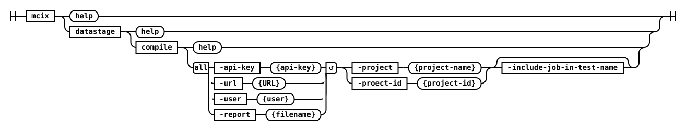
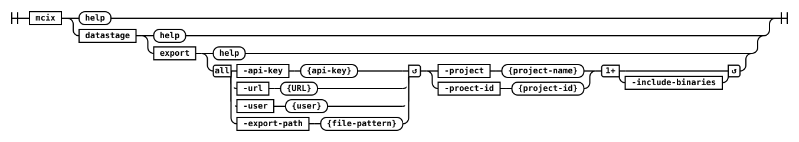

# datastage namespace

The datastage namespace contains commands for working with IBM Cloud Pak for Data (CP4D) DataStage assets.

## datastage compile



Compiles a DataStage Job producing a JUnit-compatible testing output that can be utilised by built tools orchestrating a CI/CD pipeline.  This command produces a [JUnit-compatible](https://junit.org/) XML file called `mettleci_compilation.xml` which reports each individual job’s compilation result.

#### Parameters

  * **api-key** *(Required)*

    CP4D/CP4DaaS API key

  * **-url** *(Required)*

    Base url of CP4D/CP4DaaS

  * **-user** *(Required)*

    CP4D/CP4DaaS username

  * **-report** *(Required)*

    JUnit compilation report file

  * **-project** *(Required when `-project-id` not specified)*


    Name of target project

  * **-project-id** *(Required when `-project` not specified)*

    Id of target project

  * **-include-job-in-test-name** *(Default: false)*

    Test case names will include the compiled asset name in the JUnit reports

#### Examples 

=== "Command Line"
    ```shell
    mcix datastage compile \
      -api-key XXXXXXXXXXXXXXXXXXXXXXXX \
      -url https://cp4d.datamigrators.io \
      -user isadmin \
      -report mettleci_compilation.xml \
      -project dstage1 \
      -include-asset-in-test-name
    ``` 

=== "GitHub Action"
    ```yaml
    - name: DataStage Compile using mcix datastage compile action
      uses: mettleci/mcix/datastage/compile@latest
      id: mcix-datastage-compile
      with:
        api-key: ${{ secrets.CP4DKEY }}
        url: ${{ vars.CP4DHOSTNAME }}
        user: ${{ vars.CP4DUSERNAME }}
        project: ${{ env.DatastageProject }}         
    ```

=== "Azure DevOps Tasks"
    ```yaml
    - task: mcixDatastageCompile@1
      inputs:
        url: ${{ parameters.CP4DHostName }}
        user: ${{ parameters.CP4DUsername }}
        apiKey: ${{ parameters.CP4DKey }}
        project: ${{ parameters.DatastageProject }}
        report: '$(Build.SourcesDirectory)/log/compile/compilation_results.xml'
        includeAssetInTestName: true
        imageName: 'mettleci.azurecr.io/mettleci/mcix'
      displayName: 'Compile DataStage Assets'
    ```

---

## datastage export



Exports DataStage assets from a DataStage CP4D/CP4DaaS project to a destination zip file.

#### Parameters

  * **api-key** *(Required)*

    CP4D/CP4DaaS API key

  * **-export-path** *(Required)*

    Path to DataStage export zip file or directory

  * **include-binaries**

    Whether to include executable binaries in the export (default: false)

  * **-project** *(Required when `-project-id` not specified)*

    Name of target project

  * **-project-id** *(Required when `-project` not specified)*

    Id of target project

  * **-url** *(Required)*

    Base url of CP4D/CP4DaaS

  * **-user** *(Required)*

    CP4D/CP4DaaS username   


#### Examples

=== "Command Line"
    ```shell
    mcix datastage export \
      -api-key XXXXXXXXXXXXXXXXXXXXXXXX \
      -url https://cp4d.datamigrators.io \
      -user isadmin \
      -export-path dstage1.zip \
      -project dstage1 
    ```

=== "GitHub Action"
    ```yaml
    - name: DataStage export using mcix datastage export action
      uses: mettleci/mcix/datastage/export@latest
      id: mcix-datastage-export
      with:
        api-key: ${{ secrets.CP4DKEY }}
        url: ${{ vars.CP4DHOSTNAME }}
        user: ${{ vars.CP4DUSERNAME }}
        project: ${{ env.DatastageProject }}         
        assets: "${{ github.workspace }}/datastage"
    ```

=== "Azure DevOps Tasks"
    ```yaml
    - task: mcixDatastageExport@1
      inputs:
        url: ${{ parameters.CP4DHostName }}
        user: ${{ parameters.CP4DUsername }}
        apiKey: ${{ parameters.CP4DKey }}
        project: ${{ parameters.DatastageProject }}
        exportPath: '$(Build.SourcesDirectory)/datastage'
        imageName: 'mettleci.azurecr.io/mettleci/mcix'
      displayName: 'Export DataStage Assets'
    ```

---

## datastage import


Imports DataStage assets from a DataStage export zip file or directory into a CP4D/CP4DaaS project.  This command produces a [JUnit-compatible](https://junit.org/) XML file called `mettleci_import.xml` which reports each individual asset’s import result.

#### Parameters

  * **api-key** *(Required)*

    CP4D/CP4DaaS API key

  * **-url** *(Required)*

    Base url of CP4D/CP4DaaS

  * **-user** *(Required)*

    CP4D/CP4DaaS username   

  * **-assets** *(Required)*

    Path to DataStage export zip file or directory

  * **-project** *(Required when `-project-id` not specified)*

    Name of target project

  * **-project-id** *(Required when `-project` not specified)*

    Id of target project


#### Examples

=== "Command Line"
    ```shell
    mcix datastage import \
      -api-key XXXXXXXXXXXXXXXXXXXXXXXX \
      -url https://cp4d.datamigrators.io \
      -user isadmin \
      -assets dstage1.zip \
      -project dstage1 
    ```

=== "GitHub Action"
    ```yaml
    - name: DataStage import using mcix datastage import action
      uses: mettleci/mcix/datastage/import@latest
      id: mcix-datastage-import
      with:
        api-key: ${{ secrets.CP4DKEY }}
        url: ${{ vars.CP4DHOSTNAME }}
        user: ${{ vars.CP4DUSERNAME }}
        project: ${{ env.DatastageProject }}         
        assets: "${{ github.workspace }}/datastage"
    ```

=== "Azure DevOps Tasks"
    ```yaml
    - task: mcixDatastageImport@1
      inputs:
        url: ${{ parameters.CP4DHostName }}
        user: ${{ parameters.CP4DUsername }}
        apiKey: ${{ parameters.CP4DKey }}
        project: ${{ parameters.DatastageProject }}
        assetsPath: '$(Build.SourcesDirectory)/datastage'
        imageName: 'mettleci.azurecr.io/mettleci/mcix'
      displayName: 'Import DataStage Assets'
    ```

