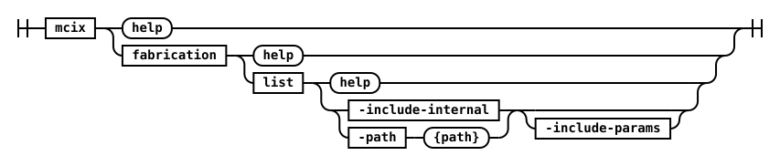

# fabrication namespace

## fabrication list



This command lists all the MettleCI data fabrication generators available in either…

- a supplied test data fabrication bundle file (or directory of bundle files), or
- the built-in MettleCI data fabrication generators

#### Parameters

| Name                  | Required | Default  | Description |
| :-------              | :------- | :------- | :-------    |
| **include-internal**  | Yes<br/>*(when path not specified)*              | - | Use pre-existing generators from MettleCI's internal libraries |
| **path**              | Yes<br/>*(when include-internal not specified)*  | - | The path to either a folder full of generators or a single `<generator>.json` file |
| **include-params**  | -        | -        |  Display parameters for each generator |

#### Examples

This example shows how to list the data fanbrication gneerators in a supplied user-created `.json` bundle file:

```shell
# Command usage
$> mettleci fabrication list
MettleCI Command Line (build 221)
(C) 2018-2022 Data Migrators Pty Ltd
Cannot execute, expected one of -include-internal, -path
Usage: fabrication list [options]
  Options:
    -include-internal
      include pre-existing generators from our internal libraries
      Default: false
    -include-params
      include the parameters available for each generator
      Default: false
    -path
      the path for any custom generators to be tested
Command failed.
```
```shell
# Listing the capabilities of custom 'Star Wars' generator
$> mettleci fabrication list -path star_wars.json
MettleCI Command Line (build 221)
(C) 2018-2022 Data Migrators Pty Ltd
fabrication list (v1.0-SNAPSHOT)
star_wars.call_sign
    Description: Generates a random Star Wars call sign, e.g. 'Red 5', 'Blue Leader'
star_wars.character
    Description: Generates a random Star Wars character name
star_wars.droid
    Description: Generates a random Star Wars droid name
star_wars.planet
    Description: Generates a random Star Wars planet name
star_wars.quote
    Description: Generates a random quote from a Star Wars character
star_wars.species
    Description: Generates a random Star Wars species name
star_wars.vehicle
    Description: Generates a random Star Wars vehicle name
star_wars.wookiee_word
    Description: Generates a random Wookiee word
```
```shell
# Showing generator parameters
$> mettleci fabrication list -path star_wars.json -include-params
MettleCI Command Line (build 221)
(C) 2018-2022 Data Migrators Pty Ltd
fabrication list (v1.0-SNAPSHOT)
star_wars.call_sign
    Description: Generates a random Star Wars call sign, e.g. 'Red 5', 'Blue Leader'
star_wars.character
    Description: Generates a random Star Wars character name
star_wars.droid
    Description: Generates a random Star Wars droid name
star_wars.planet
    Description: Generates a random Star Wars planet name
star_wars.quote
    Description: Generates a random quote from a Star Wars character
    Parameters:
    - character             STRING    (Nullable)
star_wars.species
    Description: Generates a random Star Wars species name
star_wars.vehicle
    Description: Generates a random Star Wars vehicle name
star_wars.wookiee_word
    Description: Generates a random Wookiee word
$>
```

**Note**:

This command is not available as a CI/CD native GitHub Actions or Azure DevOps task/plugin as there is no identified need for this functionality within the context of a CI/CD pipeline. If you require this functionality within your CI/CD pipeline then you can invoke the command line directly using a command line pipeline task.

---

## fabrication test


This command invokes a specific test data fabrication generator, from either…

- a supplied test data fabrication bundle file (or directory of bundle files), or
- MettleCI’s built-in data fabrication generators.

#### Parameters

| Name                  | Required | Default  | Description |
| :-------              | :------- | :------- | :-------    |
| **P, -parameters**   | -        | -        | Generator parameters<br/>Syntax: `-Pkey=value` |
| **generator**        | Yes      | -        | The generator to test |  
| **rowcount**         | -        | 5        | Number of rows to generate |
| **path**             | -        | -        | The path to either a folder containing generators or a single `<generator>.json` file |  
| **include-internal** | -        | False    | Include pre-existing generators from our internal libraries |

#### Examples

This example shows how to list the tags of a directory of Compliance Rules in both tabulated and CSV formats:

```shell
# Command usage
$> mettleci fabrication test
MettleCI Command Line (build 221)
(C) 2018-2022 Data Migrators Pty Ltd
The following option is required: [-generator]
Usage: fabrication test [options]
  Options:
  * -generator
      the generator to test
    -include-internal
      include pre-existing generators from our internal libraries
      Default: false
    -P, -parameters
      generator parameters
      Syntax: -Pkey=value
      Default: {}
    -path
      the path to either a folder full of generators or a single <generator>.json file
    -rowcount
      number of rows to generate
      Default: 5
Command failed.
```
```shell
# A test with the no parameters specified (which defaults to providing a quote from any Star Wars character)
$> mettleci fabrication test \
      -path . \
      -generator star_wars.quote
MettleCI Command Line (build 221)
(C) 2018-2022 Data Migrators Pty Ltd
fabrication test (v1.0-SNAPSHOT)
I will start my operations here, and pull the rebels apart piece by piece.
Twice the pride, double the fall.
Show me again, grandfather, and I will finish what you started.
You will remove these restraints and leave this cell with the door open.
You're smarter than a tree, aren't you?
```
```shell
# A test with the nullable 'character' parameter specified as 'darth_vader'
$> mettleci fabrication test \
      -path . \
      -generator star_wars.quote \
      -Pcharacter="darth_vader"
MettleCI Command Line (build 221)
(C) 2018-2022 Data Migrators Pty Ltd
fabrication test (v1.0-SNAPSHOT)
I find your lack of faith disturbing.
I hope so for your sake, the Emperor is not as forgiving as I am
You are a member of the rebel alliance, and a traitor.
I hope so for your sake, the Emperor is not as forgiving as I am
Impressive. Most impressive. Obi-Wan has taught you well.
$>
```

**Note**: This command is not available as a CI/CD native GitHub Action or Azure DevOps extension as there is no identified need for this functionality within the context of a CI/CD pipeline. If you require this functionality within your CI/CD pipeline then you can invoke the command line directly using a command line pipeline task.

---
