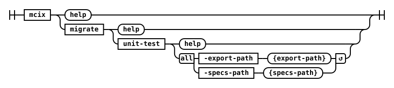

## migrate unit-test



Migrates a MettleCI unit testfrom DataStage Classic format to DataStage NextGen format .

#### Parameters

| Name           | Required | Default  | Description |
| :-------       | :------- | :------- | :-------    |
| **export**     | Yes      | -        | Target project export |
| **specs**      | Yes      | -        | Path to unit test specs directory to be used as the source of the migration |

#### Examples 

<details markdown="1">
  <summary>Command Line</summary>
```shell
# mcix migrate unit-test
MettleCI Command Line (build 1.0-SNAPSHOT)
(C) 2018-2026 Data Migrators Pty Ltd
Usage: datastage migrate-unit-test [options]
  Options:
  * -export
      Target project export
  * -specs
      Path to unit test specs directory to be used as the source of the
      migration
```
</details>
<cds-inline-notification
  kind="info"
  title="Info"
  subtitle="This command is not available as a CI/CD native task/plugin as there is no identified need for this functionality within the context of a CI/CD pipeline. If you require this functionality within your CI/CD pipeline then you can invoke the command line directly using a command line pipeline task."
  action-button-label="Acknowledged"
  close-button-label="Close notification"
  low-contrast
  id="overlay-notification2">
</cds-inline-notification>


