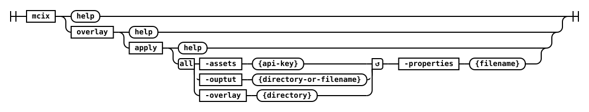

# overlay namespace

The `overlay` namespace contains commands wich enable you to define and apply changes to DataStage assets in order to modify their behavior or configuration without altering the original asset directly. This is particularly useful in scenarios where you want to maintain different configurations for different environments (e.g., development, testing, production) or when you want to apply temporary changes for specific use cases.

## overlay apply



This command applies changes - defined in a [json5-formatted](https://json5.org/) overlay file - to one or more specified DataStage assets supplied in a directory or `.zip` file.

#### Parameters

| Name            | Required | Default  | Description |
| :-------        | :------- | :------- | :-------    |
| **assets**     | Yes      | -        | Path to DataStage export zip file or directory |
| **output**     | Yes      | -        | Zip file or directory to write updated assets |
| **overlay**    | Yes      | -        | Directory containing asset overlays. Each overlay will be applied in specified order when providing multiple (e.g., `-overlay dir1 -overlay dir2`)
| **properties** | -        | -        | Properties file with replacement values |

#### Examples

##### Command Line

```shell
mcix overlay apply \
    -assets /path/to/datastage-export.zip \
    -output /path/to/updated-assets.zip \
    -overlay /path/to/overlay-directory \
    -properties /path/to/properties-file.properties
```

##### GitHub Actions

```yaml
- name: Overlay apply using mcix overlay apply action
uses: mettleci/mcix/overlay/apply@latest
id: mcix-overlay-apply
with:
    assets: "${{ github.workspace }}/datastage"
    output: "${{ github.workspace }}/something-something"
    overlay: "${{ github.workspace }}/overlay-file"
    properties: "${{ github.workspace }}/peroperties-file"
```

##### Azure DevOps Task

```yaml
- task: mcixOverlayApply@1
inputs:
    assets: 'datastage'
    overlays: |
    '$(Build.SourcesDirectory)/overlays/common'
    '$(Build.SourcesDirectory)/overlays/${{ parameters.EnvironmentID }}'
    properties: '$(Build.SourcesDirectory)/varfiles/var.${{ parameters.EnvironmentID }}'
    output: '$(Build.SourcesDirectory)/release.zip'
    imageName: 'mettleci.azurecr.io/mettleci/mcix'
displayName: 'Apply Overlays to Assets'
```

---