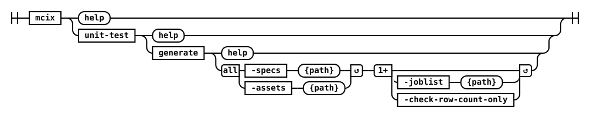

## unit-test generate



Generates a DataStage test case for one or more specified DataStage flows.

The optional `-check-row-count-only` flag will cause the generation of a test case which checks row counts, rather than the default option which is to compare data row-by-row.

#### Parameters

| Name         | Required | Default  | Description |
| :-------     | :------- | :------- | :-------    |
| **specs**    | Yes      | -        | ... |
| **assets**   | Yes      | -        | ... |
| **joblist**  | -        | -        | ... |
| **check-row-count-only** | - | -   | ... |

#### Examples


<details markdown="1">
  <summary>Command Line</summary>
```shell
# mcix unit-test generate
mcix unittest generate \
  -assets  /opt/dm/mci/jobs \
  -joblist joblist.txt \
  -specs   /opt/dm/mci/testspecs
```
</details>

<br/>
<cds-inline-notification
  kind="info"
  title="Info"
  subtitle="This command is not available as a CI/CD native task/plugin as there is no identified need for this functionality within the context of a CI/CD pipeline. If you require this functionality within your CI/CD pipeline then you can invoke the command line directly using a command line pipeline task."
  action-button-label="Acknowledged"
  close-button-label="Close notification"
  low-contrast
  id="overlay-notification2">
</cds-inline-notification>
