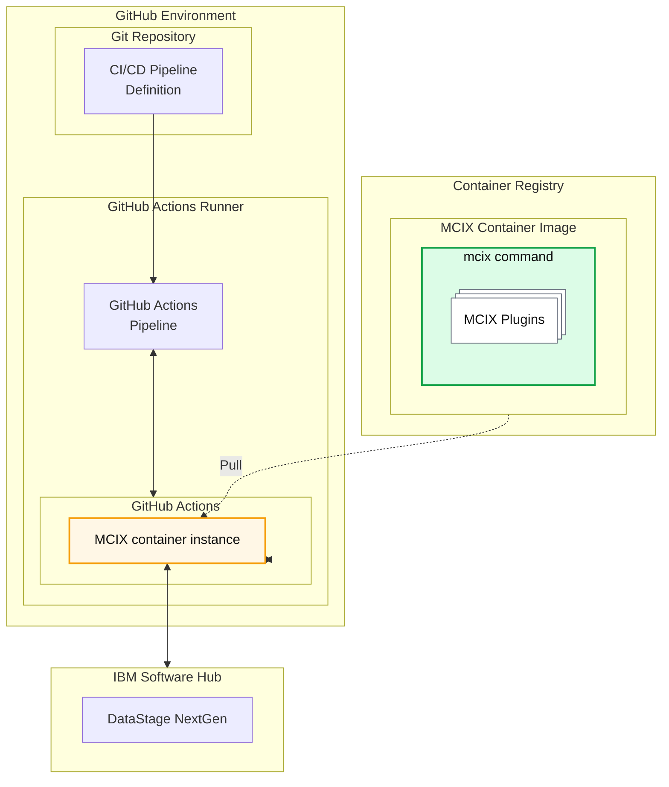

<script type="module" src="https://1.www.s81c.com/common/carbon-for-ibm-dotcom/version/v2.8.0/card-group.min.js"></script>
<script type="module" src="https://1.www.s81c.com/common/carbon-for-ibm-dotcom/version/v2.8.0/content-block.min.js"></script>
<script type="module" src="https://1.www.s81c.com/common/carbon-for-ibm-dotcom/version/v2.8.0/content-block-mixed.min.js"></script>
<script type="module" src="https://1.www.s81c.com/common/carbon-for-ibm-dotcom/version/v2.8.0/link-list.min.js"></script>

<c4d-link-list type="default" slot="complementary">
  <c4d-link-list-heading>Resources</c4d-link-list-heading>
  <c4d-link-list-item
    href="https://github.com/marketplace?query=mcix"
    target="github-marketplace"
    cta-type="external"
  >
    MCIX on GitHub Marketplace
  </c4d-link-list-item>
  <c4d-link-list-item
    href="https://marketplace.visualstudio.com/items?itemName=MettleCI.mcix"
    target="mcix-azure"
    cta-type="external"
  >
    MCIX for Azure DevOps on Visual Studio Marketplace
  </c4d-link-list-item>
  <c4d-link-list-item
    href="https://marketplace.visualstudio.com/items?itemName=MettleCI.mcix"
    target="mcix-jenkins"
    cta-type="external"
  >
    MCIX Jenkins Custom Tasks on GitHub
  </c4d-link-list-item>
</c4d-link-list>

# GitHub Custom Actions

When using GitHub as your CI/CD orchestration tool you can take advantage of the **MCIX GitHub Actions** available in the [GitHub Marketplace](https://github.com/marketplace?query=mcix){:target="_blank" rel="noopener"}. These actions provide GitHub-native tasks which are underpinned by the MCIX container image. The GitHub native tasks provide richer deeper integration and richer feedback than terminal commands while also requiring no additional infrastructure, oer the use of remote GitHub runners. For example:

#### Command Line Pipeline Task

```yaml
jobs:
  run-script:
    runs-on: ubuntu-latest
    steps:
      - name: DataStage export using the mcix datastage export command within a bash shell
        run: bash \
          ${GITHUB_WORKSPACE}/some-location/mcix datastage export \
          -api-key ${API_KEY} \
          -url ${CPD_URL} \
          -user ${CPD_USER} \
          -project ${CPD_PROJECT} \
          -export-path ${EXPORT_PATH}
```

#### GitHub Actions Native Action

```yaml
jobs:
  run-script:
    runs-on: ubuntu-latest
    steps:
      - name: DataStage export using the mcix datastage export GitHub action
        uses: mettleci/mcix/datastage/export@latest
        with:
          api-key: ${API_KEY}
          url: ${CPD_URL}
          user: ${CPD_USER}
          project: ${CPD_PROJECT}
          assets: ${EXPORT_PATH}
```


