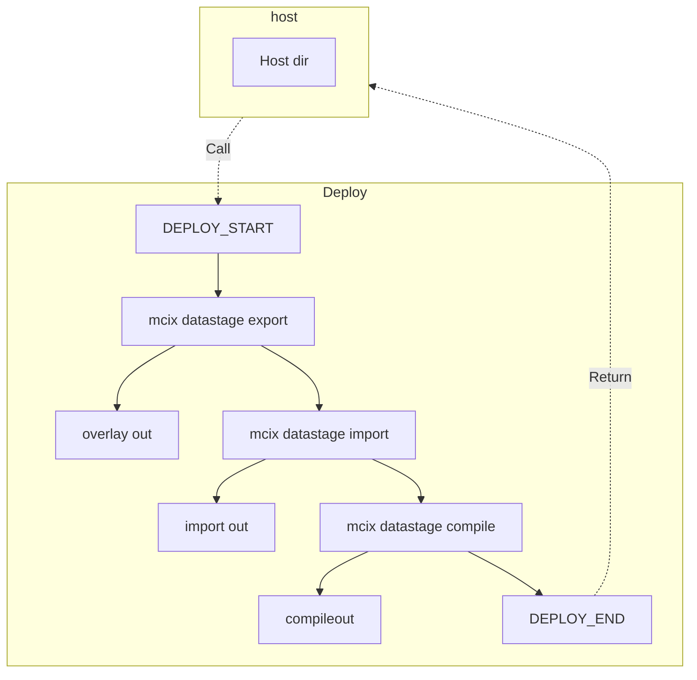

<c4d-link-list type="default" slot="complementary">
  <c4d-link-list-heading>Resources</c4d-link-list-heading>
  <c4d-link-list-item
    href="https://github.com/marketplace?query=mcix"
    target="github-marketplace"
    cta-type="external"
  >
    MCIX on GitHub Marketplace
  </c4d-link-list-item>
  <c4d-link-list-item
    href="https://marketplace.visualstudio.com/items?itemName=MettleCI.mcix"
    target="mcix-azure"
    cta-type="external"
  >
    MCIX for Azure DevOps on Visual Studio Marketplace
  </c4d-link-list-item>
  <c4d-link-list-item
    href="https://marketplace.visualstudio.com/items?itemName=MettleCI.mcix"
    target="mcix-jenkins"
    cta-type="external"
  >
    MCIX Jenkins Custom Tasks on GitHub
  </c4d-link-list-item>
</c4d-link-list>

As well being available as a [terminal command](../command-shell/command-shell) and a [Docker container image](../container/container), the individual commands provided by the MCIX command shell are also available as native tasks for the most popular CI/CD orchestration tools.

The XXXXX native tasks provide richer deeper integration and richer feedback than terminal commands while also requiring no additional infrastructure, oer the use of remote GitHub runners. For example:

MXIX features enabled by the Azure DevOps integration
<!-- - Commit to Azure DevOps-managed Git repositories -->
<!-- - Retrieve Compliance Rules from a Azure DevOps-managed Git repository -->
<!-- - Perform a live lookup of Azure DevOps work items for users to select from when they are performing a Git commit. -->
- Execute sophisticated CI/CD Azure DevOps Pipelines for Information Server using the MCIX Command Line Interface
- Provide Unit Test and Integration Test results as Azure DevOps-compatible JUnit test reports -->
<!-- - Provide Compliance, Unit Test, and Integration Test results as Azure DevOps-compatible JUnit test reports -->

Custom tasks are currentl avaialbe for the following platforms:
- GitHub Custom Actions
- Azure DevOps Task Extension
- Jenkins Custom Tasks

## Composite Tasks

There are some instances where combinations of MCIX commands aere frequently executed in combination with one another.  
A good example of this is the process of deploying DataStage assets to a target environment:

