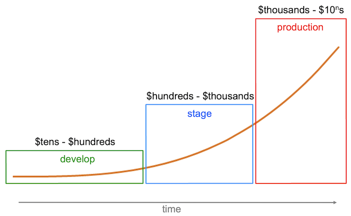
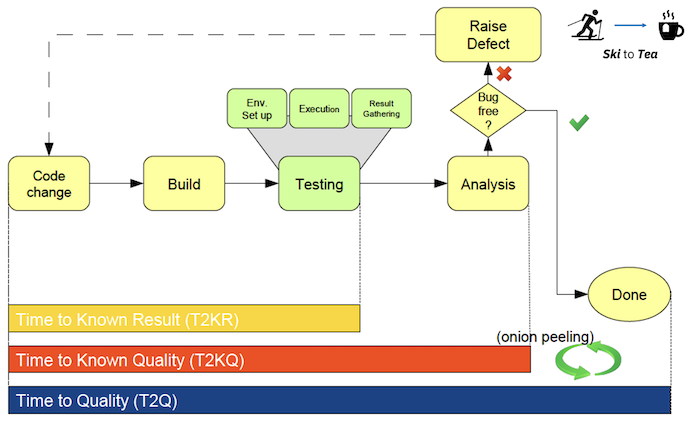

The awareness and adoption of modern software delivery practices is a crucial
step towards delivering better software-driven outcomes to your customers.
Greater efficiency cannot be achieved by simply 'working harder', it is achieved
by adopting best-in-class tools and methods to reduce errors and rework. The
ambition is to find defects in the software you produce closer to their point of
injection and to optimize your delivery pipelines.

Testing should be adopted as a cornerstone in your approach to quality assurance. 
MettleCI brings together a collection of guidelines and good practices we believe 
are essential for high performing teams to embrace, along with examples and 
recommendations of how to adopt and implement them.

## Why testing?

Testing is an integral part of software delivery. While it's unlikely that many would disagree with that statement,
how you approach testing can have a significant impact on outcomes and the speed
at which you can deliver value to customers. As software delivery practitioners,
there are two aspects to quality that you must get right: correctly aligning your
testing with customer utilization and isolating key defects as early as you can.

The chart below illustrates how the cost of defect fixing grows from
the point of defect injection to a critical outage in production. 
This is the primary motivation for the industry mantra 'shift left'.

The DevOps movement encourages development teams to accept collective responsibility for ...

- delivering the **right thing**, and 
- delivering the **thing right**. 

While testing seeks to validate both of these aspects, this assessment primarily focuses on the latter: the
effectiveness and efficiency of the engineering pipeline. The tests that the
delivery engine execute should adequately critique the product and this guide
additionally aims to share good practice. This is often referred to as delivery
engine speed versus delivery engine power. A quick engine can get the job done
quickly, while a powerful engine does a good job. Critically, the quest for
speed should not compromise power, the ambition is to remove waste and
inefficiencies that limit available power.

The delivery pipeline should be front and center of what a delivery team does.
It's fundamental, and without it the delivery function of your team will be unable 
to deliver the value they've created to the customers who need it. 
Completing an assessment should be viewed as a positive exercise. It
provides an opportunity for the team to assess the health of their pipeline and
ensure it is 'fit for purpose', and will continue to serve the team into the
future.

Good testing allows teams to write code with more confidence, which in turn
makes them more productive and able to shift their focus to delivering new features
and value to their customers.

## Where to start?

Getting started can be the hardest part of any journey, and it can be easy to
get distracted by the complexity of a modern software delivery pipeline. Let's
take a step back. Software development starts with a code change entering the
delievry pipeline. The T2 metrics chart below provides a high level snapshot
what a pipeline does.

Let's start by asking some basic questions of our pipeline. For a given code
change:

- How quickly can I go through the steps to get a build and a signal back from
  appropriate tests that the change is good or bad? This unit of time is **Time to
  Known Result (T2KR)**.
- How quickly can I go through the steps to get a build, rework a defect from a
  test failure and know my code change is good? This unit of time is **Time to
  Known Quality (T2KQ)**.
- How quickly, on average, can I go through the steps to get a build and go
  through all the stages before I can ship my code change to a customer? This
  unit of time is **Time to Quality (T2Q)**.
- How many steps in the pipeline take a long time, e.g., days (enough time for a
  skiing holiday)? How many of the steps happen in a few minutes (enough time for
  a tea break)? What would it take to move the pipeline from Ski to Tea?

Spending a few minutes as a team thinking about the T2 metrics can be a really
useful place to start. It helps visualize what's going on under the covers and
provides context for the assessment process.

## What is your role in this?

### → Managers

The manager's role is to understand and advocate for the competitive advantage efficient and automated
testing will bring to your team and to their product. 

They should understand their team's level of deliery maturity, and appreciate that Just because the engine is running
they shouldn't assume it's running well.

Managers should actively support their team by providing them with
the resources required to implement improvements. 

### → Technical leaders

As technical leaders, testing is an integral part of your delivery journey and
not something to be bolted on as an afterthought. Championing code that's designed
for testing and investing in 'test skill' empowers teams to be more resilient
and autonomous. Avoiding technical debt by removing ineffective process steps
improves morale, productivity, and allows you to focus more on your primary goal:
delivering features that delight your users.

### → Developers

As a developer, you understand that untested, or poorly tested, code is risk:
it's potential for a problem to happen. Small units of change, the ability to
contribute tests easily and a rapid feedback loop help mitigate risk stored in
the system. It's therefore important that you understand what an EngX assessment
is and why it matters. Does the pipeline deliver these characteristics? How
could new features or greater automation in the pipeline improve your confidence
in delivering great code?

### → QA / Test engineers

Test engineers apply deep knowledge and expertise in developing approaches to
isolate mission critical defects. Often engaged in exploratory testing and test
architecture, this community are often the first-responders to resolve pipeline
problems. Left unchecked, an unhealthy pipeline can consume engineering resource
in serving day-to-day chores. How could new features or greater automation in
the pipeline support you?

Again, the EngX assessments are not here to give you a personal grade, it's your
opportunity to shine light on the delivery engine and signpost where investment
will drive improvements. The whole team should be proud of the pipeline that
delivers the product alongside the product itself.
