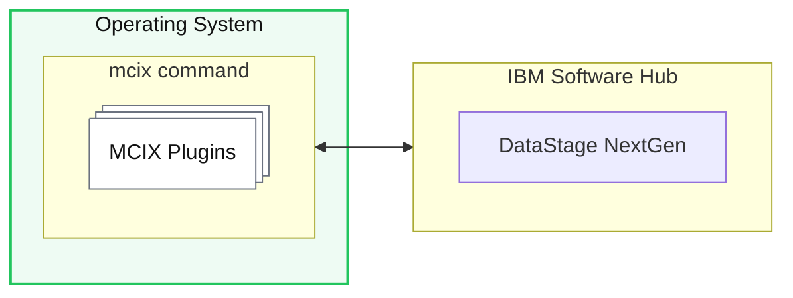
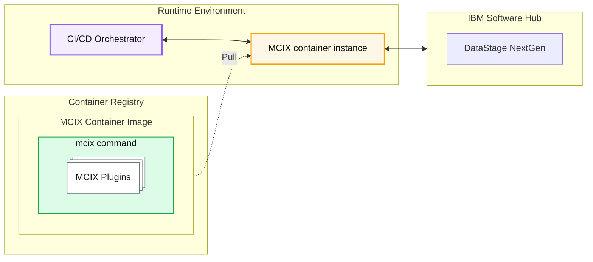

The MCIX command provides a set of capabilities underpinning the creation of automated CI/CD pipelines for any modern build tool.

| **Deployment operations** | - Importing and exporting assets to/from CPD environments  - Compiling assets in CPD - Automatically adapting properties of asset to suit their target environments |
| **Testing** | - Invoking static asset analysis (the equivalent of [lint](<https://en.wikipedia.org/wiki/Lint_(software)>){:target="_blank" rel="noopener"} for DataStage NextGen assets) - Fabricating synthetic test data based on custom test data specifications - Dynamic asset analysis (executing your DataStage NextGenn flows using a restricted sets of test data) |

These capabilities are supplied by the MCIX command which itself is available in various forms:

- Terminal Command
- Container Image
- GitHub Custom Actions
- Azure DevOps Task Extensions
- Jenkins Things

## Terminal Command

The MCIX CLI terminal command is available for **Linux (x86)**, **Windows (x86)**, and **macOS (ARM64)**, all downloadable from [here](https://github.com/mettleci/mcix-cli/releases/latest){:target="_blank" rel="noopener"}.

While not necessarily being the most _useful_ mode of operation, the MCIX terminal command provides the ability to interactively explore MCIX's capabilities without requiring additional software or infrastructure.

## Container Image

MCIX is also available as a Docker container image hosted [here](https://github.com/MettleCI/mcix/pkgs/container/mcix){:target="_blank" rel="noopener"}. This mode of delivery provides the fundamental building block of your automated CI/CD processes for DataStage NextGen.

## Native CI/CD Tasks

The individual commands provided by the MCIX command shell are also available as [native tasks](native-tasks) for the most popular CI/CD orchestration tools:

- GitHub
- Azure DevOps
- Jenkins
