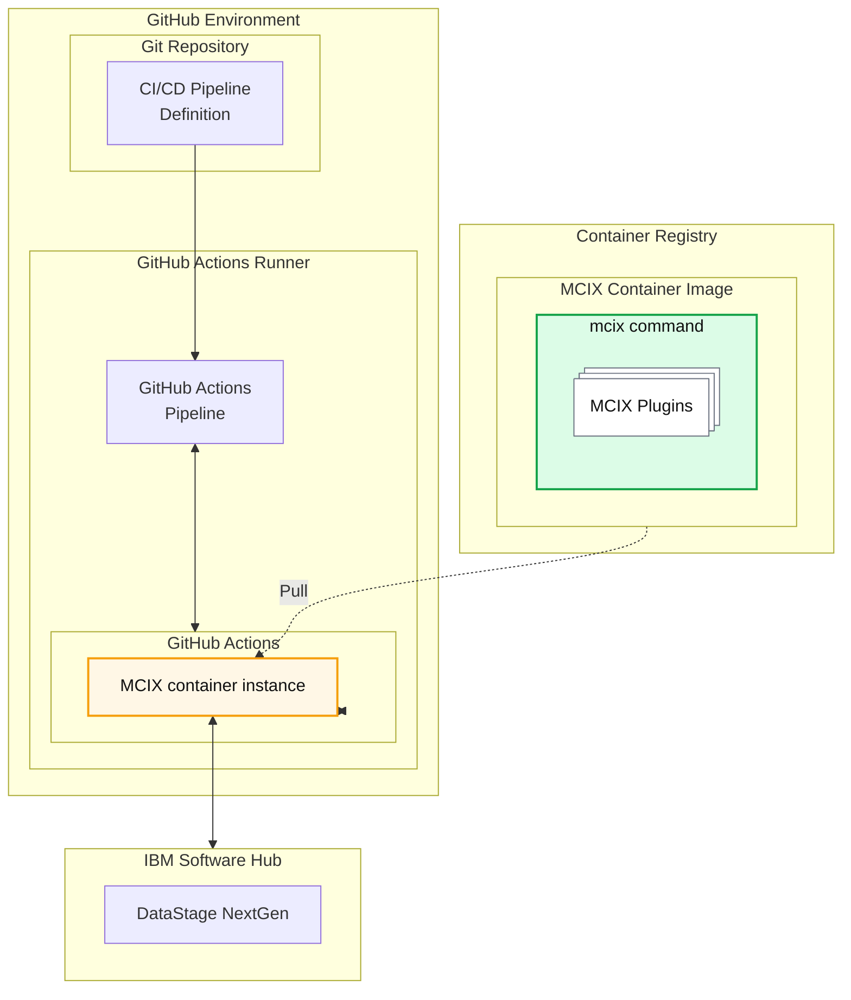
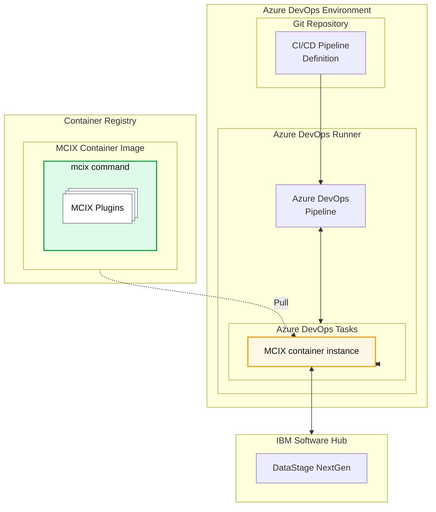

<script type="module" src="https://1.www.s81c.com/common/carbon-for-ibm-dotcom/version/v2.8.0/card-group.min.js"></script>
<script type="module" src="https://1.www.s81c.com/common/carbon-for-ibm-dotcom/version/v2.8.0/content-block.min.js"></script>
<script type="module" src="https://1.www.s81c.com/common/carbon-for-ibm-dotcom/version/v2.8.0/content-block-mixed.min.js"></script>
<script type="module" src="https://1.www.s81c.com/common/carbon-for-ibm-dotcom/version/v2.8.0/link-list.min.js"></script>

<c4d-link-list type="default" slot="complementary">
  <c4d-link-list-heading>Resources</c4d-link-list-heading>
  <c4d-link-list-item
    href="https://github.com/marketplace?query=mcix"
    target="github-marketplace"
    cta-type="external"
  >
    MCIX on GitHub Marketplace
  </c4d-link-list-item>
  <c4d-link-list-item
    href="https://marketplace.visualstudio.com/items?itemName=MettleCI.mcix"
    target="mcix-azure"
    cta-type="external"
  >
    MCIX for Azure DevOps on Visual Studio Marketplace
  </c4d-link-list-item>
  <c4d-link-list-item
    href="https://marketplace.visualstudio.com/items?itemName=MettleCI.mcix"
    target="mcix-jenkins"
    cta-type="external"
  >
    MCIX Jenkins Custom Tasks on GitHub
  </c4d-link-list-item>
</c4d-link-list>

As well being available as a terminal command and a Docker container image, the individual commands provided by the MCIX command shell are also available as native tasks for the most popular CI/CD orchestration tools.

## GitHub Custom Actions

When using GitHub as your CI/CD orchestration tool you can take advantage of the **MCIX GitHub Actions** available in the [GitHub Marketplace](https://github.com/marketplace?query=mcix){:target="_blank" rel="noopener"}. These actions provide GitHub-native tasks which are underpinned by the MCIX container image. The GitHub native tasks provide richer deeper integration and richer feedback than terminal commands while also requiring no additional infrastructure, oer the use of remote GitHub runners. For example:

#### Command Line Pipeline Task

```yaml
jobs:
  run-script:
    runs-on: ubuntu-latest
    steps:
      - name: DataStage export using the mcix datastage export command within a bash shell
        run: bash \
          ${GITHUB_WORKSPACE}/some-location/mcix datastage export \
          -api-key ${API_KEY} \
          -url ${CPD_URL} \
          -user ${CPD_USER} \
          -project ${CPD_PROJECT} \
          -export-path ${EXPORT_PATH}
```

#### GitHub Actions Native Action

```yaml
jobs:
  run-script:
    runs-on: ubuntu-latest
    steps:
      - name: DataStage export using the mcix datastage export GitHub action
        uses: mettleci/mcix/datastage/export@latest
        with:
          api-key: ${API_KEY}
          url: ${CPD_URL}
          user: ${CPD_USER}
          project: ${CPD_PROJECT}
          assets: ${EXPORT_PATH}
```



## Azure DevOps Task Extension

Like GitHub users, Azure DevOps users (both Server and SaaS) can also take advantage of native pipeline tasks. The **MCIX Azure DevOps Task Extension**, available in the [Visual Studio Marketplace](https://marketplace.visualstudio.com/items?itemName=MettleCI.mcix){:target="_blank" rel="noopener"} provides a number of native tasks for use in Azure DevOps CI/CD pipelines - again, underpinned by the MCIX container image which is nosted automtically by your Azure DevOps runner. For example:

#### Command Line Pipeline Task

```yaml
- stage: Export
  pool:
    vmImage: "ubuntu-latest"
  jobs:
    - job: MCIX_Export
      steps:
        - bash: |
            ./some-location/mcix datastage export \
              -api-key ${API_KEY} \
              -url ${CPD_URL} \
              -user ${CPD_USER} \
              -project ${CPD_PROJECT} \
              -export-path ${EXPORT_PATH}
          displayName: "Run export command"
```

#### Azure DevOps Native Task

```yaml
- stage: Export
  pool:
    vmImage: "ubuntu-latest"
  jobs:
    - job: MCIX_Export
      steps:
        - task: mcixDatastageExport@1
          inputs:
            containerRegistry: "my-docker-service-connection"
            imageName: "mettleci.azurecr.io/mettleci/mcix"
            api-key: ${API_KEY}
            url: ${CPD_URL}
            user: ${CPD_USER}
            project: ${CPD_PROJECT}
            assets: ${EXPORT_PATH}
          displayName: "Export DataStage Assets"
```



## Jenkins Custom Tasks

Jenkins supports Docker-based tasks primarily through two distinct mechanisms: 

1. The [Docker Pipeline plugin](https://plugins.jenkins.io/docker-workflow/){:target="_blank" rel="noopener"} enabling inline container usage within Jenkinsfiles. In this approach the stage runs inside the MCIX container. 
2. The [Docker Plugin](https://plugins.jenkins.io/docker-plugin/){:target="_blank" rel="noopener"} for provisioning dynamic build agents. In this approach the stage runs on a Docker-provisioned Jenkins agent, and your shared-library step launches the MCIX container itself.

#### Command Line Pipeline Task

```yaml
stage("Export) {
     agent { label 'mcix-capable' }
      steps {
          withCredentials([
     string(credentialsId: ${CPD_APIKEY_CRED}, variable: 'CP4DAPIKEY')
    ]) {
              sh label: 'Export DataStage Assets',
                  script: """#!/bin/bash
                      ./some-location/mcix datastage export \
                          -api-key ${CP4DAPIKEY} \
                          -url ${CPD_URL} \
                          -user ${CPD_USER} \
                          -project ${CPD_PROJECT} \
                          -export-path ${EXPORT_PATH}
                  """
          }
     }
```

#### Docker Pipeline Plugin

In this example the entire stage itself, and all the steps within it, runs inside the MCIX Docker image (available from Jenkins v2.5.0). 
This is achieved by using the `agent` directive to define a specific Docker image for the individual stage.
Using the **Docker *Pipeline* plugin** Jenkins schedules the stage on a Docker-capable Jenkins node, then 
runs the stage steps inside the `ghcr.io/mettleci/mcix:latest` container. 

```yaml
@Library('mcix-jenkins-lib') _
pipeline {
    agent none
    stages {
        stage("Export") {
            agent {
                docker {
                    registryUrl 'https://ghcr.io'
                    registryCredentialsId 'GHCR'
                    image 'ghcr.io/mettleci/mcix:latest'
                    args "-u root --entrypoint=''"
                }
            }
            steps {
                mcixDatastageExport(
                    url: "${CPD_URL}",
                    user: "${CPD_USER}",
                    apiKeyCredentialsId: "${CPD_APIKEY_CRED}",
                    project: "${CPD_PROJECT}",
                    assets: "${EXPORT_PATH}"
                )
            }
        }
    }
}
```

#### Docker Plugin (Agent Provisioning)

In this example Jenkins provisions a Docker-backed agent (identified by label) and the shared-library step (from `mcix-jenkins-lib`) runs on that agent.
Using the Docker plugin in this example, `mcix-docker-agent` is a Jenkins label mapped to a Docker Plugin agent template. Jenkins provisions a temporary 
container as the build agent, runs the stage on it, then removes it after the build.
Note that this approach requires configuring a Docker Cloud in Jenkins with the Docker API URL and Agent Templates (defining labels and images).

```yaml
@Library('mcix-jenkins-lib') _
pipeline {
    stages {
        stage("Export") {
  	        agent { label 'docker-capable' }
            steps {
                mcixDatastageExport(
                    registryUrl: "${MCIX_CONTAINER_REG_URL}",
                    registryCredentialsId: "${MCIX_CONTAINER_REG_CRED}",
                    image: "${MCIX_CONTAINER_IMAGE}",
                    url: "${CPD_URL}",
                    user: "${CPD_USER}",
                    apiKeyCredentialsId: "${CPD_APIKEY_CRED}",
                    project: "${CPD_PROJECT}",
                    assets: "${EXPORT_PATH}",
                )
           }
        }
    }
}
```
