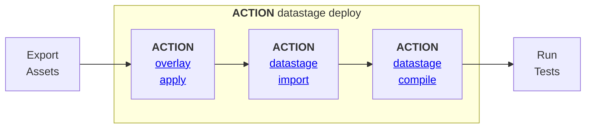

## datastage deploy

[](https://github.com/marketplace/actions/mcix-datastage-deploy){:target="_blank" rel="noopener"} 



This **composite action** deploys DataStage assets to a target CP4D/CP4DaaS project by applying any specified overlays, importing the resulting assets, and compiling the imported DataStage flows. Compilation produces a [JUnit-compatible](/introduction/junit-output) XML output file which reports each individual flow's compilation result.

<cds-inline-notification
  kind="info"
  title="Note"
  subtitle="A composite action is a GitHub Action that combines multiple workflow steps into 
  a single action, so those steps can be reused in multiple workflows as a single job step."
  low-contrast
  hide-close-button="true"
  id="overlay-notification">
</cds-inline-notification>


#### Parameters

| Name                         | Required                                     | Default | Description                                                               |
| :--------------------------- | :------------------------------------------- | :------ | :------------------------------------------------------------------------ |
| **api-key**                  | Yes                                          | -       | CP4D/CP4DaaS API key                                                      |
| **url**                      | Yes                                          | -       | Base url of CP4D/CP4DaaS                                                  |
| **user**                     | Yes                                          | -       | CP4D/CP4DaaS username                                                     |
| **assets**                   | Yes                                          | -       | Path to the DataStage assets to deploy                                    |
| **report**                   | Yes                                          | -       | JUnit compilation report file                                             |
| **project**                  | Yes <br/>*(when `project-id` not specified)* | -       | Name of target project                                                    |
| **project-id**               | Yes <br/>*(when `project` not specified)*    | -       | Id of target project                                                      |
| **overlay**                  | -                                            | -       | Overlay file, or files, to apply before import                            |
| **include-job-in-test-name** | -                                            | False   | Test case names will include the compiled asset name in the JUnit reports |

<details markdown="1">
  <summary>Example</summary>

````yaml
# mcix datastage deploy
- name: DataStage Deploy using mcix datastage deploy action
  uses: mettleci/mcix/datastage/deploy@latest
  id: mcix-datastage-deploy
  with:
    api-key: ${{ secrets.CP4DKEY }}
    url:     ${{ vars.CP4DHOSTNAME }}
    user:    ${{ vars.CP4DUSERNAME }}
    project: ${{ env.DatastageProject }}
    assets:  ./datastage
    overlay: ./overlays/ci.json
    report:  ./compile-report.xml
```
</details>

---
