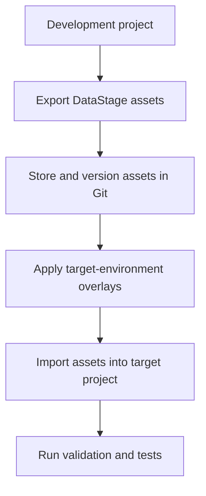
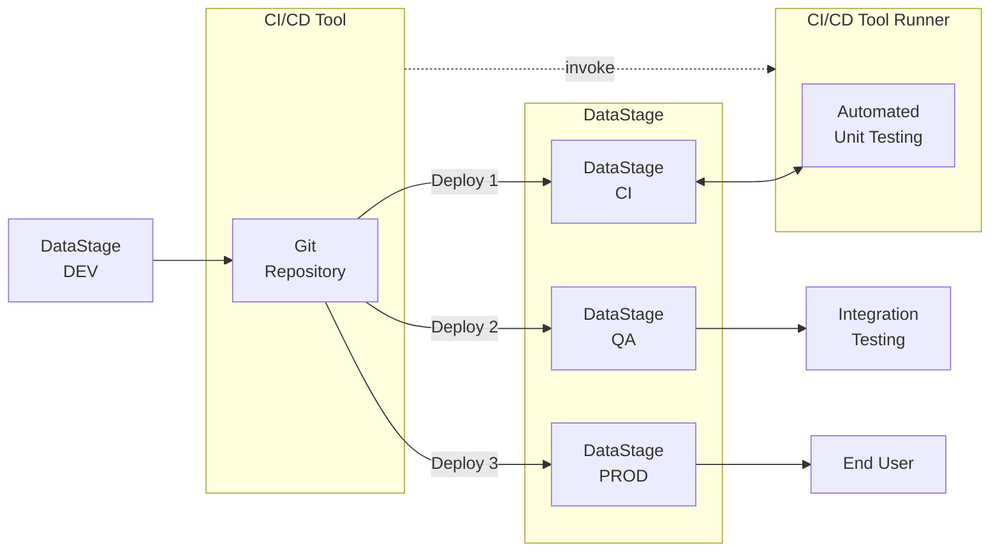

This GitHub Actions tutorial will help you understand the individual steps that make up an MCIX-based CI/CD pipeline. In a production pipeline, GitHub provides the automation, orchestration, credential management, approval gates, audit history, logging, notifications, and repeatability needed to run these steps reliably across teams and environments. The MCIX GitHub Actions perform the DataStage-related work, but GitHub. is responsible for deciding when, where, and how these commands are executed.

When using GitHub as your CI/CD orchestration tool you can take advantage of the **MCIX GitHub Actions** available in the [GitHub Marketplace](https://github.com/marketplace?query=mcix){:target="_blank" rel="noopener"}. These actions provide GitHub-native tasks which are underpinned by the MCIX container image. The GitHub native tasks provide richer deeper integration and richer feedback than terminal commands while also requiring no additional infrastructure, oer the use of remote GitHub runners. For example:

---

## What you will need

Before running the pipeline steps, you will prepare a working environment containing:

1. access to a source DataStage project 
1. at least one unit test specification and its associated test data
1. access to a target DataStage project
1. access to a repository on [http://github.com](http://github.com)
1. a local clone of that repository
1. at least one [overlay file](/introduction/overlays) for the target environment

The [prerequisite page](/command-line/tutorial-prerequisites) walks through establishing 
each of these. 

That page also provides a downloadable DataStage NextGen project that can be
imported into your DataStage environment to act as your source for the tutorial.

---

## What this tutorial demonstrates

The tutorial simulates a simple deployment flow between two DataStage projects:



The pipeline pattern is deliberately simple. It focuses on the essential delivery lifecycle rather than the details of any one CI/CD product.

---

## The pipeline stages

The tutorial walks through the following stages.

| Stage    | Purpose                                                     |
| -------- | ----------------------------------------------------------- |
| Export   | Retrieve DataStage assets from a source project             |
| Version  | Store the exported assets in a Git repository               |
| Overlay  | Apply environment-specific configuration changes            |
| Import   | Deploy the modified assets into a target DataStage project  |

| Validate | Check that the assets meet expected coding standards        |

| Test     | Execute DataStage unit tests and produce test results       |

Some of stages are optional. For example, asset analysis may only apply where asset analysis rules are available.

---

## Repository role in the tutorial

The Git repository acts as the well goverened, single source of truth for your DataStage delivery assets.  It is not tied to a single environment such as Dev, Test, or Production. Instead, it represents the authoritative versioned source for the DataStage initiative.

The different DataStage environments are populated from that source at different stages of the delivery lifecycle. For example:

| Environment | Typical role                                                                   |
| ----------- | ------------------------------------------------------------------------------ |
| Development | Where changes are initially created                                            |
| CI          | Where exported and [overlaid](/introduction/overlays) assets are imported and (automaticaly) unit tested |
| QA          | Where a tested candidate release may be validated further                      |
| Production  | Where only approved versions should be deployed                                |



<cds-inline-notification
  kind="warning"
  title="Important"
  subtitle="The repository stores the versioned source, while the DataStage projects represent 
  deployments of that source into specific environments.  Each environment (project) represents 
  a version of the source at different points in its lifecycle."
  low-contrast
  hide-close-button="true"
  id="overlay-notification">
</cds-inline-notification>

---

## Tutorial structure

This tutorial is split into two main parts.

### 1. Prepare the prerequisites

The prerequisite section confirms that your local workstation and Git repository are ready for the pipeline exercise.

You will:

- install and verify the MCIX CLI
- verify that the required MCIX command namespaces are available
- configure access to your Git platform
- create a suitable empty repository
- clone the MettleCI template repository
- repoint the local clone to your own repository
- confirm that you can pull, commit, and push changes

### 2. Run the pipeline steps

The pipeline section then uses that prepared environment to simulate a CI/CD process from the command line.

You will:

- define connection details for your source and target DataStage projects
- export DataStage assets
- apply overlays
- import the modified assets
- run validation checks
- execute unit tests
- review the generated outputs

The attached pipeline page already describes the command sequence and expected outputs for this process.

---

## Next Steps

After completing this tutorial, you should understand the purpose of each pipeline stage and how the MCIX commands work together.  That understanding provides the foundation for implementing the same process in a real CI/CD platform, where the manually executed commands can be converted into automated pipeline steps using a container or native MCIX tasks.


### Command Line Pipeline Task

```yaml
jobs:
  run-script:
    runs-on: ubuntu-latest
    steps:
      - name: DataStage export using the mcix datastage export command within a bash shell
        run: bash \
          ${GITHUB_WORKSPACE}/some-location/mcix datastage export \
          -api-key ${API_KEY} \
          -url ${CPD_URL} \
          -user ${CPD_USER} \
          -project ${CPD_PROJECT} \
          -export-path ${EXPORT_PATH}
```

#### GitHub Actions Native Action

```yaml
jobs:
  run-script:
    runs-on: ubuntu-latest
    steps:
      - name: DataStage export using the mcix datastage export GitHub action
        uses: mettleci/mcix/datastage/export@latest
        with:
          api-key: ${API_KEY}
          url: ${CPD_URL}
          user: ${CPD_USER}
          project: ${CPD_PROJECT}
          assets: ${EXPORT_PATH}
```


