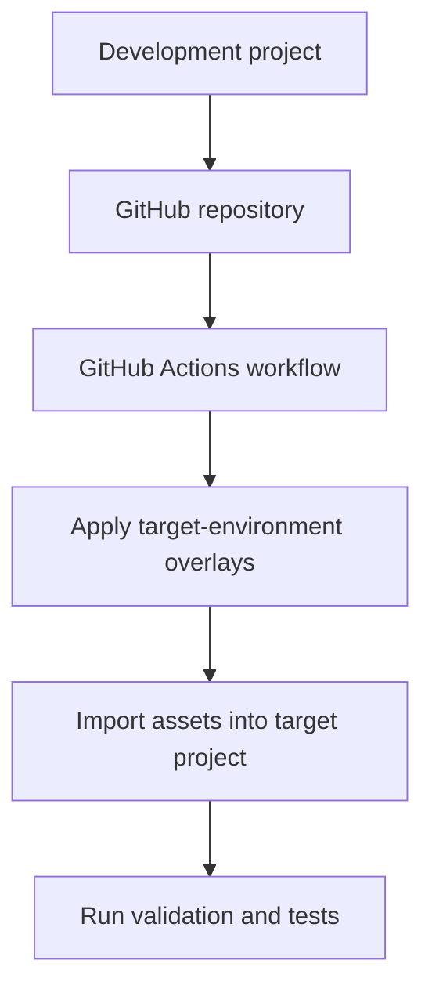
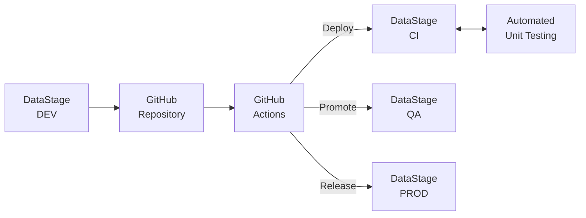
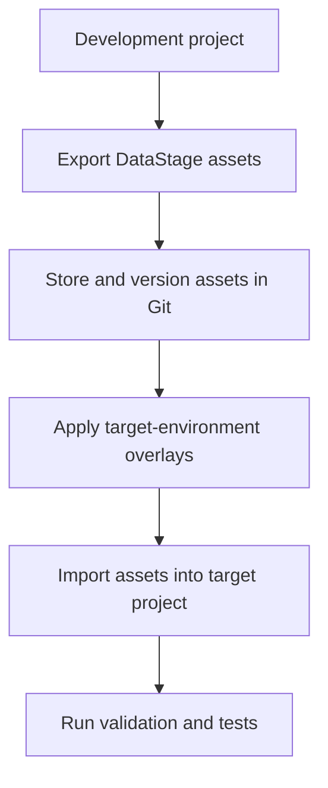
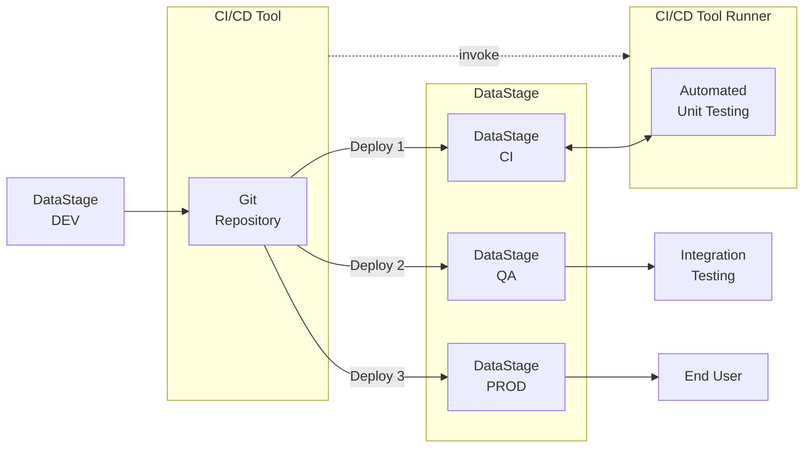
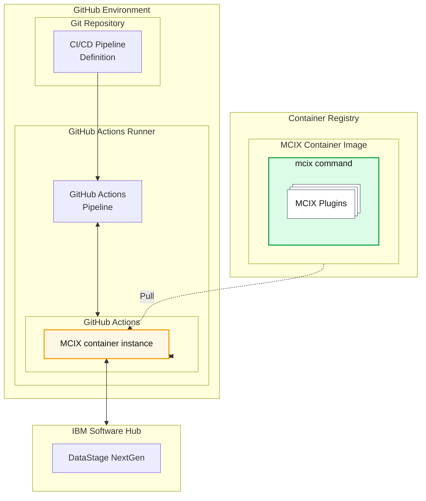

## Building a simple CI/CD pipeline using<br/> MCIX GitHub Actions

This GitHub Actions tutorial will help you create a simple MCIX-based CI/CD pipeline for DataStage. Instead of running each MCIX command manually from your local command line, you will define a GitHub Actions workflow that runs the required delivery steps automatically whenever the workflow is triggered.

In this tutorial, GitHub Actions provides the automation, orchestration, credential management, audit history, logging, and repeatability needed to run the pipeline reliably. The MCIX GitHub Actions perform the DataStage-related work, while GitHub Actions decides when, where, and how those actions are executed.

This tutorial builds on the same delivery pattern used by the command-line tutorial, but moves the execution into GitHub Actions. You will define a workflow, configure repository secrets, run MCIX actions in sequence, and review the results produced by the workflow run.

---

## What you will need

Before building the GitHub Actions workflow, you will prepare an environment containing:

1. access to a GitHub repository containing your DataStage delivery assets
2. access to a source DataStage project
3. access to a target DataStage project
4. at least one unit test specification and its associated test data
5. at least one overlay file for the target environment
6. asset-analysis rules, if you want to include static validation
7. GitHub repository secrets containing your DataStage connection details
8. permission to create or modify GitHub Actions workflows in the repository

The prerequisite page walks through establishing each of these.

That page may also provide a downloadable DataStage NextGen project that can be imported into your DataStage environment to act as your source for the tutorial.

---

## Why use GitHub Actions?

GitHub Actions allows your DataStage delivery process to run automatically from the same Git repository that stores your source-controlled assets.

A command-line pipeline is useful for learning each individual MCIX operation, but a GitHub Actions workflow is closer to how a real delivery process should run. It allows you to:

* trigger a pipeline when changes are pushed or a pull request is created
* store credentials securely as GitHub repository or environment secrets
* run deployment and validation steps in a repeatable sequence
* stop the pipeline automatically when a step fails
* publish test results and logs as workflow outputs
* keep a clear audit history of each pipeline run
* make the delivery process visible to the whole team

In this tutorial, you will use GitHub Actions to automate the same kind of pipeline that can be run manually with the MCIX CLI.

---

## What this tutorial demonstrates

The tutorial creates a simple deployment flow between two DataStage projects.



The pipeline pattern is deliberately simple. It focuses on the essential delivery lifecycle rather than advanced GitHub Actions features such as reusable workflows, protected environments, deployment approvals, matrix builds, or release promotion.

Once the basic workflow is working, you can extend it to match your organisation’s branching strategy, environment model, and release governance process.

---

## The pipeline stages

The tutorial walks through the following stages.

| Stage    | Purpose                                                         |
| -------- | --------------------------------------------------------------- |
| Checkout | Retrieve the repository contents into the GitHub Actions runner |
| Overlay  | Apply environment-specific configuration changes                |
| Import   | Deploy the modified assets into a target DataStage project      |
| Validate | Check that the assets meet expected coding standards            |
| Test     | Execute DataStage unit tests and produce test results           |
| Publish  | Make reports and logs available from the workflow run           |

Some stages are optional. For example, asset analysis only applies where asset-analysis rules are available, and unit testing only applies where suitable test specifications and test data have been configured.

---

## How this differs from the command-line tutorial

In the command-line tutorial, you act as the pipeline orchestrator.

You decide when to run each command, inspect the outputs manually, and move from one step to the next. That approach is useful when learning the mechanics of the MCIX commands.

In this GitHub Actions tutorial, the workflow becomes the orchestrator.

| Command-line tutorial                                      | GitHub Actions tutorial                              |
| ---------------------------------------------------------- | ---------------------------------------------------- |
| You run MCIX commands manually                             | GitHub Actions runs MCIX actions automatically       |
| Credentials are stored locally or in environment variables | Credentials are stored in GitHub Secrets             |
| You decide when to continue                                | The workflow enforces success and failure rules      |
| You inspect generated files on your workstation            | Reports and logs are available from the workflow run |
| You run the process from your local machine                | Jobs run on a GitHub-hosted or self-hosted runner    |
| The process is useful for learning                         | The process is suitable for team automation          |

The important point is that the underlying delivery process remains the same. GitHub Actions changes how the process is automated; it does not change the purpose of each MCIX operation.

---

## Repository role in the tutorial

The GitHub repository acts as the well-governed, single source of truth for your DataStage delivery assets. It is not tied to a single environment such as Development, CI, QA, or Production. Instead, it represents the authoritative versioned source for the DataStage initiative.

The different DataStage environments are populated from that source at different stages of the delivery lifecycle.

| Environment | Typical role                                                             |
| ----------- | ------------------------------------------------------------------------ |
| Development | Where changes are initially created                                      |
| CI          | Where exported and overlaid assets are imported and automatically tested |
| QA          | Where a tested candidate release may be validated further                |
| Production  | Where only approved versions should be deployed                          |



In a simple tutorial, you may only deploy to a single target project. In a real implementation, the same source-controlled assets can be promoted through multiple environments using different overlays, different credentials, and different approval rules.

---

## GitHub Actions concepts used in this tutorial

This tutorial introduces a small number of GitHub Actions concepts.

| Concept  | Purpose                                                     |
| -------- | ----------------------------------------------------------- |
| Workflow | The YAML file that defines the automated pipeline           |
| Job      | A group of steps that run on the same GitHub Actions runner |
| Step     | An individual operation within a job                        |
| Action   | A reusable component that performs a specific task          |
| Secret   | A protected value, such as an API key or username           |
| Runner   | The machine that executes the workflow                      |
| Artifact | A file produced by the workflow, such as a report or log    |

You do not need to be a GitHub Actions expert to complete this tutorial. The workflow used here is intentionally small and explicit so that each stage is easy to understand.

---

## Tutorial structure

This tutorial is split into two main parts.

### 1. Prepare the prerequisites

The prerequisite section confirms that your GitHub repository, DataStage projects, and credentials are ready for the pipeline exercise.

You will:

* create or identify a suitable GitHub repository
* confirm that your DataStage delivery assets are stored in the repository
* configure repository secrets for your DataStage connection details
* confirm that the required overlays are available
* confirm that asset-analysis rules are available, if required
* confirm that unit test specifications and test data are available, if required
* confirm that GitHub Actions is enabled for the repository

### 2. Build the GitHub Actions workflow

The workflow section then uses that prepared environment to define and run an automated MCIX pipeline.

You will:

* create a GitHub Actions workflow file
* configure the workflow trigger
* check out the repository contents
* apply target-environment overlays
* import the modified assets into the target DataStage project
* run asset-analysis validation, if required
* execute DataStage unit tests, if required
* publish reports and logs from the workflow run
* review the workflow result in GitHub

The pipeline steps page describes the workflow file, the MCIX actions used by each step, and the expected outputs from the run.

---

## Next steps

After completing this tutorial, you should understand how MCIX GitHub Actions work together to automate a simple DataStage CI/CD process.

You can then extend the workflow to support more realistic delivery patterns, such as pull request validation, protected deployment environments, manual approval gates, release branches, reusable workflows, and promotion through CI, QA, and Production.

---
---
---
---


This GitHub Actions tutorial will help you understand the individual steps that make up an MCIX-based CI/CD pipeline. In a production pipeline, GitHub provides the automation, orchestration, credential management, approval gates, audit history, logging, notifications, and repeatability needed to run these steps reliably across teams and environments. The MCIX GitHub Actions perform the DataStage-related work, but GitHub. is responsible for deciding when, where, and how these commands are executed.

When using GitHub as your CI/CD orchestration tool you can take advantage of the **MCIX GitHub Actions** available in the [GitHub Marketplace](https://github.com/marketplace?query=mcix){:target="_blank" rel="noopener"}. These actions provide GitHub-native tasks which are underpinned by the MCIX container image. The GitHub native tasks provide richer deeper integration and richer feedback than terminal commands while also requiring no additional infrastructure, oer the use of remote GitHub runners. For example:

---

## What you will need

Before running the pipeline steps, you will prepare a working environment containing:

1. access to a source DataStage project 
1. at least one unit test specification and its associated test data
1. access to a target DataStage project
1. access to a repository on [http://github.com](http://github.com)
1. a local clone of that repository
1. at least one [overlay file](/introduction/overlays) for the target environment

The [prerequisite page](/command-line/tutorial-prerequisites) walks through establishing 
each of these. 

That page also provides a downloadable DataStage NextGen project that can be
imported into your DataStage environment to act as your source for the tutorial.

---

## What this tutorial demonstrates

The tutorial simulates a simple deployment flow between two DataStage projects:



The pipeline pattern is deliberately simple. It focuses on the essential delivery lifecycle rather than the details of any one CI/CD product.

---

## The pipeline stages

The tutorial walks through the following stages.

| Stage    | Purpose                                                     |
| -------- | ----------------------------------------------------------- |
| Export   | Retrieve DataStage assets from a source project             |
| Version  | Store the exported assets in a Git repository               |
| Overlay  | Apply environment-specific configuration changes            |
| Import   | Deploy the modified assets into a target DataStage project  |

| Validate | Check that the assets meet expected coding standards        |

| Test     | Execute DataStage unit tests and produce test results       |

Some of stages are optional. For example, asset analysis may only apply where asset analysis rules are available.

---

## Repository role in the tutorial

The Git repository acts as the well goverened, single source of truth for your DataStage delivery assets.  It is not tied to a single environment such as Dev, Test, or Production. Instead, it represents the authoritative versioned source for the DataStage initiative.

The different DataStage environments are populated from that source at different stages of the delivery lifecycle. For example:

| Environment | Typical role                                                                   |
| ----------- | ------------------------------------------------------------------------------ |
| Development | Where changes are initially created                                            |
| CI          | Where exported and [overlaid](/introduction/overlays) assets are imported and (automaticaly) unit tested |
| QA          | Where a tested candidate release may be validated further                      |
| Production  | Where only approved versions should be deployed                                |



<cds-inline-notification
  kind="warning"
  title="Important"
  subtitle="The repository stores the versioned source, while the DataStage projects represent 
  deployments of that source into specific environments.  Each environment (project) represents 
  a version of the source at different points in its lifecycle."
  low-contrast
  hide-close-button="true"
  id="overlay-notification">
</cds-inline-notification>

---

## Tutorial structure

This tutorial is split into two main parts.

### 1. Prepare the prerequisites

The prerequisite section confirms that your local workstation and Git repository are ready for the pipeline exercise.

You will:

- install and verify the MCIX CLI
- verify that the required MCIX command namespaces are available
- configure access to your Git platform
- create a suitable empty repository
- clone the MettleCI template repository
- repoint the local clone to your own repository
- confirm that you can pull, commit, and push changes

### 2. Run the pipeline steps

The pipeline section then uses that prepared environment to simulate a CI/CD process from the command line.

You will:

- define connection details for your source and target DataStage projects
- export DataStage assets
- apply overlays
- import the modified assets
- run validation checks
- execute unit tests
- review the generated outputs

The attached pipeline page already describes the command sequence and expected outputs for this process.

---

## Next Steps

After completing this tutorial, you should understand the purpose of each pipeline stage and how the MCIX commands work together.  That understanding provides the foundation for implementing the same process in a real CI/CD platform, where the manually executed commands can be converted into automated pipeline steps using a container or native MCIX tasks.


### Command Line Pipeline Task

```yaml
jobs:
  run-script:
    runs-on: ubuntu-latest
    steps:
      - name: DataStage export using the mcix datastage export command within a bash shell
        run: bash \
          ${GITHUB_WORKSPACE}/some-location/mcix datastage export \
          -api-key ${API_KEY} \
          -url ${CPD_URL} \
          -user ${CPD_USER} \
          -project ${CPD_PROJECT} \
          -export-path ${EXPORT_PATH}
```

#### GitHub Actions Native Action

```yaml
jobs:
  run-script:
    runs-on: ubuntu-latest
    steps:
      - name: DataStage export using the mcix datastage export GitHub action
        uses: mettleci/mcix/datastage/export@latest
        with:
          api-key: ${API_KEY}
          url: ${CPD_URL}
          user: ${CPD_USER}
          project: ${CPD_PROJECT}
          assets: ${EXPORT_PATH}
```


