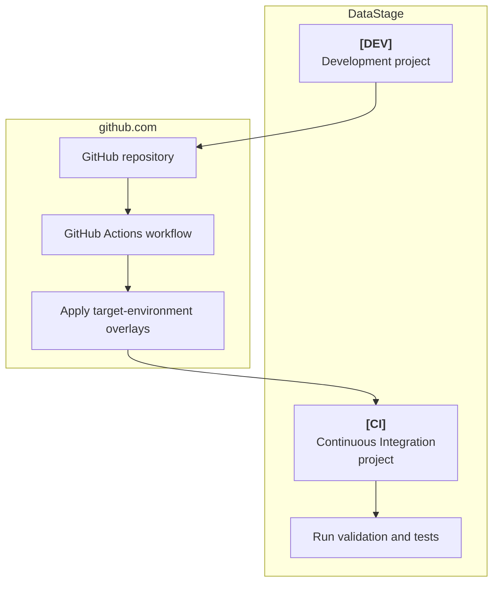
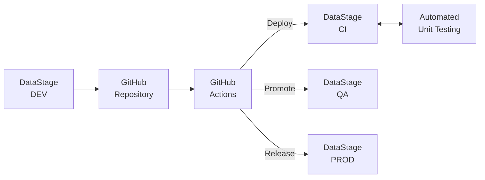

## Building a simple CI/CD pipeline using  MCIX GitHub Actions

In a production pipeline, GitHub can provides the automation, orchestration, credential management, approval gates, audit history, logging, notifications, and repeatability needed to run these steps reliably across environments. The MCIX GitHub Actions perform the DataStage-related work while GitHub is responsible for deciding when, where, and how these commands are executed.

This GitHub Actions tutorial will guide you to create a simple MCIX-based CI/CD pipeline for DataStage. Instead of running each MCIX command manually from your local command line, you will define a GitHub Actions workflow that runs the required delivery steps automatically whenever the workflow is triggered.  

This tutorial also demonstrates the effectiveness of the **MCIX GitHub Actions** available in the [GitHub Marketplace](https://github.com/marketplace?query=mcix){:target="_blank" rel="noopener"}. These actions provide GitHub-native tasks which are underpinned by the [MCIX container](/container/container) image. The GitHub native tasks provide richer deeper integration and richer feedback than terminal commands while also requiring no additional infrastructure, such as remote GitHub runners.

<cds-inline-notification
  kind="warning"
  title="Important"
  low-contrast
  hide-close-button="true"
  id="overlay-notification">
  
GitHub Actions are only available on the SaaS version of GitHub and not on GitHub Server (the self-hosted equivalent.) This tutorial is therefore only relevant if you are able to use <a href="github.com">github.com</a>.

</cds-inline-notification>

---

## What you will need

Before building the GitHub Actions workflow, you will prepare an environment containing:

1. access to a GitHub repository with the relevant permissions
1. a local clone of that repository
1. access to a source DataStage project
1. access to a target DataStage project
1. at least one unit test specification and its associated test data
1. at least one overlay file for the target environment

1. asset analysis rules, if you want to include static validation


The [prerequisites](tutorial-prerequisites) page walks through the process of establishing each of these.

That page may also provide a downloadable DataStage NextGen project that can be imported into your DataStage environment to act as your source for the tutorial.

---

## Why use GitHub Actions?

GitHub Actions allows your DataStage delivery process to run automatically from the same Git repository that stores your source-controlled assets.

A command-line pipeline is useful for learning each individual MCIX operation, but a GitHub Actions workflow is closer to how a real delivery process should run. It allows you to:

* trigger a pipeline when changes are pushed
* store credentials securely as GitHub repository or environment secrets
* run deployment and validation steps reliably and repeatably
* stop the pipeline automatically when a step fails
* publish test results and logs as workflow outputs
* keep a clear audit history of each pipeline run
* make the delivery process visible to the whole team

In this tutorial, you will use GitHub Actions to automate the same kind of pipeline that can be run manually with the MCIX CLI.

---

## What this tutorial demonstrates

The tutorial creates a simple deployment flow between two DataStage projects.

The pipeline pattern is intentionally simplified. It focuses on the essential delivery lifecycle rather than advanced GitHub Actions features such as reusable workflows, protected environments, deployment approvals, matrix builds, or release promotion.

Once the basic workflow is working, you can extend it to match your organisation’s branching strategy, environment model, and release governance process.

---

## The pipeline stages

The tutorial walks through the following stages.

 
| Stage           | Purpose                                                         |
| --------------- | --------------------------------------------------------------- |
| Prerequisites   | Establish resources and permissions required to follow the tutorial |
| Export          | Export the DataStage contents into a local Git repository (an [interim solution](/notes/git-interface)) |
| Overlay         | Apply environment-specific configuration changes ([overlays](/introduction/overlays))                |
| Import          | Deploy the modified assets into a target DataStage project      |
| Asset Analysis  | Identify anti-patterns in your DataStage flow, some of which will cause CI to fail | 
| Test            | Execute DataStage unit tests and produce test results           |

| Stage           | Purpose                                                         |
| --------------- | --------------------------------------------------------------- |
| Prerequisites   | Establish resources and permissions required to follow the tutorial |
| Export          | Export the DataStage contents into a local Git repository (an [interim solution](/notes/git-interface)) |
| Overlay         | Apply environment-specific configuration changes ([overlays](/introduction/overlays))                |
| Import          | Deploy the modified assets into a target DataStage project      |
| Test            | Execute DataStage unit tests and produce test results           |
 

Some stages are optional. For example,  asset analysis only applies where asset-analysis rules are available, and  unit testing only applies where suitable test specifications and test data have been configured.

---

## How this differs from the command-line tutorial

In the command-line tutorial, you act as the pipeline orchestrator. You decide when to run each command, inspect the outputs manually, and progress through the stages of the development lifecycle. That approach is useful for understanding the mechanics of the MCIX commands.

In this GitHub Actions tutorial, the GitHub workflow engine becomes the orchestrator, however the underlying delivery process remains the same. GitHub Actions introduces process automation; it does not change the purpose of each MCIX operation.

---

## Repository role in the tutorial

The GitHub repository acts as the well-governed, single source of truth for your DataStage delivery assets. It is not tied to a single environment such as Development, CI, QA, or Production. Instead, it represents the authoritative versioned source for the DataStage initiative.

The different DataStage environments are populated from that source at different stages of the delivery lifecycle.

| Environment | Typical role                                                             |
| ----------- | ------------------------------------------------------------------------ |
| Development | Where changes are initially created                                      |
| CI          | Where exported and overlaid assets are imported and automatically tested |
| QA          | Where a tested candidate release may be validated further                |
| Production  | Where only approved versions should be deployed                          |

<cds-inline-notification
  kind="warning"
  title="Important"
  subtitle="The repository stores the versioned source, while the DataStage projects represent 
  deployments of that source into specific environments.  Each environment (project) represents 
  a version of the source at different points in its lifecycle."
  low-contrast
  hide-close-button="true"
  id="overlay-notification">
</cds-inline-notification>

In this  simple tutorial you will only deploy to a single target project (the **CI** project.) In a real implementation the same source-controlled assets would be promoted through multiple environments using different overlays to adapt them to their target.

---

## GitHub Actions concepts used in this tutorial

This tutorial introduces a small number of GitHub Actions concepts.

| Concept  | Purpose                                                     |
| -------- | ----------------------------------------------------------- |
| Workflow | The YAML file that defines the automated pipeline. |
| Job      | A group of steps that run on the same GitHub Actions runner. |
| Step     | An individual operation within a job. |
| Action   | A reusable component that performs a specific task. |
| Secret   | A protected value, such as an API key or username. |
| Runner   | The machine that executes the workflow.  The use of MCIX GitHub Actions means  that GitHub provides this automatically, on demand, running on its own infrastructure. |
| Artifact | A file produced by the workflow, such as a report or log. |

You do not need prior GitHub Actions experience to complete this tutorial. The workflow used here is intentionally small and explicit so that each stage is easy to understand.

---

## Tutorial structure

This tutorial is split into two main parts.

### 1. Prepare the prerequisites

The prerequisite section confirms that your GitHub repository, DataStage projects, and credentials are ready for the pipeline exercise.

You will:

* create or identify a suitable GitHub repository
* confirm that your DataStage delivery assets are stored in the repository
* configure repository secrets for your DataStage connection details
* confirm that the required overlays are available
 * confirm that asset analysis rules are available, if required  
* confirm that unit test specifications and test data are available, if required
* confirm that GitHub Actions is enabled for the repository

### 2. Build the GitHub Actions workflow

The workflow section then uses that prepared environment to define and run an automated MCIX pipeline.  You will:

* create a GitHub Actions workflow file
* configure the workflow trigger
* export DataStage assets you wish to submit for downstream promotion 
* apply target-environment overlays
* import the modified assets into the target DataStage project
* run asset-analysis validation, if required
* execute DataStage unit tests, if required
* publish reports and logs from the workflow run
* review the workflow result in GitHub

The pipeline steps page describes the workflow file, the MCIX actions used by each step, and the expected outputs from the run.

---

## Next steps

After completing this tutorial, you should understand how MCIX GitHub Actions work together to automate a simple DataStage CI/CD process.

You can then extend the workflow to support more realistic delivery patterns, such as pull request validation, protected deployment environments, manual approval gates, release branches, reusable workflows, and promotion through CI, QA, and Production.

---