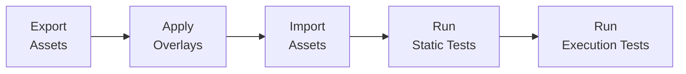
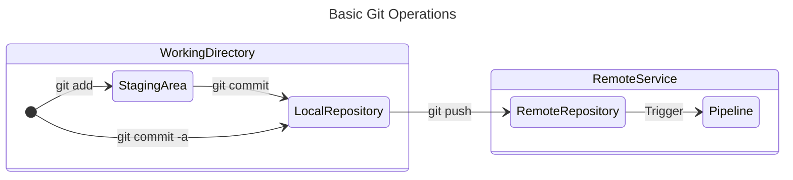

<c4d-link-list type="default" slot="complementary">
  <c4d-link-list-heading>Resources</c4d-link-list-heading>
  <c4d-link-list-item
    href="https://marketplace.visualstudio.com/items?itemName=MettleCI.mcix"
    target="mcix-azure"
    cta-type="external"
  >
    MCIX for Azure DevOps on Visual Studio Marketplace
  </c4d-link-list-item>
</c4d-link-list>

## Source control

Source control is the foundation of CI/CD. In the tutorials in this documentation, Git is used to store the authoritative version of your DataStage assets, overlay files, unit tests, and supporting configuration. The DataStage projects are deployment targets; the Git repository is the versioned source of truth.

This distinction is important because CI/CD pipelines should work from source-controlled content, not directly from someone’s local machine or an untracked development environment.

---

## Source of truth

A CI/CD process needs one trusted place from which deployments are performed.  For this tutorial, the Git repository acts as the source of truth. Assets may originate in a development DataStage project, but once exported and committed, the repository becomes the controlled version of those assets.  Downstream environments such as CI, QA, and Production should be populated from that controlled source, rather than being updated manually.

---

## Environment promotion

CI/CD is based on the idea of promoting the same logical change through a series of environments. For example:

```text
Development → CI → QA → Production
```

Each environment has a different purpose. Development is where changes are created, CI is where changes are automatically validated, QA is where release candidates are tested, and Production is where approved changes are made available to users.  The important principle is that the same versioned change is promoted forward, rather than being recreated separately in each environment.  

An important CI/CD concept is the difference between promoting a known version and rebuilding or re-exporting a new one.  For controlled delivery, QA and Production should receive the same tested version that passed earlier stages. The code in each environment should be deployed from the same tagged codebase in Git, not promoted between environments.  This helps preserve confidence that the version of code being deployed is the version which was approved.

---

## Environments and DataStage project naming

This documentation includes tutorials which assume a consistent DataStage project naming convention based on 
a single project **base name**.  The base name identifies the DataStage initiative or application being delivered. 
For example, if the base name is:

```text
ElectroMart
````

then the related DataStage projects are named by adding an **environment** suffix to that base name which relates to 
the functional role of each project:

| Environment | Project name       | Role                                                                           |
| ----------- | ------------------ | ------------------------------------------------------------------------------ |
| Development | `ElectroMart`      | Where changes are initially created                                            |
| CI          | `ElectroMart_CI`   | Where exported and overlaid assets are imported and (automaticaly) unit tested |
| QA          | `ElectroMart_QA`   | Where a tested candidate release may be validated further                      |
| Production  | `ElectroMart_PROD` | Where only approved versions should be deployed                                |

In this model, the project name without a sufix represents the development project. Environment-specific projects are then created by appending a standard suffix such as `_CI`, `_QA`, or `_PROD`.

This convention is used consistently for all DataStage projects, regardless of the chosen base name. For example:

| Base name           | Development         | CI                     | QA                     | Production               |
| ------------------- | ------------------- | ---------------------- | ---------------------- | ------------------------ |
| `ElectroMart`       | `ElectroMart`       | `ElectroMart_CI`       | `ElectroMart_QA`       | `ElectroMart_PROD`       |
| `CustomerAnalytics` | `CustomerAnalytics` | `CustomerAnalytics_CI` | `CustomerAnalytics_QA` | `CustomerAnalytics_PROD` |
| `FinanceReporting`  | `FinanceReporting`  | `FinanceReporting_CI`  | `FinanceReporting_QA`  | `FinanceReporting_PROD`  |

Using a predictable naming convention makes it easier to automate project creation, configure pipelines, generate variable values, and apply the same deployment pattern across multiple DataStage initiatives.

For example, automation only needs to know the base name:

```text
ElectroMart
```

From that value it can derive the related environment project names:

```text
ElectroMart
ElectroMart_CI
ElectroMart_QA
ElectroMart_PROD
```

This keeps pipeline configuration simple and reduces the number of project-specific values that users need to enter manually.

---

## Build, deploy, and test stages

A pipeline is usually made up of **stages**. A stage is a logical part of the delivery process, such as:

| Stage           | Purpose                                               |
| --------------- | ----------------------------------------------------- |
| Build / Export  | Package or extract the assets to be delivered.        |
| Validate        | Check the assets against rules or standards.          |
| Deploy / Import | Apply the assets to a target environment.             |
| Test            | Confirm that the deployed result behaves as expected. |
| Promote         | Move an approved version to the next environment.     |

In the MCIX tutorials inclued in this documentation these stages are implemented using operations such as `datastage export`, `overlay apply`, `datastage import`, `asset-analysis test`, and `unit-test execute`.

---

## Pipeline orchestration

A CI/CD tool does not usually perform the specialised work of interacting with DataStage itself. Instead, it orchestrates tools that know how to perform each task. For example, Azure DevOps, GitHub Actions, Jenkins, Bitbucket Pipelines, or Tekton may decide:

* when the pipeline should start
* which job should run next
* whether a failed step should stop the process
* which credentials are available to each step
* where logs and test results should be published

... but specialised tools such as MCIX take on the role of deployment and testing DataStage Assets.

---

## Triggers

A trigger defines when a pipeline should run. Common triggers include:

| Trigger              | Example                                             |
| -------------------- | --------------------------------------------------- |
| Commit trigger       | Run the pipeline whenever code is pushed to `main`. |
| Manual trigger       | Let a user start the pipeline on demand.            |
| Scheduled trigger    | Run the pipeline overnight or at a fixed time.      |
| Release trigger      | Run deployment when a version tag is created.       |

---

## Agents and runners

A pipeline needs somewhere to run.  Different platforms use different terms:

| Platform              | Execution host term |
| --------------------- | ------------------- |
| Azure DevOps          | Agent               |
| Bitbucket Pipelines   | Runner              |
| GitHub Actions        | Runner              |
| GitLab CI             | Runner              |
| Jenkins               | Agent / Node        |
| Tekton                | Pod / TaskRun       |

The important idea is that the CI/CD system schedules work onto an execution host (virtual or physical) and it's that host which runs the commands in the pipeline.

For MCIX Azure DevOps tasks, users do not usually need a dedicated MCIX-specific self-hosted agent. The platform provides the execution environment and the MCIX task provides the functional behaviour in a compatible form (command line, container, or native task).

---

## Variables and secrets

Pipelines need configuration values, but not all values should be handled the same way.

| Type     | Example                                      | How it should be handled                     |
| -------- | -------------------------------------------- | -------------------------------------------- |
| Variable | Project name, environment name, registry URL | Stored as normal pipeline configuration.     |
| Secret   | API key, password, access token              | Stored in the CI/CD platform’s secret store. |

This is an important concept to grasp as it will help you avoid hard-coding usernames, passwords, and API keys directly into your CI/CD pipelines.

---

## Service connections

A service connection, used by some CI/CD platforms, is a stored, reusable connection from the CI/CD platform to an external system. For 
example, Azure DevOps service connections can be used to connect to:

* an external deployment platform
* a container registry (This is how you tell MCIX Azure DevOps Tasks where the MCIX container can be found. More details [here](/azure/azure-prereqs).)
* a Git repository (This is how you use Azure DevOps backed by a different Git provider, such as GitHub.)

In the MCIX Azure DevOps tutorial, a Docker Registry service connection allows the pipeline to semalessly authenticate to the registry that hosts the MCIX container image. This avoids placing registry credentials directly into every pipeline definition.

---

## Artifacts

An artifact is a file or package produced by one part of a pipeline and used later. Examples include:

* exported assets
* overlaid deployment assets
* test reports
* log
* compiled binaries (Not applicable to DataStage)
* release packages  (Not applicable to DataStage)

In the MCIX tutorial, exported assets, [overlaid assets](/introduction/overlays), and [JUnit XML](/introduction/junit-output) reports are all useful examples of pipeline artifacts.

---

## Test results

One of the functions of a CI/CD pipelines is to produce evidence of whether a change is safe to promote.  Many CI/CD tools understand standard test result formats such as JUnit XML. This means that the results from testing tools which produce their test results in [JUnit format](/introduction/junit-output) can to be displayed in the pipeline interface rather than buried in logs.

For MCIX, commands such as [asset-analysis test](/command-line/command-reference#asset-analysis-test) and [unit-test execute](/command-line/command-reference#unit-test-execute) can produce test result files that a CI/CD platform can publish and display.

---

## Fail-fast behaviour

A pipeline normally stops when an important step fails. For example:



If the overlay step fails, the import step should not run. If the import step fails, the tests should not (or cannot) run.  This is known as fail-fast behaviour and it prevents later stages from running against incomplete, invalid, or incorrectly deployed assets.

---

## Approvals and gates

Not every environment should be updated automatically. For example, it may be acceptable to deploy automatically to CI on successful completion of CI testing, but Production deployments will almost always require the manual approval of a human operator.

Approvals and gates allow a CI/CD platform to pause a pipeline before a sensitive stage and require a nominated person or group to approve the deployment. This is especially useful when explaining the difference between technical automation and organisational control.

---

## Idempotency

An idempotent operation can be run more than once and still produce the same intended result.  This is important in CI/CD because it enables pipeline steps to be retried after a failure.  For example, a project setup script should ideally be able to check whether a repository, variable group, service connection, or environment already exists before creating it again.  This makes automation safer and easier to rerun.

---

## Auditability

A CI/CD platform creates a record of what happened.  It can show:

* how a pipeline was triggered
* who triggered a pipeline
* which version was deployed
* which environment was updated
* which tests passed or failed
* who approved a production deployment
* when the deployment occurred

This audit trail is one of the major advantages of using a proper CI/CD platform instead of relying on manual command execution, or simple scripted solutions operating outside a CI/CD tool.

---

## Separation of configuration from assets

The same DataStage assets often need different configuration in different environments.  For example, Dev, QA, and Production may use different:

* database connections
* schema names
* file paths
* credentials
* runtime parameters

The [overlay](/command-line/tutorial-steps#4-apply-environment-overlays) step in the tutorials included in this documentation demonstrates this principle. The core assets are versioned once, while environment-specific configuration is applied during deployment.

---

## Git essentials

Git is a command-line tool used to track changes to files over time, making it easier to manage source code, documentation, and other project assets. Most Git operations are performed using the git command in a terminal, where you explicitly tell Git which changes to prepare, record, and share. Although graphical tools and web interfaces can simplify some tasks, understanding the Git CLI is valuable because it exposes the core workflow directly and works consistently across platforms, automation tools, and CI/CD pipelines.



This diagram shows the basic flow of changes in Git using only the simplest of the git commands. You start with modified files in your working directory. 
- `git add` moves selected changes into the **staging area** where they are prepared for the next commit. 
- `git commit` then records those staged changes into your **local repository**. 
- `git commit -a` is a shortcut which commits changes to already-tracked files directly from the working directory, bypassing a separate `git add` step. 
- `git push` sends the commits from your **local repository** to a **remote repository**, such as one hosted on Azure DevOps ot GitHub. A git push is commonly (but not always) configured as the [trigger](/introduction/cicd-concepts#triggers) for the start of a CI/CD pipeline.  

---

## Rollback

A Good CI/CD design should not only be capable of promote a change forward, but should also consider how to stop safely, report failures clearly, and support recovery to a previous known-good version. In practice, this means keeping deployed assets versioned, preserving deployment outputs and logs, and ensuring that an earlier approved version can be redeployed if the current change proves unsuccessful.

Rollback is the ability to return an environment to a previous known-good version.  In a DataStage context, this may involve redeploying a previous version of the exported assets from Git.

---

## Pipeline as code

Modern CI/CD systems usually define pipelines in files stored in source control. For example:

* **Azure:** `azure-pipelines.yml`
* **Bitbucket:** `bitbucket_pipeline.yml`
* **GitHub:** `.github/workflows/deploy.yml`
* **GitLab:** `.gitlab-ci.yml`
* **Jenkins:**`Jenkinsfile`

This is refered to a 'pipeline as code'. This approach means the pipeline definition can be reviewed, versioned, branched, and changed using the same source-control practices as the assets it tests and deploys.
