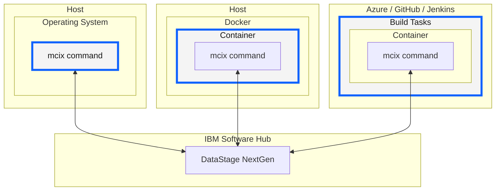
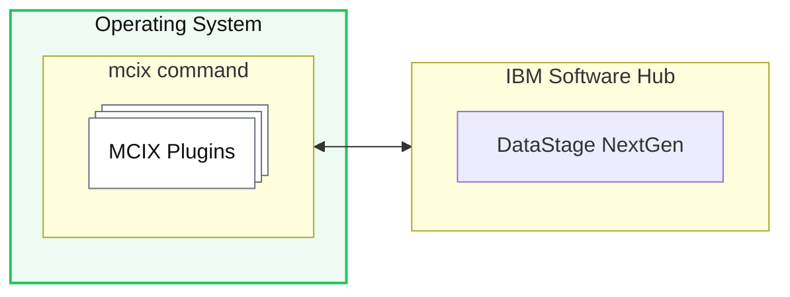
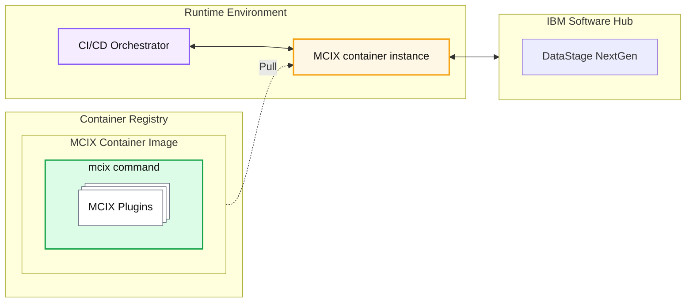
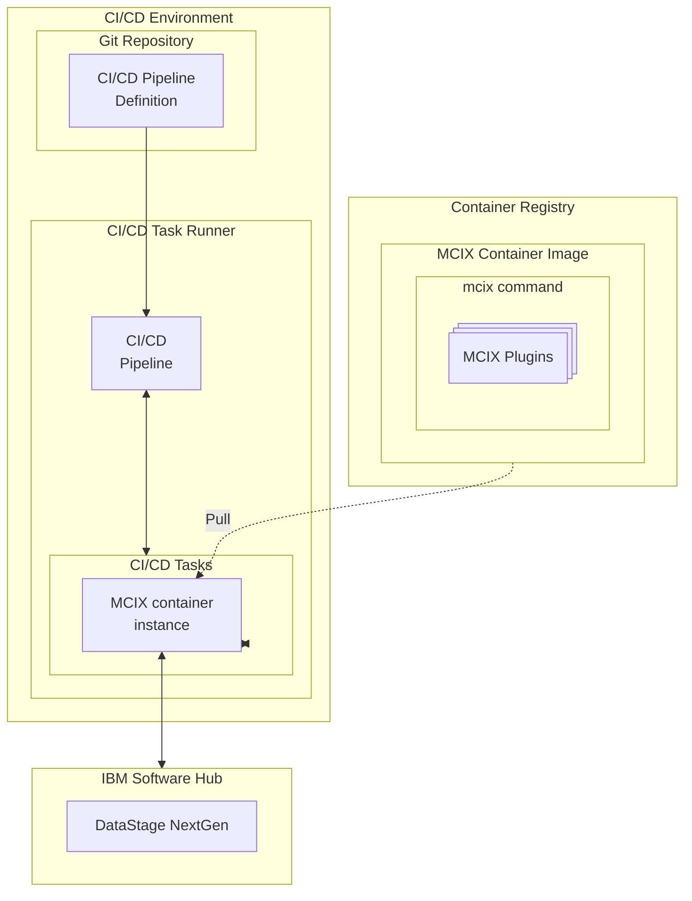

# Introduction

The MCIX command provides a set of capabilities underpinning the creation of automated CI/CD pipelines for any modern build tool.

| **Migration** | - Providing facilities to migrate MettleCI test assets from DataStage v11.x to DataStage NextGen. |
| **Deployment operations** | - Importing and exporting assets to/from DataStage NextGen environments  - Compiling assets in DataStage NextGen - Automatically adapting properties of assets to suit their target environments |
| **Testing** | - Invoking static asset analysis (the equivalent of [lint](<https://en.wikipedia.org/wiki/Lint_(software)>){:target="_blank" rel="noopener"} for DataStage NextGen assets) - Fabricating synthetic test data based on custom test data specifications - Dynamic unit testing (executing your DataStage NextGen flows using a restricted set of test data) |

These capabilities are supplied by the MCIX command which itself is available in various forms:

- A native **terminal command** (Linux, macOS, or Windows) 
- A **container image**
- A set of native CI/CD **build task** (Azure DevOps, GitHub Actions, and Jenkins)

## Terminal Command

The MCIX CLI terminal command provides the ability to interactively explore MCIX's capabilities without requiring additional software or infrastructure.  It is described in more detail [here](../command-line/command-shell){:target="_blank" rel="noopener"}.

The command is available for **Unix (x86)**, **Windows (x86)**, and **macOS (ARM64)**, all downloadable from [here](https://github.com/mettleci/mcix-cli/releases/latest){:target="_blank" rel="noopener"}.

## Container Image

The MCIX container provides all the capablities of the MCIX command line with the deployment flexibility of a container.  This form of MCIX provides the fundamental building block of your automated CI/CD processes for watsonx.data integration. It is described in more detail [here](../container/container){:target="_blank" rel="noopener"} and is hosted [here](https://github.com/MettleCI/mcix/pkgs/container/mcix){:target="_blank" rel="noopener"}. 

## Native CI/CD Tasks

Users of the most popular CI/CD orchestration tools can make use of native pipeline tasks which enable them to reference MCIX operators directory from within their pipeline YAM files. MCIX tasks, introduced [here](../container/native-tasks), are available for ...

- [Azure DevOps](../azure/azure)
- [GitHub](../github/github)
- [Jenkins](../jenkins/jenkins)

