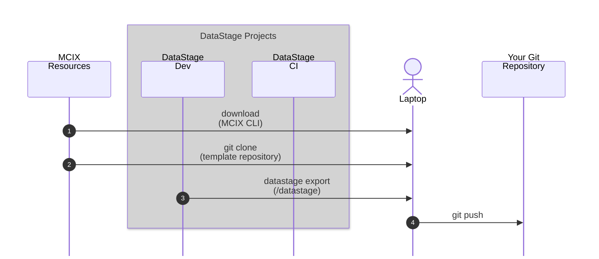
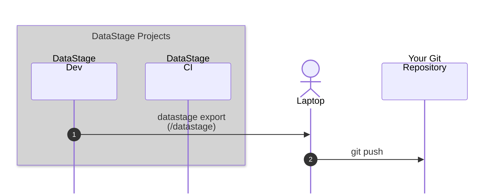

### Build simulated pipeline

## Setup

```mermaid
%%{init: {'sequence': {'diagramMarginY': 50, 'mirrorActors': false}}}%%
sequenceDiagram
    autonumber
    participant MCIX as MCIX<br/>Resources<br/><br/><br/><br/>
    box lightgray DataStage Projects<br/><br/>
        participant DSDEV as DataStage<br/>Dev<br/><br/><br/><br/>
        participant DSCI as DataStage<br/>CI<br/><br/><br/><br/>
    end
    actor Laptop as Laptop
    participant Git as Your Git<br/>Repository<br/><br/><br/><br/>

    MCIX->>Laptop: download<br/>(MCIX CLI)
    MCIX->>Laptop: git clone<br/>(template repository)
    DSDEV->>Laptop: datastage export<br/>(/datastage)
    Laptop->>Git: git push
```

## Pipeline

```mermaid
%%{init: {'sequence': {'diagramMarginY': 50, 'mirrorActors': false}}}%%
sequenceDiagram
    autonumber
    box lightgray DataStage Projects<br/><br/>
        participant DSDEV as DataStage<br/>Dev<br/><br/><br/><br/>
        participant DSCI as DataStage<br/>CI<br/><br/><br/><br/>
    end
    actor Laptop as Laptop
    participant Git as Your Git<br/>Repository<br/><br/><br/><br/>

    DSDEV->>Laptop: datastage export<br/>(/datastage)
    Laptop->>Git: git push
```
