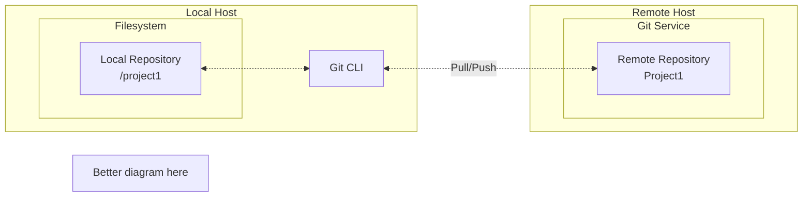

# Configuring your Git platform

Before running through the CLI-based MCIX pipeline tutorial you need to  ensure you have access to your nominated Git platform, and that the platform hosts a Git repository suitably structured for the storage of IBM DataStage project assets. 

We'll start by establishing a folder on your local host's filesystem which is a local clone of a remote Git repository into which we'll push our DataStage assets.

<!--

-->

## Verify your local Git CLI instalation

If Git is not installed, [install it](https://git-scm.com/install/) before continuing.

Then, on your local host (Linux, macOS, or Windows), run:

```bash
git --version
```

You should see output similar to:

```text
git version 2.54.0
```

## Create a new project repository

Your Git platform can be GitHub, GitLab, Bitbucket, Azure DevOps, your organisation’s internal Git platform, or any other Git-compatible service,

Login to your Git platform and create a new repository.

| Platform | URL | Links |
| -------- | --- | ----- |
| Azure DevOps | [https://dev.azure.com](https://dev.azure.com) | [Authentication](https://learn.microsoft.com/en-us/azure/devops/integrate/get-started/authentication/authentication-guidance?view=azure-devops),  [Create a repository](https://learn.microsoft.com/en-us/azure/devops/repos/git/create-new-repo?view=azure-devops) |
| Bitbucket | [https://bitbucket.org](https://bitbucket.org) | [Authentication](https://confluence.atlassian.com/bitbucketserver/permanently-authenticating-with-git-repositories-776639846.html), [Create a repository](https://support.atlassian.com/bitbucket-cloud/docs/create-a-git-repository/) |
| GitHub | [https://github.com](https://github.com) | [Authentication](https://docs.github.com/en/authentication/keeping-your-account-and-data-secure/about-authentication-to-github), [Create a repository](https://docs.github.com/en/repositories/creating-and-managing-repositories/creating-a-new-repository) |
| GitLab | [https://gitlab.com](https://gitlab.com) | [Authentication](https://docs.gitlab.com/auth/user_authentication/), [Create a repository](https://docs.gitlab.com/user/project/repository/#create-a-repository) |

Use a simple, purpose-based repository name, such as `mcix-cli-pipeline-demo`.

Avoid naming the repository after a specific environment, such as `myproject-prod` or `myproject-test`. The repository should represent the single source of truth for the DataStage initiative, not one particular deployment target.

In this model, environments such as Dev, CI, QA, and Prod are separate DataStage projects. Each environment is populated from the repository at different points in the delivery lifecycle. For example, Dev may contain the latest working changes, QA may contain a tested candidate release, and Prod should contain only the approved production version.

In other words, the repository stores the authoritative versioned source, while the DataStage projects represent environment-specific deployments of that source.


You do not need to enable any provider-specific features such as build pipelines, actions, runners, wikis, discussions, boards, branch protection rules, or deployment features for this tutorial.

Recommended settings for your repository:

| Setting | Value |
| ------- | ----- |
| Repository name   | mcix-cli-pipeline-demo |
| Visibility        | Private  |
| Default branch    | main     |
| .gitignore        | Yes      |
| README            | Yes      |
| Licence           | Optional |
| Issues:           | Disabled |
| Wiki:             | Disabled |
| Discussions:      | Disabled |
| Projects/Boards:  | Disabled |
| Branch protection | Disabled |

<cds-inline-notification
  kind="info"
  title="Note"
  subtitle="Your Git platform will provide HTTPS and SSH references to you newly-created repository. HTTPS and SSH are the two primary secure transport protocols used to connect Git clients to remote repositories.  HTTPS uses port 443, relies on token-based or password authentication, and is generally easier to configure and more firewall-friendly.  SSH (Secure Shell) uses public/private key cryptography on port 22, and offers the convenience of eliminating the need for repetitive credential entry after initial setup."
  low-contrast
  hide-close-button="true"
  id="overlay-notification">
</cds-inline-notification>

## Clone the template repository

A MettleCI template repository is provided for convenience and as a recommended starting point. It is available to clone from [here](https://github.com/MettleCI/datastage-nextgen-repo-template). This repository is hosted on GitHub but is a generic Git repository which can be cloned and deployed to any target Git paltform.

You are not required to follow its structure exactly. You can organise your repository in whatever way best suits your project, including where you store DataStage assets, scripts, configuration files, documentation, and other non-DataStage artefacts. The repository does, however, demonstrate a practical best-practice layout that is easy to understand, easy to deploy, and suitable for most delivery pipelines. Starting from the template helps you avoid unnecessary setup decisions and gives you a working structure that can be adapted later as your needs evolve.

**Process**

These commands work the same regardless of your host platform (macOS, Windows, or Linux)

1. Configure your Git environment with your name and email:
```bash
git config --global user.name "Your Name"
git config --global user.email "you@example.com"
```

1. Copy the repository clone URL:
```
https://github.com/MettleCI/datastage-nextgen-repo-template
```

1. Clone the to your local host:
```shell
git clone https://github.com/MettleCI/datastage-nextgen-repo-template
```
or, using SSH:
```bash
git clone git@github.com/MettleCI/datastage-nextgen-repo-template.git
```
If desried, you can test SSH access using:
```bash
ssh -T git@github.com
ssh -T git@gitlab.com
ssh -T git@bitbucket.org
# etc.
```
**Note:** For Azure Repos, use the SSH host shown in the Azure DevOps 'clone' instructions of your repository in the Azure DevOps user interface.<br/><br/>
A successful response usually confirms that you have authenticated, even if it says shell access is not provided.<br/><br/>
Both of these approaches (HTTPS or SSH) will require you to authenticate yourself to your Git platform.  When using HTTPS, your Git platform may require a personal access token rather than your account password.<br/><br/>

1. Next, inspect the contents of the cloned repository:
```shell
cd mcix-cli-pipeline-demo
ls -al
```
Which should look like this:
```text
mcix-cli-pipeline-demo/
├── .git
├── .gitattributes
├── .gitignore
├── datastage/
├── filesystem/
├── pipelines/
├── README.md
├── unit-tests/
└── varfiles/
```
The `.git` and `.gitattributes` files tell your Git CLI that this is folder is a Git repository, and what its properties are.
1. Next, point your local clone to your new remote repository:
```shell
# Confirm your local repository currently points 
# to the remote template repository
git remote -v
```
This should show:
```shell
origin	https://github.com/MettleCI/datastage-nextgen-repo-template (fetch)
origin	https://github.com/MettleCI/datastage-nextgen-repo-template (push)```
```
Or, for SSH:
```text
origin  git@github.com:MettleCI/datastage-nextgen-repo-template.git (fetch)
origin  git@github.com:MettleCI/datastage-nextgen-repo-template.git (push)
```
Now change the remote to your recently-created repository:
```shell
git remote set-url origin <YOUR_NEW_REPOSITORY_URL>   
```

---

## Verify essential Git operations

From inside the cloned repository, run:

```bash
git pull
```

If this completes successfully (usually with an `Already up to date` message) you have permission to retrieve the latest repository content.  

Append a line to the `README.md` file:

```bash
echo "Git access check" >> README.md
```

Check the Git status to verify the change has been identified locally:

```
git status
```

This should show:
```
On branch main
Your branch is up to date with 'origin/main'.

Changes not staged for commit:
  (use "git add <file>..." to update what will be committed)
  (use "git restore <file>..." to discard changes in working directory)
	modified:   README.md

no changes added to commit (use "git add" and/or "git commit -a")```
```

Stage it and Commit it:

```bash
git add README.md
git commit -m "Updated README to verify Git access"
```

If the commit succeeds, your local Git configuration is working.

Push the test change:

```bash
git push -u origin main
```

If this succeeds, you have the necessary write access to the repository.
